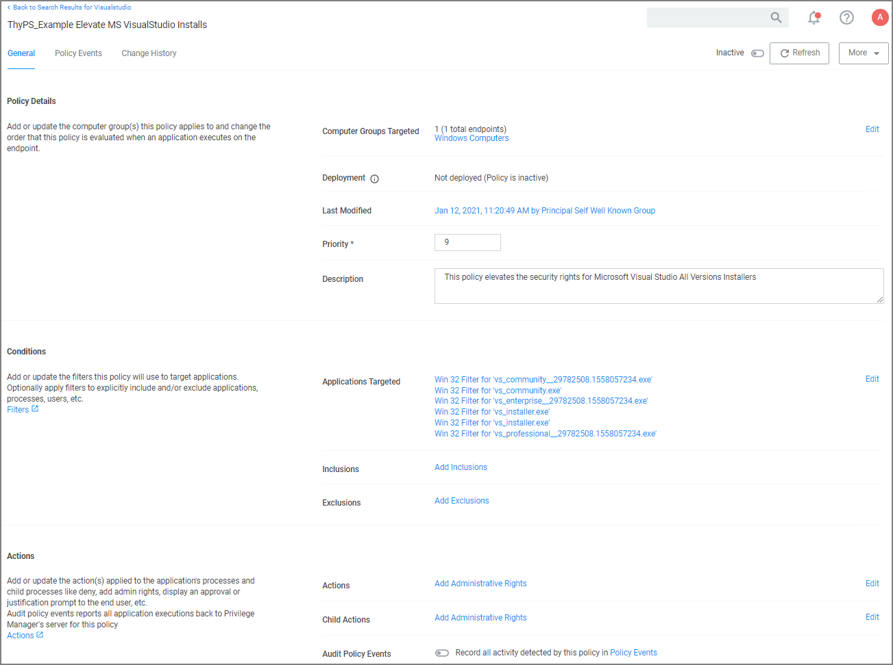
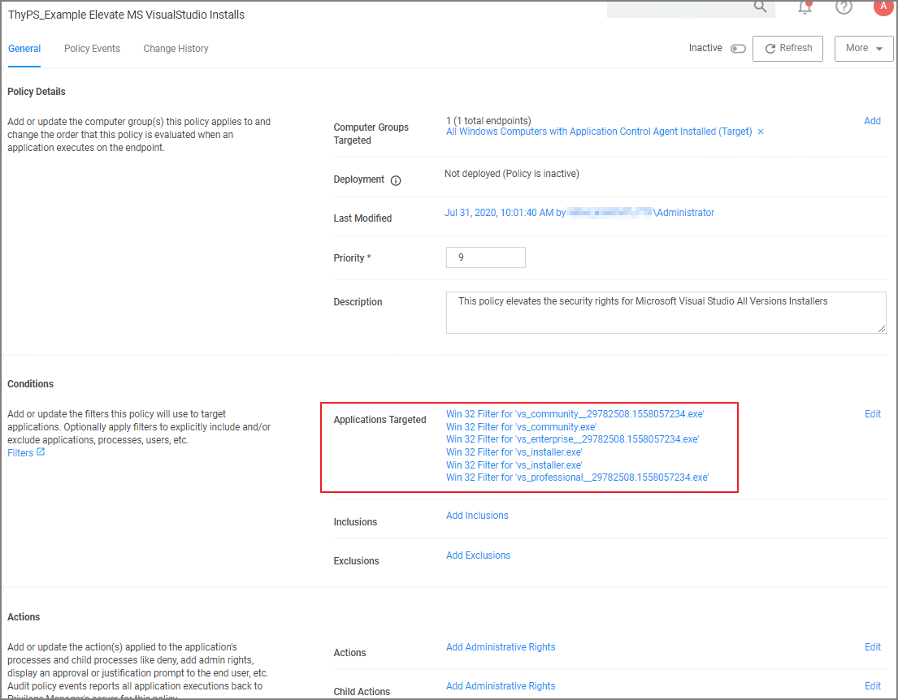

[title]: # (MS Visual Studio Installations)
[tags]: # (elevate, xml example)
[priority]: # (4)
# MS Visual Studio Installations

After downloading the [Visual Studio Installer Elevation configuration feed](../../../../admin/config-feed/index.md), follow the below best practices to elevate Visual Studio Installer packages.

## Customizing the Policy

1. In the Privilege Manager console search for __ThyPS_Example Elevate MS VisualStudio Installs__. 
1. On the results page click the __ThyPS_Example Elevate MS VisualStudio Installs__ policy.

   

   The policy
   * is set to a priority of 9.
   * incorporates various filters, covering various Visual Studio versions. Each File Specification Filter incorporates a Certificate Filter for the signing cert and a Win 32 Filter for the targeted file attributes.
   * adds Administrative Rights to each of the application targets.

>**Note**: For enhanced security, the policy should include a certificate filter when rolled out into a production environment.

### Background Notes

Four Microsoft Initial download files and subsequent two Windows Start Menu target files are defined as Application targets in this policy.

If you use this policy in your environment, check frequently to update when new versions are released. Verify if there are any versions of Visual Studio you would need to include for your customization. To cover additional versions, use these filters as a basis and download desired versions from Microsoft.

Additionally, work is needed to sort out what needs elevation when using the application’s various modules. Not every Module install was tested with these filters.

The Applications Elevation Policy should be a separate Policy, as it should be located differently in the Policy Stack.

Prior to rolling this out to a production environment, proper testing by a developer should be performed.
