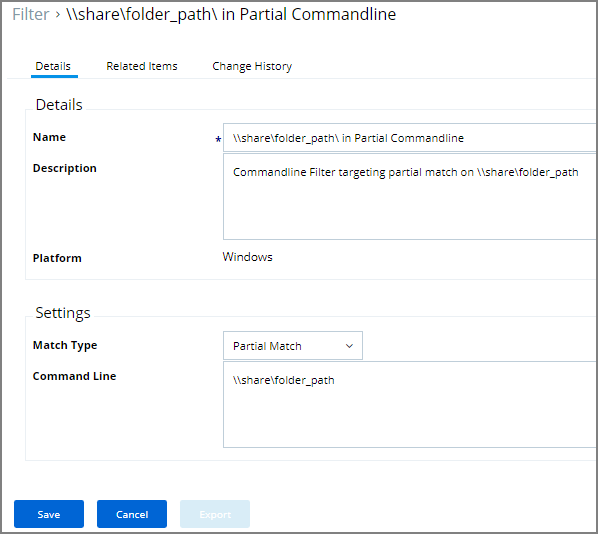
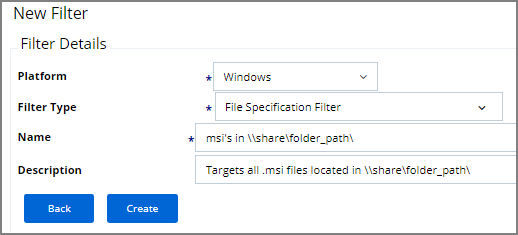
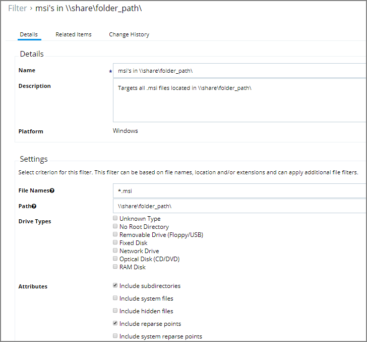
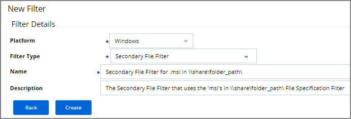

[title]: # (MSI on Network Share)
[tags]: # (elevate)
[priority]: # (4)
# Elevate MSI Files on the Network Share

A wizard generated UNC or Network Share Path Elevation Policy elevates .exe files but not .msi files.

When launching an .msi file, the following command line is executed:

```cmd
C:\Windows\System32\msiexec.exe /i "\[path-to-network-share]\[file]"
```

This means that the application is not elevated because the msiexec.exe file is not in the elevated Network Share directory.

This topic details two options for elevating .msi files from a network share.

## Option 1

In order to enable elevation for .msi files on the network share, a command line filter can be created and added to the Elevation Policy.

1. In the Privilege Manager, navigate to __ADMIN | Filters__.
1. Click __Add Filters__.
1. From the __Platform__ pull-down menu, select __Windows__.
1. From the __Filter Type__ pull-down menu, select __Commandline Filter__.
1. Give this filter a custom name and description.

   
1. Click __Create__.
1. On the newly created filter, click __Edit__.
1. Under __Settings | Match Type__, select __Partial Match__.
1. In the Command line field, enter the network share path that needs to be elevated (such as `\share\folder_path`).

   
1. Click __Save__.
1. Navigate to your Elevation Policy. On the __Conditions__ tab under __Application Targets__ add the command line filter you just created.

Now MSI files in the network share will be elevated.

## Option 2

An application control policy can be created that targets "msiexec.exe" and uses a secondary file filter as an include only filter.

1. In the Privilege Manager, navigate to __ADMIN | Filters__.
1. Click __Add Filters__.
1. From the __Platform__ pull-down menu, select __Windows__.
1. From the __Filter Type__ pull-down menu, select __File Specification Filter__.
1. Give this filter a custom name and description.

   
1. Click __Create__. 
1. On the newly created filter, click __Edit__.
1. Under __Settings | File Names__, enter `*.msi`.
1. For __Path__, enter the approved UNC path.
1. Under __Attributes__, select __Include subdirectories__.

   
1. Click __Save__.
1. Click __Back__.
1. Click __Add Filters__.
1. From the __Platform__ pull-down menu, select __Windows__.
1. From the __Filter Type__ pull-down menu, select __Secondary File Filter__.
1. Give this filter a custom name and description.

   
1. Click __Create__.
1. Click __Edit__.
1. Under __Settings__, select __+ Add__ button for Filters and select the file specification filter you just created.

   
1. Click __Save__.
1. Navigate to the Elevation Policy.  On the __Conditions__ tab under __Application Targets__ add the secondary file filter you just created.

MSI files in the network share will be elevated.

Adding the Secondary File Filter created to the Applications Targets on the Conditions tab of the Policy will catch all instances where `.msi` files are run from `\share\folder_path`. Only msiexec.exe will run .msi files,
so the Secondary File Filter can be added to an Elevation Policy that has other Application Targets.

An Elevation Policy can be built with this Secondary File Filter as the Application Target and add the built-in Microsoft Installer File Filter as an Inclusion Filter to specifically target msiexec.exe runs an .msi from
`\share\folder_path\`.
