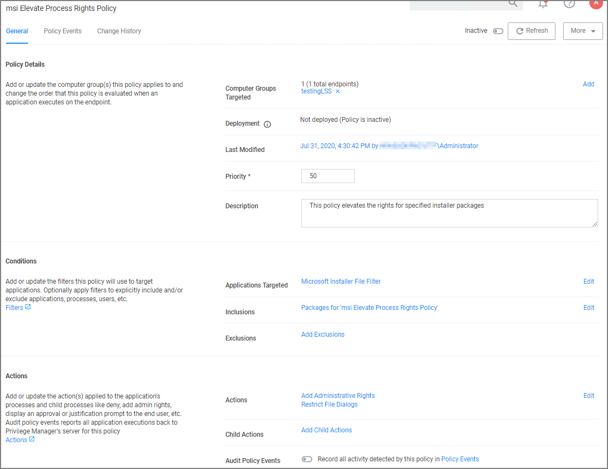

[title]: # (MSI on Network Share)
[tags]: # (elevate)
[priority]: # (4)
# Elevate MSI Files on the Network Share

A wizard generated UNC or Network Share Path Elevation Policy elevates .exe files but not .msi files.

When launching an .msi file, the following command line is executed:

```cmd
C:\Windows\System32\msiexec.exe /i "\[path-to-network-share]\[file]"
```

This means that the application is not elevated because the msiexec.exe file is not in the elevated Network Share directory.

This topic details two options for elevating .msi files from a network share.

## Option 1

In order to enable elevation for .msi files on the network share, a command line filter can be created and added to the Elevation Policy.

1. In the Privilege Manager, navigate to __Admin | Filters__.
1. Click __Add Filters__.
1. From the __Platform__ pull-down menu, select __Windows__.
1. From the __Filter Type__ pull-down menu, select __Commandline Filter__.
1. Give this filter a custom name and description.
1. Click __Create__.
1. Under __Settings | Match Type__, select __Partial Match__.
1. In the Command line field, enter the network share path that needs to be elevated (such as `\share\folder_path`).

   
1. Click __Save Changes__.
1. Navigate to your Elevation Policy. Under __Conditions__ for __Application Targets__ add the command line filter you just created.

Now MSI files in the network share will be elevated.

## Option 2

An application control policy can be created that targets "msiexec.exe" and uses a secondary file filter as an include only filter.

1. Navigate to __Computer Groups | Windows Computers__.
1. Select __Application Policies__.
1. Click __Create Policy__.
1. In the policy wizard select __Controlling__, click __Next Step__.
1. In the policy wizard select __Elevate__, click __Next Step__.
1. In the policy wizard select __Run Silently__, click __Next Step__.
1. In the policy wizard select __Installer Packages__, click __Next Step__.
1. In the policy wizard select __File Upload__.
   1. On the Upload a File modal, Click __Choose File__.
   1. Select the file(s) you wish to be targeted.
   1. Click __Upload File__.
   1. On the Manage Application dialog, check __File Name__.
   1. Click __Create Filter__.
   1. Click __Next Step__.
1. On the Finalize the Policy page, enter a name for your new policy. The policy will be created with a default priority of 50, since it is a silent elevation policy.
1. Click __Create Policy__.
1. Under __Conditions__, click __Edit__.
1. Search and add the network share path filter previously created.
1. Click __Update__.

   
1. Click __Save Changes__.

MSI files in the network share will be elevated.

Adding the Secondary File Filter created to the Applications Targets under Conditions of the Policy will catch all instances where `.msi` files are run from `\share\folder_path`. Only msiexec.exe will run .msi files, so the Secondary File Filter can be added to an Elevation Policy that has other Application Targets.

An Elevation Policy can be built with this Secondary File Filter as the Application Target and add the built-in Microsoft Installer File Filter as an Inclusion Filter to specifically target msiexec.exe runs an .msi from
`\share\folder_path\`.
