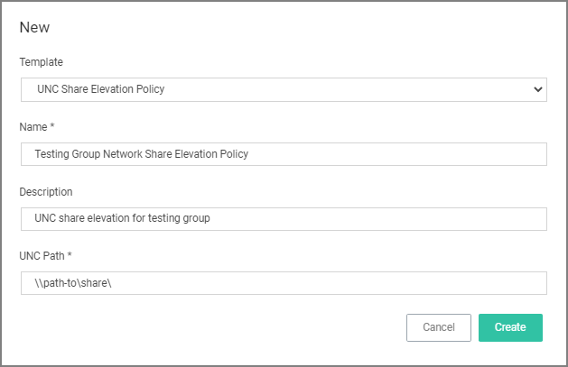
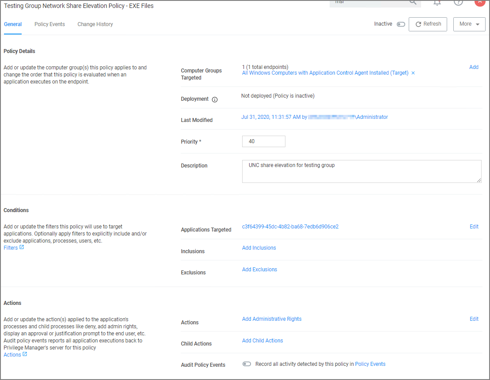

[title]: # (Network Share)
[tags]: # (elevate)
[priority]: # (4)
# Network Share Applications

Many organizations put trusted installers on a network share that employees can use. Those installers can be elevated automatically from the shared network location by assigning an elevation policy to the network share location.

There are different options to elevate rights to launch applications from a network share location.

* One option is to create a file specification filter setting the path for the network share location. Then use that filter in a policy to apply administrative rights to all application launches from that path.
* The other option is to download the Application Control - UNC Elevation Policy Template via Config Feeds and customize the template.

## Applying Administrator Rights to a Network Share

### Creating the Filter

1. In the Privilege Manager Console navigate to __Admin | Filters__.
1. On the Filter page, click __Create Filter__.
1. On the New Filter page, select the platform. This can be either __Both Windows / Mac OS__, __Windows__, or __Mac OS__. For this example, select __Windows__.
1. From the __Filter Type__ drop-down select __File Specification Filter__. This also allows you to link in hashes or signatures.
1. Enter the name and a description for the filter, for example "network share" and "filter to elevate applications installed from network share".
1. Click __Create__.
1. Add the Path that points to your Fileshare folder, click __Save Changes__. Use the same UNC path format for both macOS and Windows endpoints.

### Creating the New Policy

1. Navigate to __Computer Groups | Windows Computers__.
1. Select __Application Policies__.
1. Click __Create Policy__.
1. In the policy wizard select __Controlling__, click __Next Step__.
1. In the policy wizard select __Elevate__, click __Next Step__.
1. In the policy wizard select __Run Silently__, click __Next Step__.
1. In the policy wizard select __Installer Packages__, click __Next Step__.
1. In the policy wizard select __Existing Filter__.
1. Search and add the network share path filter previously created.
1. Click __Update__.
1. Click __Next Step__.
1. Name your policy and enter a description.
1. Click __Create__.
1. Set the __Inactive__ switch to __Active__.

## Using the UNC Elevation Policy Template

Use the UNC Elevation Policy Template to create a customized policy that lets you scan a network share and automatically elevates launches of MSI and EXE files from that share.

1. Navigate to __Admin | Config Feeds__.
1. Expand __Privilege Manager Product Configuration Feeds__.
1. Expand __Application Control Solution__.
1. Install __Application Control - UNC Elevation Policy Template__. The template is being installed.
1. Navigate to __Admin | Folders__.
1. In the folder tree open __Privilege Manager Solutions | Application Control | Policies | macOS or Windows policies | Privilege Management__.
1. Click __Create__.
1. From the template drop-down select __UNC Share Elevation Policy__.
1. Enter a name and description.
1. Enter the UNC Path to the network share. Use the same UNC path format for both macOS and Windows endpoints.

   
1. Click __Create__.
1. The Policy is created, but needs some attention. Confirm that this is an elevation policy and click __Set as Elevate__.

   
1. Change the priority based on how this policy needs to interact with other policies for your organization, click __Save Changes__.
1. Set the __Inactive__ switch to __Active__.
