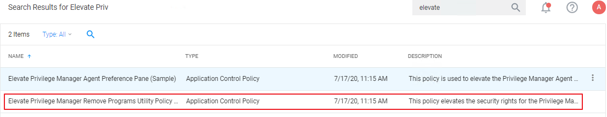
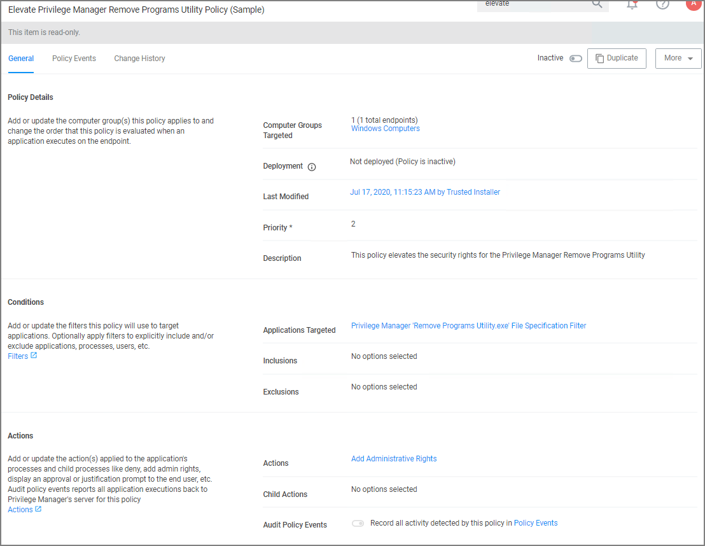
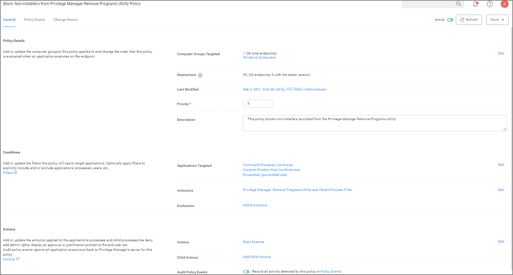

[title]: # (Remove Programs Utility Policy)
[tags]: # (elevate)
[priority]: # (5)
[display]: # (none)

<!--
# Elevating the Privilege Manager Remove Programs Utility Policy

If standard users need to be able to use the Remove Program Utility the __Elevate Privilege Manager Remove Programs Utility Policy__ needs to be elevated.

1. Search for __Elevate Privilege Manager Remove Programs Utility Policy__.

   
1. Click on the policy link __Elevate Privilege Manager Remove Programs Utility Policy__.

   

   The default policy is read-only. If you need to customize any policy settings like the Conditions, Actions (like an approval action to run it), Policy Enforcement, or the Deployment, create a __Duplicate__ to make edits.
1. Set the __Inactive__ switch to __Active__.

Refer to [Using the Remove Programs Utility](../../../../how-to/maintenance/remove-programs-utility.md) for further details about the utility set-up and functionality.

## Blocking NON Installer Child Processes from Running

When the __Elevate Privilege Manager Remove Program Utility Policy__ is active on a system, non installer child processes should be blocked from being executed.

Import the [block-non-installer-child-processes XML file](scripts/block-non-installer-child-processes.xml) to add the policy to your instance.

### Policy Verification

1. Open the HKEY_CURRENT_USER\SOFTWARE\Microsoft\Windows\CurrentVersion\Uninstall registry and find an installer to change, for example Fiddler2.
1. Rename the UninstallString to "UninstallString2".
1. Create a new UninstallString registry string with the value "cmd.exe" or "powershell.exe".
1. Open the Remove Programs Utility
1. Select the installer you edited above, in this example Fiddler 2.
1. Click the uninstall button.
1. Check the agent logs to verify that the installer is blocked.
-->