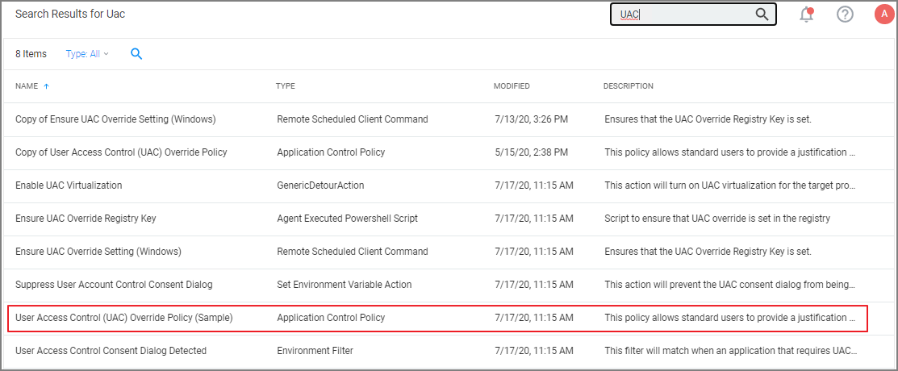
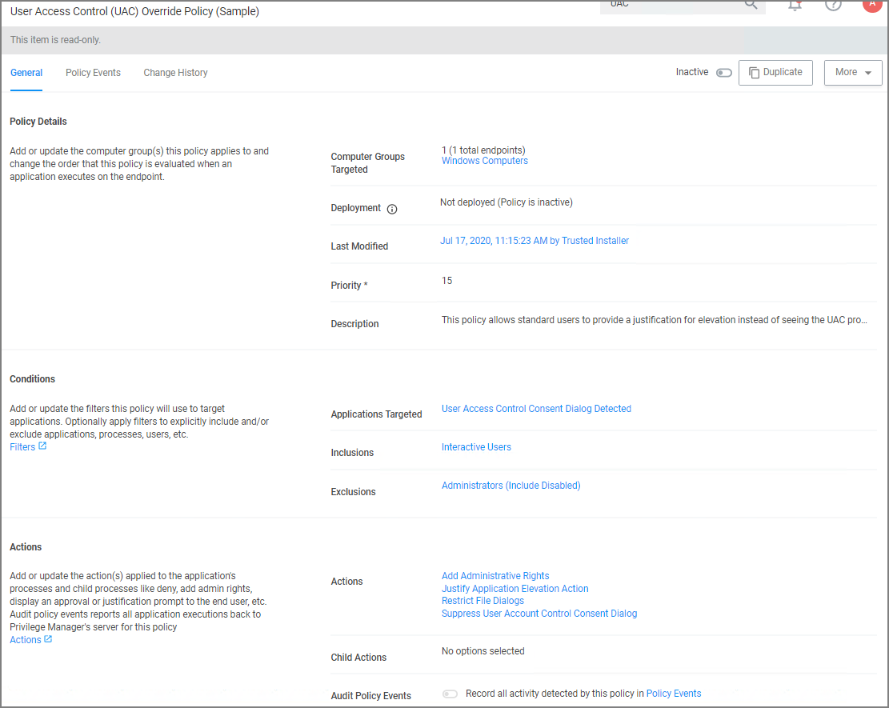

[title]: # (UAC Override Policy)
[tags]: # (elevate)
[priority]: # (4)
# UAC Override Policy

By creating a User Access Control (UAC) Override Policy you can override UAC prompts for end-users. You can create custom messages that require users to submit a reason for requesting administrator rights, which replace UAC prompts for credentials.

## Using the Default Policy

1. Under __Computer Groups__ search for __User Access Control (UAC) Override Policy (Sample)__.

   

   The UAC Override Policy is a read-only item, that allows standard user to provide a justification for elevation instead of seeing the UAC prompt.

   
1. To edit this policy, you need to make a copy and assign a different name, to do so click  __Duplicate__.
1. Under __Computer Groups Targeted__ you may change the targeted endpoints.
1. Under __Conditions__ you edit the

   * Application Targets
   * Inclusion Filters
   * Exclusion Filters
1. Under __Actions__ you can edit

   * the actually actions for the policy like
     * the Justify Application Elevation Action
     * the Add Administrative Rights Action
     * the Suppress User Account Control Consent Dialog Action
   * if you want to Audit Policy Events (as a learning mode/monitoring feature)
   * you can add Child Actions.
1. Click __Save Changes__, if you created a copy and made edits.
1. Set the __Inactive__ switch to __Active__.

By default the UAC Override Policy has a priority setting of 15.
