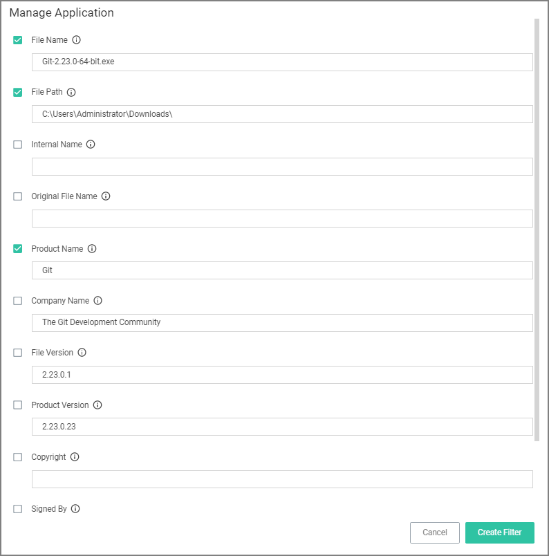

[title]: # (User Justification)
[tags]: # (elevate)
[priority]: # (4)
# User Justification Required to Run

This policy type requires a user to provide a justification for why they need to run an application before elevating with administrator privileges. User Justification refers to the policy action. Since Conditions and Actions are independent, this action can be applied to any condition. In this use case, we will simply apply this action to a specific application.

1. Using the Policy Wizard, create a controlling policy that elevates application execution on endpoints.
1. Select __Require Justification__, and click __Next Step__.
1. Select what file type to target, for this example select __Executable__, and click __Next Step__.
1. Choose your target, for this example __File Upload__.
1. Click __Choose File__ and select a file to upload.
1. Click __Upload File__.
1. On the __Manage Application__ page select all the identifying factors you want the filter to target.

   
1. Click __Create Filter__.
1. Click __Next Step__.
1. Name your policy and add a description, click __Create Policy__.

   
1. Set the __Inactive__ switch to __Active__.

The user will see a justification message as a result of the policy.
When the user adds a reason, they will then click the __Continue__ button and the application is allowed to execute.

>**Note**: You can then view a user’s provided reasons in Privilege Manager under __Reports | Application Justification Summary Details Report__.
