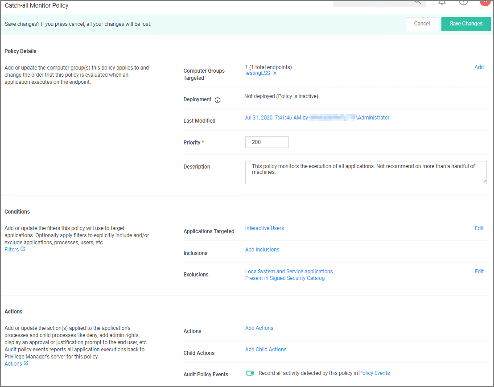
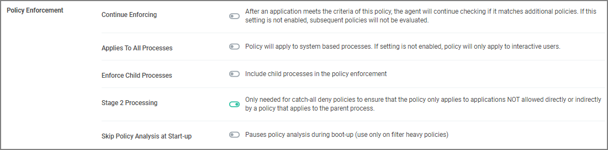

[title]: # (Catch-All Policy)
[tags]: # (monitor)
[priority]: # (4501)
# Catch-All Policy

A useful Learning Mode Policy to set up in Production environments is called a Catch-All Policy. This type of policy will gather information on any executables in your environment that are not satisfied by other Privilege Manager policies.

1. Navigate to __ADMIN | Policies__ and click __Add New Policy__.
1. From Policy Type drop-down select __Show All Templates__.
1. For POC and testing environments from Template Type drop-down, select __Other: Empty Policy Targeting Test Computers__.
1. Name the policy _Catch-All Policy_, and add a description.
1. Click __Create__.
1. Click __Edit__.

   This policy is supposed to catch all processes not caught by any defined policy above it, change to priority to the highest possible value (100).

   
1. Select the __Enable__ checkbox.
1. Customize the policies Conditions, Actions, and Policy Enforcement. Refer to the following screenshots for example configuration of the the policy:

   

   

   
1. Click __Save__.