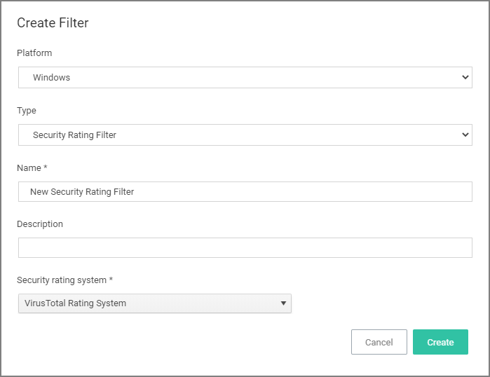
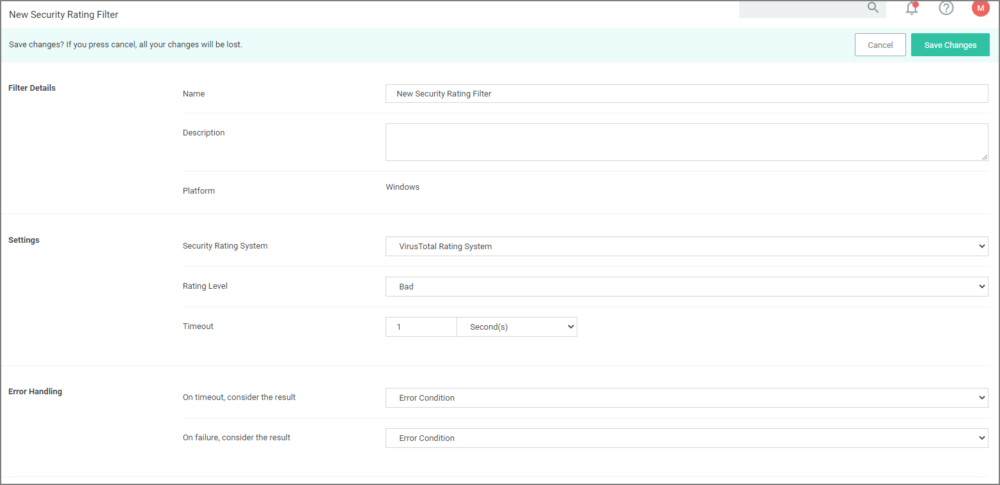
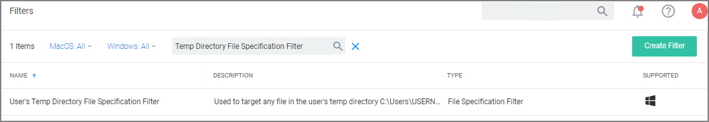
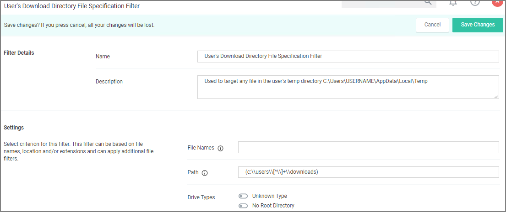
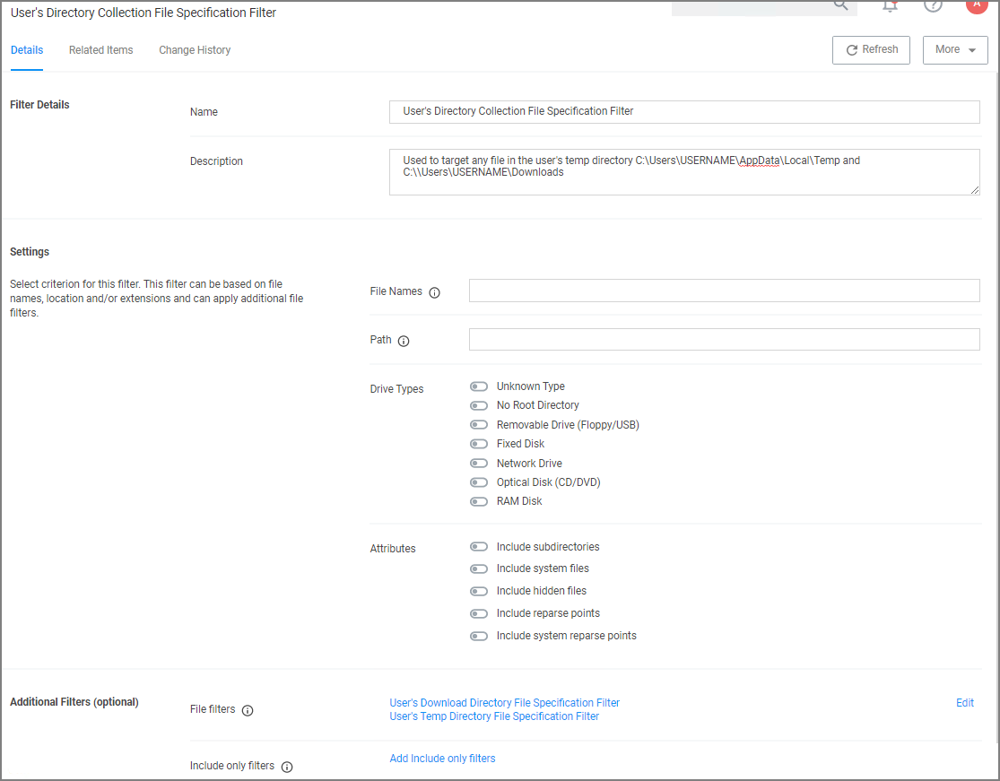
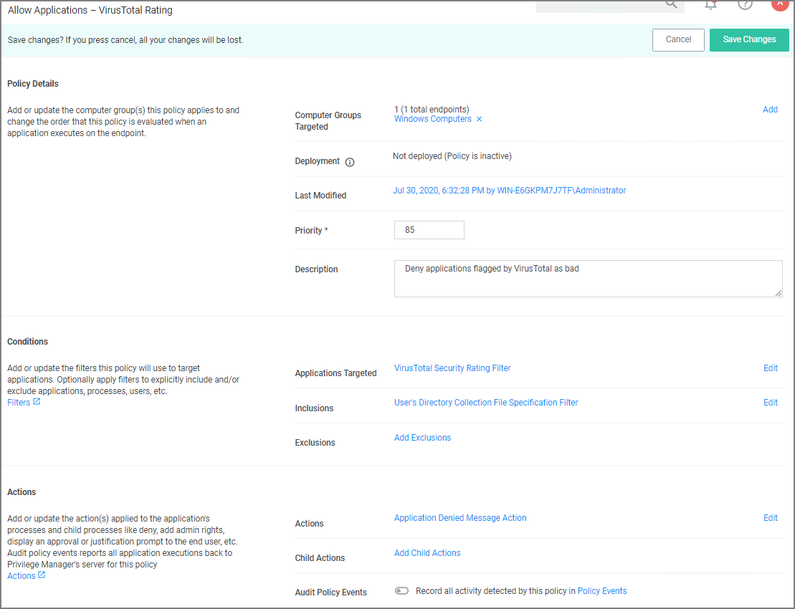

[title]: # (Reputation Checking)
[tags]: # (monitoring)
[priority]: # (5)
# Reputation Checking

Privilege Manager analyzes applications in real-time.  This unique feature allows for reputation analysis of any unknown applications that will mitigate endpoint attacks from Ransomware, Zero-day attacks, Drive-by Downloads, and other unknown malicious software.

The monitor approach used here is that all applications that meet a general condition (i.e. executed from a specific directory or directories) will be sent to VirusTotal for a reputation check. For this use case we will perform real-time reputation analysis of unknown applications using VirusTotal.

First, you will need to integrate Privilege Manager and VirusTotal by following the Integration steps listed in the [Setting Up VirusTotal for Reputation Checking](../../../../admin/config/foreign-systems/third-party/set-up-virustotal.md) topic. That section will walk you how to do the following:

1. Configure VirusTotal Ratings Provider
2. Install VirusTotal in Privilege Manager
3. Create a Security Rating Filter for VirusTotal

For information and setup steps to configure reputation checking using Cylance, see the [Cylance Integration](../../../../admin/config/foreign-systems/third-party/set-up-cylance.md) topic.

## Creating Security Rating Filter

Next you have to create a Security Rating Filter for VirusTotal. Follow these steps:

1. Navigate to __Admin | Filters__, the click __Create Filter__.
1. Select a platform, then __Security Rating Filter__ as a Filter Type. Name the policy and add a description.
1. From the __Security Rating System__ drop-down, select __Virus Total Rating System__.

   
1. Click __Create__.
1. Under __Settings__, change the __Rating Level__ drop-down to specify __Bad__.

   

   The rating level trigger is supposed to match what you want to accomplish with the policy that will be using this filter. A rating level of Bad should be used for Deny policies, and Clean for applications or files that are part of the safe list. A rating level of Suspect can be used in justification and/or learning/discovery policies.
1. Click __Save Changes__.

## Creating User's Downloads Location, Temp Dir, and Collection Filters

1. Navigate to __Admin | Filters__ and search for __Temp Directory File Specification Filter__.

   
1. Select the filter __User's Temp Directory File Specifications Filter__, click __Duplicate__.
1. Name the new filter _User's Download Directory File Specification Filter_, provide a description and click __Create__.
1. Change the regular expression in the Path filed to the following: (c:\\users\\[^\\]+\\downloads):

   
1. Click __Save Changes__.
1. Finally, combine the 2 filters into a single filter to target both directories:
   1. Click __More | Duplicate__.
   1. Enter the name for the new filter _User’s Directory Collection File Specification Filter_, click __Create__.
   1. Clear the data in the Path field.
   1. Under Additional Filters, click __Add File filters__.
   1. Search for __User’s Download__ and add the __User’s Downloads Directory File Specification Filter__.
   1. Search for __User’s Temp Directory__ and add __User’s Temp Directory File Specification Filter__ (this is a default filter).
   1. Click __Update__.

      
   1. Click __Save Changes__.

## Creating a Policy

Next you have to create a Policy and add the filters for VirusTotal:

1. Using the Policy Wizard, create a controlling policy that allows application execution on endpoints.
1. Select __Existing Filter__.
1. Search for add the previously created __VirusTotal Security Rating Filter__.
1. Click __Update__
1. Name the policy __Allow Applications – VirusTotal Rating__, and add a description _Deny applications flagged by VirusTotal as bad_, click __Create Policy__.
1. Click __Add Inclusions__, search for and add the __User’s Directory Collection File Specification Filter__.
1. Click __Update__

      
1. Click __Save Changes__.
1. Set the __Inactive__ switch to __Active__.

>**Note**:
>This policy will send any application run from the user’s Downloads or Temp directory to VirusTotal for a reputation check in real-time. If the application is graded with Bad from VirusTotal, the application will be denied.

## Viewing a File Security Ratings Report

To view a File Security Ratings report, search for __File Security Rating Details Report__. To see details of the applications in the report, click on the file name in the File column.
