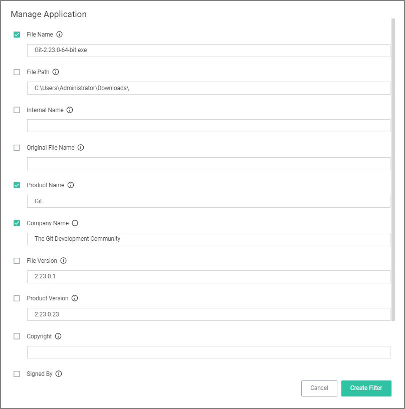
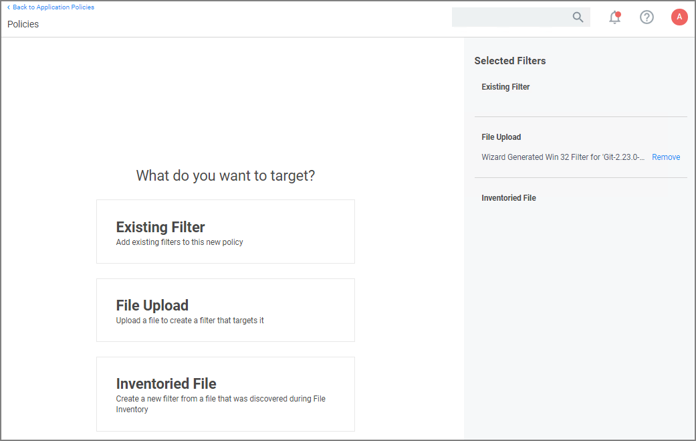
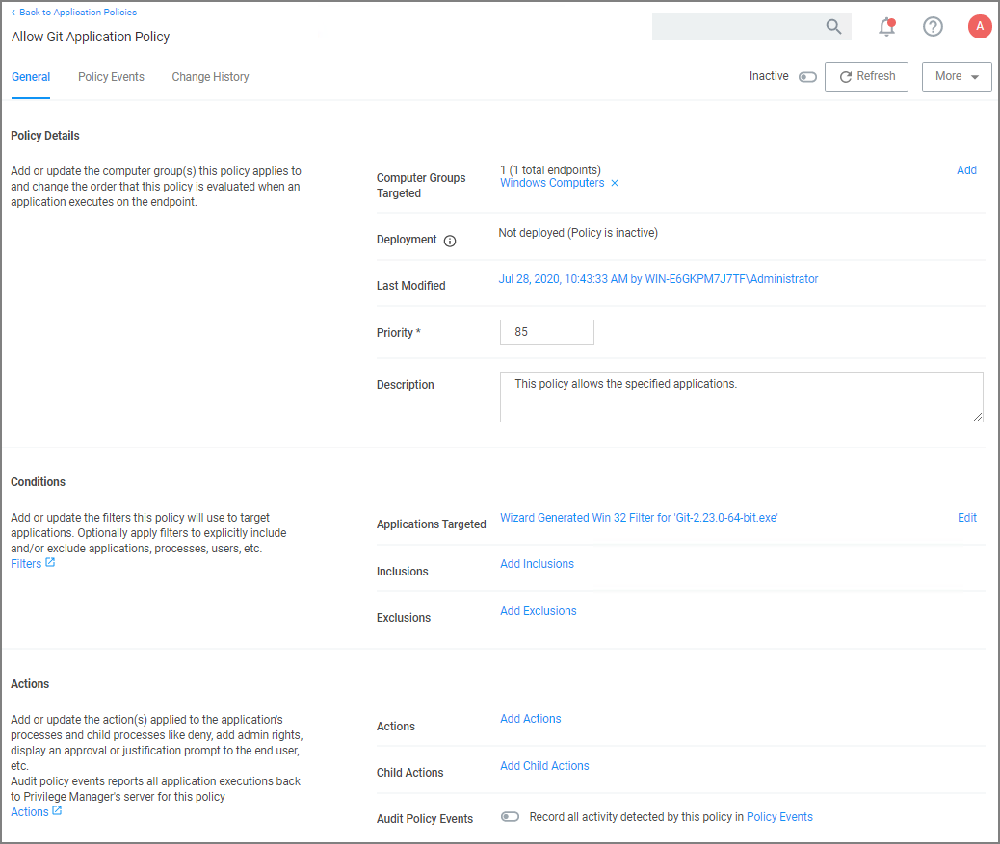

[title]: # (Git App with File Upload)
[tags]: # (allow list)
[priority]: # (2)
# Git App with File Upload

In evaluation and production installations, proactive introduction of executables into Privilege Manager can be accomplished with a feature called File Upload.  File Upload allows you to quickly introduce a file, then create a Filter and/or a Policy to govern the application. As example, here's how to introduce the Git Installer into Privilege Manager and use the file information to allow list Git applications.

For this use-case you will need to have access to downloaded Git installer files.

1. Using the Policy Wizard, create a controlling policy that allows application execution on endpoints.
1. Select what process types you want the policy to allow, for this example it's __Specific Applications__.
1. Choose your target, for this example __File Upload__.
1. Click __Choose File__ and select a file to upload.
1. Click __Upload File__.
1. On the __Manage Application__ page select all the identifying factors you want the filter to target.

   
1. Click __Create Filter__.

   
1. Click __Next Step__.
1. Name your policy and add a description, click __Create Policy__.

   
1. Set the __Inactive__ switch to __Active__.
