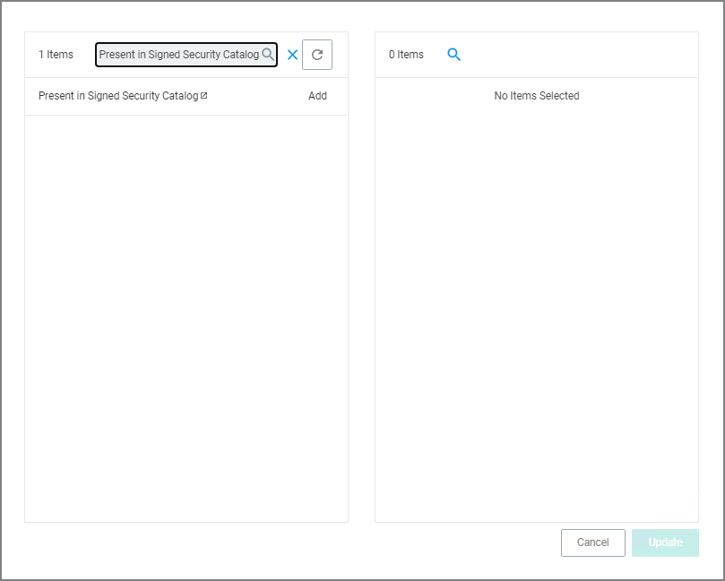
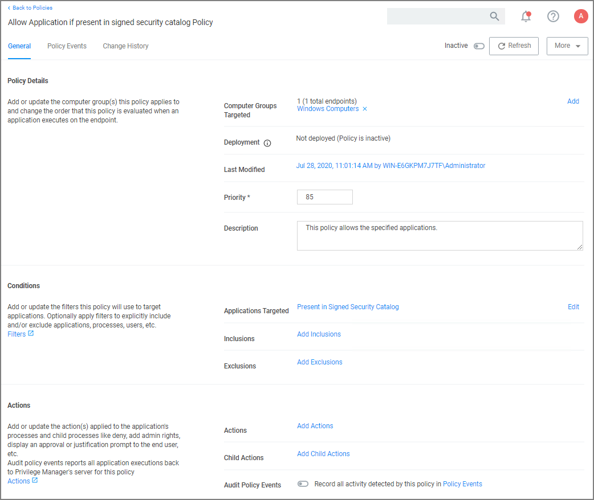

[title]: # (MS Security Catalog)
[tags]: # (allow list)
[priority]: # (2)
# MS Security Catalog

This policy uses a built-in filter to allow list Microsoft's Signed Security Catalog. This filter is often used to dynamically allow to update items from Microsoft. Allow listing these executables clears them so they are not effected by any other policy, (i.e. they are allowed to run).

1. Using the Policy Wizard, create a controlling policy that allows application execution on endpoints.
1. Select what process types you want the policy to allow, for this example it's __Specific Applications__.
1. Choose your target, for this example __Existing Filter__.
1. Search for and __Add__ the __Present in Signed Security Catalog__ filter.

   
1. Click __Update__.
1. Click __Next Step__.
1. Name your policy and add a description, click __Create Policy__.

   
1. Set the __Inactive__ switch to __Active__.

There is no need to add actions under the Actions tab, because these applications are allow listed, they are allowed to run with default permissions.
