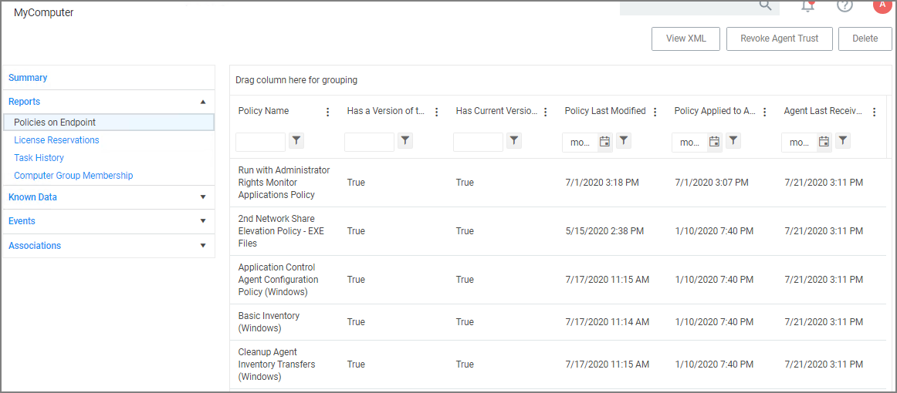

[title]: # (Agent Policy State)
[tags]: # (agent)
[priority]: # (2)
# Agent Policy State

These are the steps for verifying which policies were received by an agent:

1. Navigate to __Admin | Agents__ and click on __Agent Policy State__.

   
1. On the __Agent Policy State - Drilldown__ page select the computer, whose policy state you wish to examine.
1. This opens the Resource Explorer for the selected endpoint.

   
1. Open the __Reports__ section and select __Policies on Endpoint__.

   

   View the polices that the agent on the endpoint has received. The Filter on the __Policy Name__ column allows you to search for specific policies.

The column details are: 

* __Has a Version of the Policy__ and __Has Current Version of the Policy__ provide information about the version of the policy.
* __Policy Last Modified__ informs when a policy was last changed.
* __Policy Applied to Agent__ specifies when the policy was first received by the agent.
* __Agent Last Received Policies__ informs when the agent last contacted the server to request updates.
