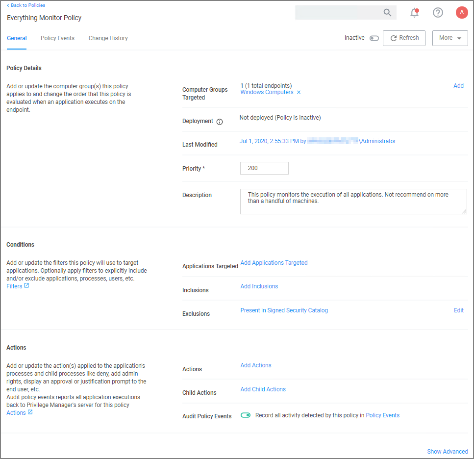
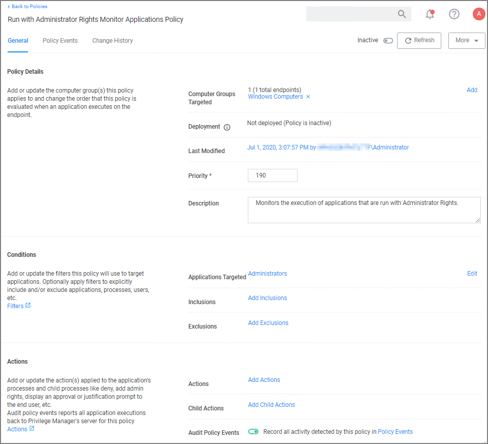
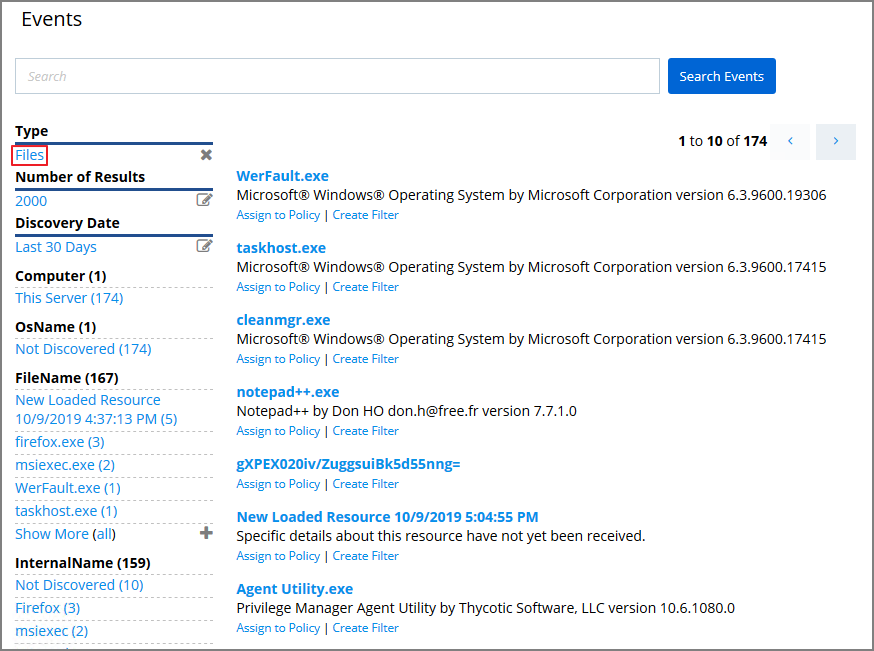

[title]: # (Learning Mode Policies)
[tags]: # (event discovery, policy feedback)
[priority]: # (3)
# Learning Mode Policies

At the most basic level, a Learning Mode Policy is a policy that takes no action, it exists only to gather data and you can use the data it gathers for audits or for assigning actions to application events retrospectively. For trials and Proof of Concept (PoC) environments these can be pointed at specific endpoints in order to learn about events that are already happening, or in order to test-run specific applications that you want to quickly introduce into Privilege Manager.

Any Learning Mode Policy will have the __Audit Policy Events__ set to active under the Actions section.

>**Note**:
>Audit Policy Events is generally inactive in production environments outside of specific auditing or data-collecting initiatives due to the large amount of data these policies can gather.

## Creating a Monitoring Policy

Use the policy wizard to create a monitoring policy for the learning mode phase on your instance.

1. Under your Computer Group navigate to Application Policies, click __Create Policy__.
1. On the __What type of policy?__ page select Monitoring and click __Next Step__.
1. On the __What processes do you want this policy to monitor in this computer group?__ page select __Everything__ and click __Next Step__.
1. Enter a new name for the policy and click __Create Policy__.

>**Note**: It is not recommended to run be active on more than a handful of machines.

## Discover Applications that Require Administrator Rights

The most influential applications are those that require administrator credentials to run. For setting up endpoints that are organized by Least Privilege, you can use a Learning Mode Policy to discover all events requiring Administrator rights.

Use the policy wizard to create a monitoring policy for the learning mode phase on your instance.

1. Under your Computer Group navigate to Application Policies, click __Create Policy__.
1. On the __What type of policy?__ page select Monitoring and click __Next Step__.
1. On the __What processes do you want this policy to monitor in this computer group?__ page select __Applications Run as Admin__ and click __Next Step__.
1. Enter a new name for the policy and click __Create Policy__.

<!-- ## Discover All Events on Test Endpoints

Another type of Learning Mode Policy will discover all events on targeted machines regardless of whether the application requires Administrator Rights. This policy is used in test environments to quickly target policies at untrusted/unwanted applications, but is not recommended for production settings.

1. From the __Event Discovery | Configuration__ screen select __Edit__.
1. Select the checkboxes for Log all Windows/MacOS activity from Application Compatibility Testing Computers.
1. Simply checking these boxes will not activate this policy. To begin collecting data you must first specify target computers. To do so, click the text __Application Compatibility Testing Computers__.
1. Under the Filter Definition tab, click __Edit__, then __Edit Resources to Include__.
1. Here you can add specific __Resource Filters__, or target machines that your new policies should run on.

   
1. When target computers are selected, click __Close__, then __Save__. -->

## View Policy Results

To view all feedback, or event, sent from your existing policies with the Send Policy Feedback activity checked, navigate to __Policy Events__. Events will be listed in the main section and on the left sidebar you can scope results for certain policies, computers, time frame, etc. You can use this view to assign any events to policies by clicking Assign to Policy under the event listing.

## New Loaded Resource

At the beginning of your policy creation process you will see many new events labeled as __New Loaded Resource__. This is because importing files in Privilege Manager is not the same thing as discovering information about the files. Discovery of file details is done by scheduled tasks by default, but if you want to discover file details immediately, do the following:

1. Navigate to __File Inventory__.
1. Select New Loaded Resource.

   
1. Click one of the inventoried file or on a New Loaded Resource entry.
1. Click __View File__ or __Create Filter__ as your next option to use the discovered or inventoried resource.

>**Note**:
>Files may not be discovered if they have already been deleted from your system.

<!-- 
## View Files

You can also quickly glean any new files found by Privilege Manager  __Event Discovery | Files Screen__. Distinct from the Policy Events screen view, the Files page only shows files rather than displaying all events attached to current policies.

 -->
