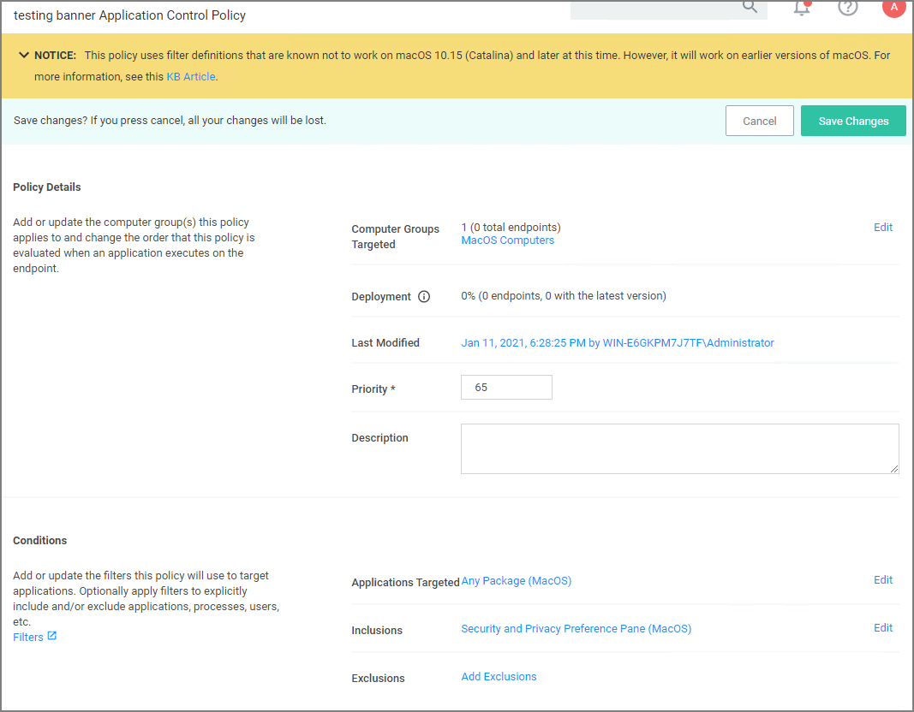

[title]: # (Error Conditions)
[tags]: # (policy;warning banner)
[priority]: # (14)
# Warning Banner indicating Filter Error Conditions in Policies

A warning banner on the top of a policy page indicates error conditions in the policy due to conflicting filters or OS version based restrictions/limitation for an applied filter.

The warning banner in the image indicates that the filter selected as an inclusion filter does not work with macOS 10.15 or later versions.

The banner is displayed for the following conditions:

* A filter has a warning banner associated due to targeting a macOS preference pane in combination with a conflicting computer group.
* A filter starts with `com.apple.preference` or the file path starts with `/System/Library/PreferencePanes/`.
* Invalid filter definitions are selected.

The banner is expandable and lists all filter definitions creating the potential conflict. Each filter definition is a hyperlink to the offending filter.

Removing the offending filters from the policy clears the banner warning.
