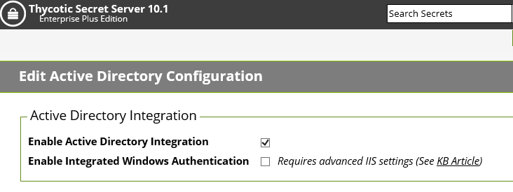

[title]: # (Google Authenticator)
[tags]: # (create,set-up)
[priority]: # (4)
# Google Authenticator 

This topic describes how to set up a Privilege Manager policy for enabling two-factor functionality with Google Authenticator.

Follow the steps described below to set up a policy for enabling two-factor functionality with Google Authenticator.

1. If you are using the Secret Server login for Privilege Manager, make sure you log in with an Active Directory credential. If you are currently using a Secret Server credential, you need to enable Active Directory Integration.

1. Once you log in with an Active Directory credential go to this URL:

   [https://[ServerName]/Tms/Account/Totp](https://[ServerName]/Tms/Account/Totp)
1. There you will see the QR Code or Secret to input into Google Authenticator in order for your user account to  authenticate on the endpoint. Each user will need to go to this URL after logging in to Secret Server and add this
QR Code to their authenticator app.  Users can NOT re-use the same authenticator code that they are using for Secret Server.
1. After you have done that with one of your user accounts, you need to import an XML file as follows:

   1. Access the topic, [XML for Challenge Response Message Actions](xml.md). It contains XML code, copy all that XML code.
   1. Go to [https://[ServerName]/Tms/PrivilegeManager/\#/item/xml/](https://[ServerName]/Tms/PrivilegeManager/#/item/xml/) 
   1. Paste the contents of the XML code (which you copied in a previous sub-step) into the text field and click the Import button.
1. You can then go to each policy for which you want to enable the two-factor prompt and add the “Challenge/Response Message Action” as an action. 

   >**Note**: It is not recommended that you do this for ALL applications that are being run.
1. The end users will then see a prompt such as shown below, when they go to launch an application which triggers that action:

   

>**NOTE**: Justification prompt messages are customizable.
