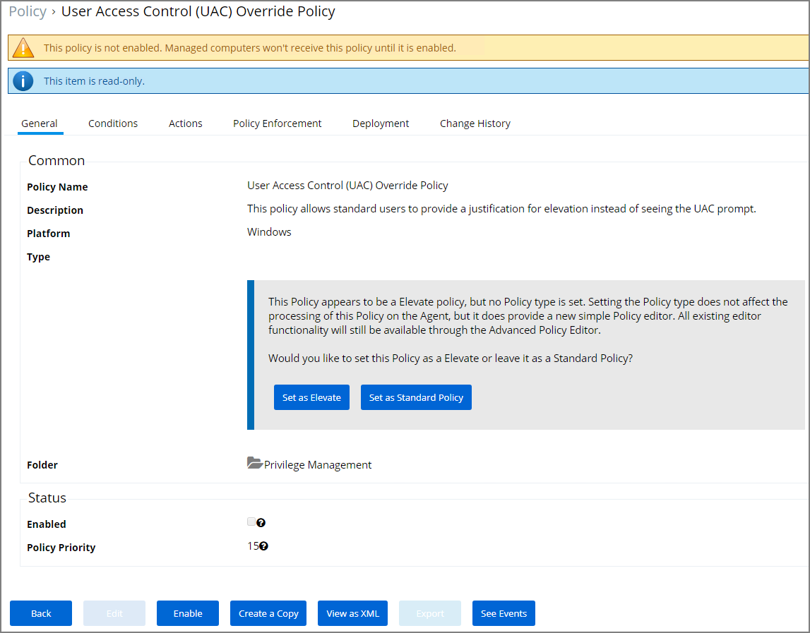
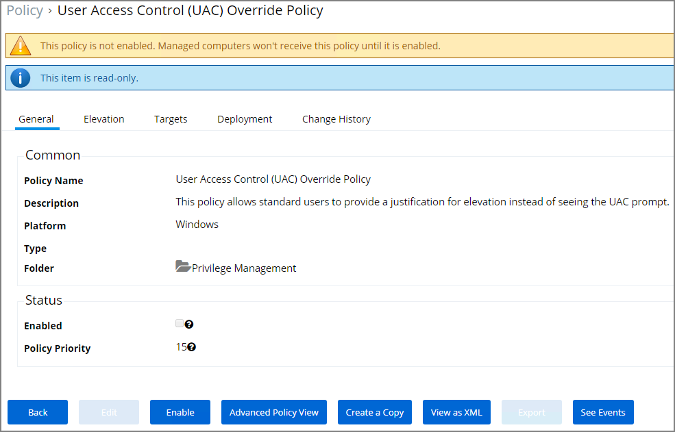
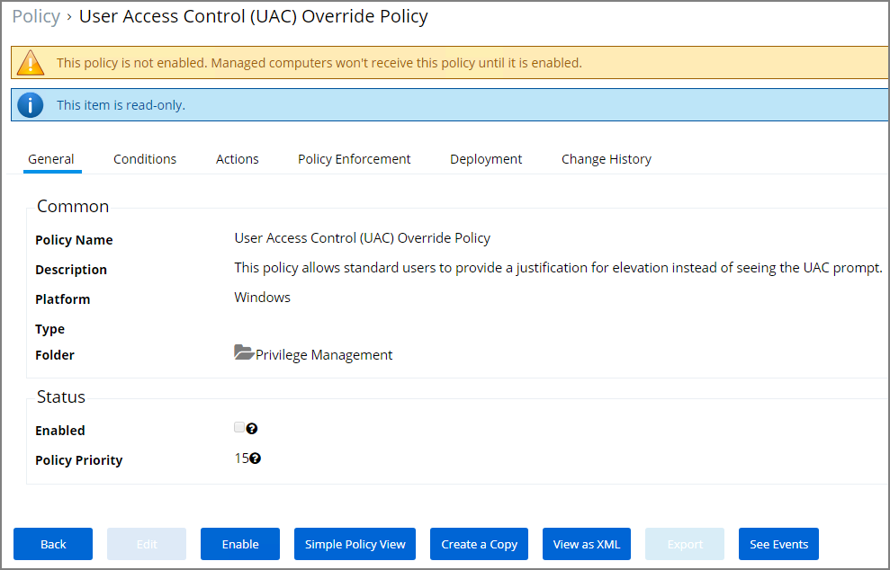
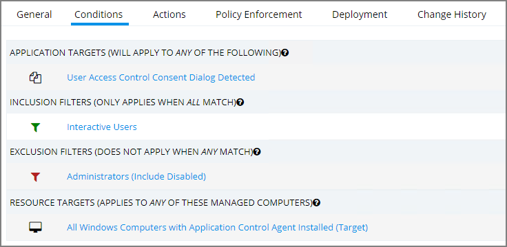

[title]: # (UAC Override Policy)
[tags]: # (elevate)
[priority]: # (4)
# UAC Override Policy

By creating a User Access Control (UAC) Override Policy you can override UAC prompts for end-users. You can create custom messages that require users to submit a reason for requesting administrator rights, which replace UAC prompts for credentials.

## Using the Default Policy

1. Navigate to __ADMIN | Policies__ and search for __User Access Control (UAC) Override Policy__.

   

   The UAC Override Policy is a read-only item.
1. Depending on how you wish to run this policy, you either select

   * __Set as Elevate__ or
   * __Set as Standard Policy__.
1. If you are in the __Simple Policy View__ indicated by only a subset of tabs showing,

   

   Switch to __Advanced Policy View__ by clicking the __Advanced Policy View__ button.

   
1. To edit this policy, you need to make a copy and assign a different name, to do so click the __Create a Copy__ button.
1. On the __Conditions__ tab you edit the

   * Application Targets
   * Inclusion Filters
   * Exclusion Filters
   * Resource Targets

   
1. On the __Actions__ tab edit

   * if you want to Send Policy Feedback (as a learning mode/monitoring feature)
   * the Justify Application Elevation Action
   * the Add Administrative Rights Action
   * the Suppress User Account Control Consent Dialog Action

   

   The checkbox __Use the same actions as the parent__ lets you establish how to apply actions to child applications.
1. Click __Save__, if you created a copy and made edits.
1. Click the __Enable__ button, to enable the policy.

By default the UAC Override Policy has a priority setting of 15.
