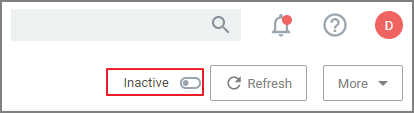
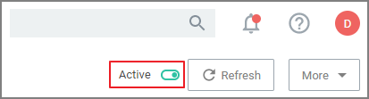
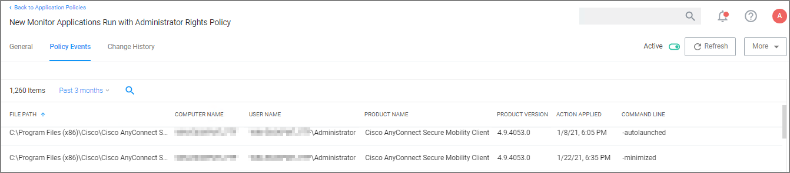
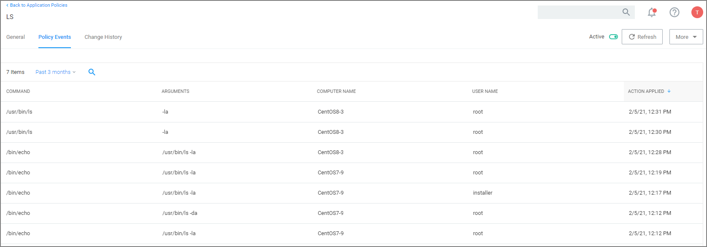
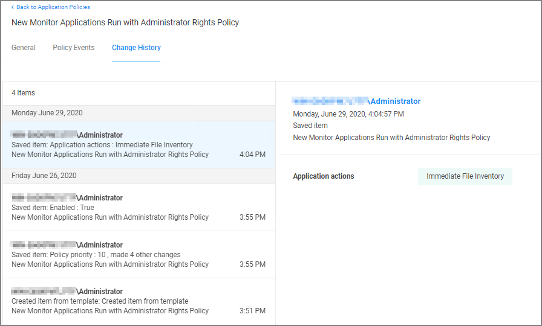

[title]: # (The Policy Page)
[tags]: # (create)
[priority]: # (12)
# What's on the Policy Page

Once a policy is created, it can be customized. The following screen capture shows a policy example that denies the execution of a specific batch file.

## Policy Activation

By default newly created policies are inactive and to activate them, the switch needs to be set to active.

   - 

## Policy Details

The Policy Details section provided information about and customization options for:

* __Computer Groups Targeted__ can be edited by either
  * deleting the current target by clicking the __x__ next to the computer group name, or
  * adding another computer group by clicking __Add__.
* __Deployment__, provides information about the deployment status at endpoints. Click the explanation point next to Deployment to run the __Resource and Collection Targeting Update Task__.
* __Last Modified__ provided a quick history on the last edit to the policy, time and by whom.
* __Priority__, modify the priority if needed, specific deny policies get lower priority values than monitor, allow, or elevate policies.

## Conditions

Under Conditions edit the

* Applications Targeted,
* Inclusions, and
* Exclusions.

## Actions

Under Actions edit which message action to use, if child actions are applicable, and if you wish to audit all activities this policy is detecting.

* Actions
* Add Child Actions
* Audit Policy Events

### Audit Policy Events

All activity identified on a policy can be recorded by using the Audit Policy Events switch. This setting is automatically enabled for all monitoring policies. It can be activated on demand for controlling policies. Once selected, a confirmation message appears advising users that this functionality should only be enabled for a limited time on a selected number of endpoints.

For Unix/Linux endpoints the `pmagent --privman --refreshpolicies` command needs to run, to update the policy on the endpoint.

## Show Advanced

Clicking __Show Advanced__, provides access to setting Policy Enforcement options, like:

* Continue Enforcing
* Applies to All Processes
* Enforce Child Processes
* Stage 2 Processing
* Skip Policy Analysis at Start-up.

Refer to [Policy Enforcement](stage-two.md) for further details.

## Policy Events Tab

The Policy Events tab lists all events that were discovered with this specific policy.

The Policy Events page provides the

* File Path
* Computer Name
* User Name
* Product Name
* Product Version
* Action Applied
* Command Line

information for the active application control policy creating the events.

### Unix/Linux Policy Events Tab

The Policy Events page for Unix/Linux shows a subset of the information available for macOS/Windows systems on this page.

## Change History Tab

The Change History tab provides insight into any change events for the specific policy.

