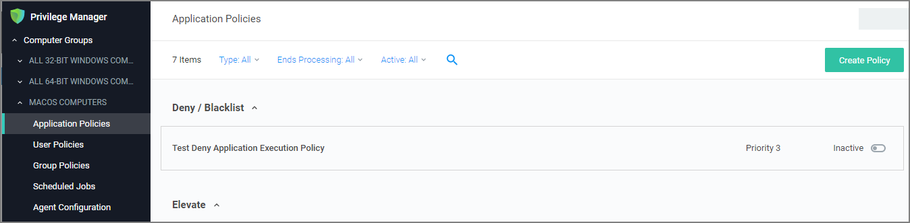
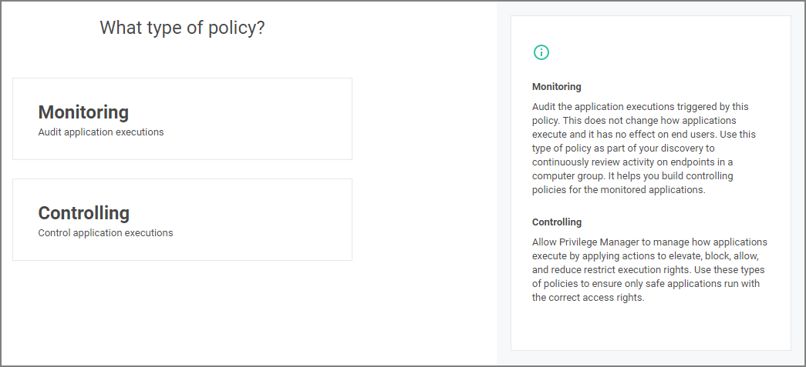
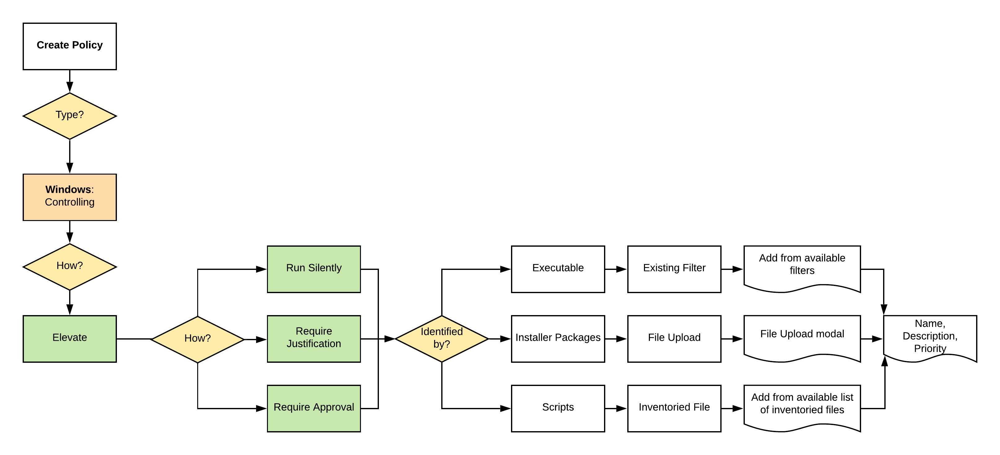

[title]: # (Controlling: Elevate Windows)
[tags]: # (create)
[priority]: # (13)
# Creating a Controlling Elevation Policy for Windows

1. For any of your Computer Groups navigate to __Application Policies__.

   
1. Click __Create Policy__.

   

   Make you selection and click __Next__ to get to the next wizard page.

   For the steps through the wizard follow these decision points:

   
1. After assigning a name, description and verifying the priority number, click __Create Policy__.

While in the wizard you can navigate back to previous pages via the __Previous Step__ link to select another path. However, any __Previous Step__ navigation clears selected options on accessed wizard pages.

The wizard provides on page help explaining the different options available to the user.