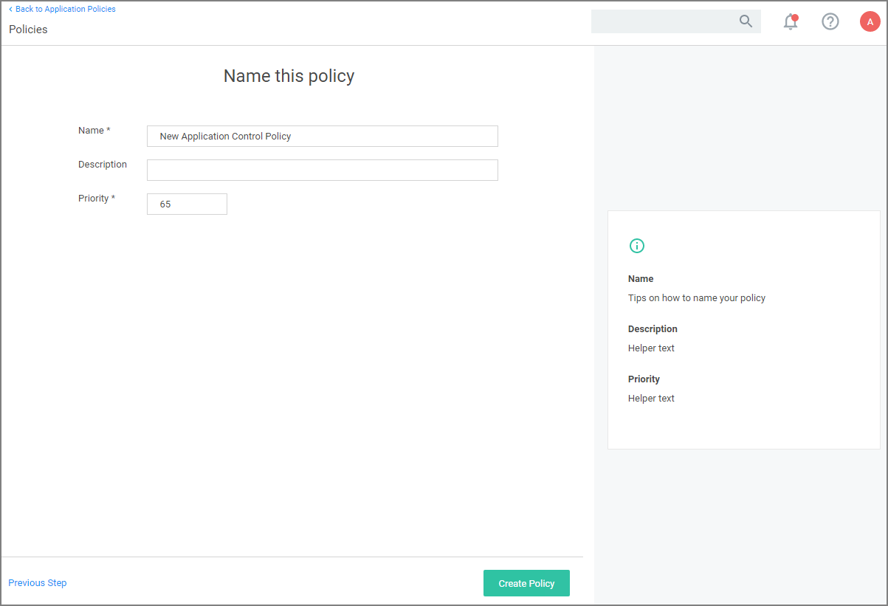

[title]: # (Policy Wizard)
[tags]: # (create)
[priority]: # (11)
# Using the Policy Wizard

Privilege Manager 10.8 is introducing the Policy Wizard for an easy and guided creation of new policies.

1. For any of your Computer Groups navigate to __Application Policies__.

   
1. Click __Create Policy__.

   

   Make your selection and click __Next__ to get to the next wizard page.

   For the steps through the wizard, follow these decision points references per OS:

   * [Monitoring Policy Diagram](monitoring.md)
   * macOS:
     * [Controlling Allow Diagram](controlling-allow-macOS.md)
     * [Controlling Block Diagram](controlling-block-macOS.md)
     * [Controlling Elevate Diagram](controlling-elevate-macOS.md)
   * Windows
     * [Controlling Allow Diagram](controlling-allow-win.md)
     * [Controlling Block Diagram](controlling-block-win.md)
     * [Controlling Elevate Diagram](controlling-elevate-win.md)
     * [Controlling Restrict Diagram](controlling-restrict-win.md)
1. After assigning a name, description and verifying the priority number, click __Create Policy__.

While in the wizard you can navigate back to previous pages via the __Previous Step__ link to select another path. However, any __Previous Step__ navigation clears selected options on accessed wizard pages.

The wizard provides on page help explaining the different options available to the user.

## Using a Blank Policy

It is possible to create a new policy based on a blank template. On the first page of the Policy Wizard, you can find a link to __Skip the wizard__ at the bottom of the page.

Click the link to open a blank policy and build the policy out manually.

