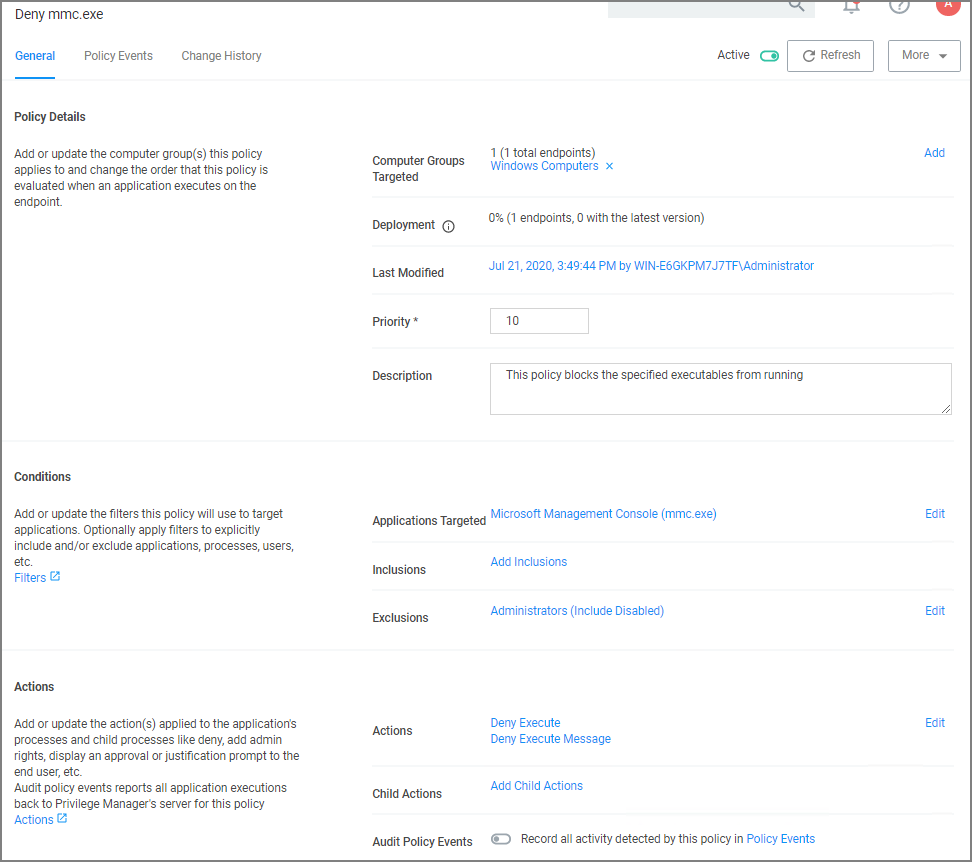
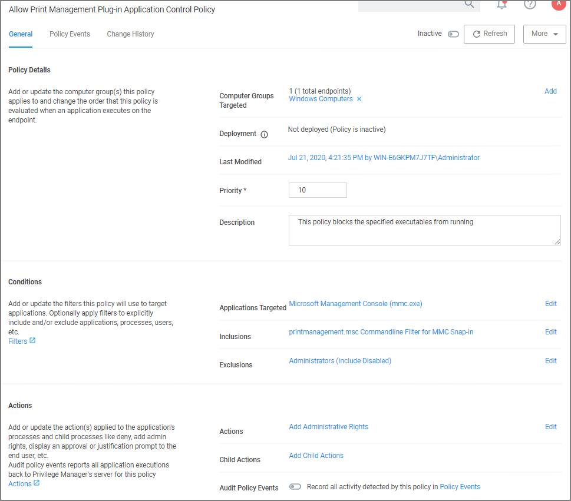

[title]: # (Priority)
[tags]: # (policy)
[priority]: # (5)
# Priority

In Privilege Manager your Policies are evaluated in a certain order for each application that runs. It is important to have an awareness of all policies that are defined and the order in which they are called by the agent. If one policy blocks an application and ends execution before a second policy that was intended to elevate privileges, then only the block will occur.

The Policy Priority setting can be found on the Policies main screen in the left column. By default, policies are ordered according to their priority. You can edit this setting under the General tab after clicking into a policy.

## Why Policy Priority Matters

To illustrate the way policies are applied in order, this use case will define two policies to 

* block MMC.EXE, but
* allow a specific MMC Snap-in.

### Deny MMC.EXE Policy setup

1. We will create a policy at with a default priority level of 10.  This policy will block the execution of MMC.EXE.

   Privilege Manager provides a filter to identify the executable mmc.exe. This can be used in this policy to block mmc.exe. Search for mmc.exe from the main screen search tool. Select the filter named Microsoft Management Console (mmc.exe). Review how the Filter is setup. Note that both File Name and File Path parameters are used.
2. Create the deny mmc.exe policy.

   1. Under your __Computer Group__ select __Application Policies__.
   1. Click __Create Policy__.
   1. Select __Controlling__ and click __Next Step__.
   1. Select __Block__ and click __Next Step__.
   1. Select __Block Silently__ and click __Next Step__.
   1. Select __Executables__ and click __Next Step__.
   1. Select __Existing Filter__.
   1. Search for __mmc.exe__.
   1. Next to __Microsoft Management Console (mmc.exe)__ click Add.
   1. Click __Update__.
   1. Click __Next Step__.
   1. Set the __Inactive__ switch to __Active__.
   1. Click __Add Exclusion__ to set an exception filter to not have this policy apply to Administrators.
   1. Search for the __Administrators (Include Disabled)__ filter.
   1. Click __Add__.
   1. Click __Update__
   1. Click __Save Changes__.

   

The policy will now be listed on the Application Policies page under the deny group. Once the policy is delivered to the endpoint agent, mmc.exe will be denied execution for all users without administrator credentials on all target computers. See details on how to deliver policies to the endpoint in the [Sending Policies to Endpoints](ac-policy-endpoints.md) topic.

Once the policy is delivered to the endpoint, test running mmc.exe to see the results.
  
## Allow specific MMC Snap-in

Next, we will create a policy that has a priority of less than 50 and it will allow specific MMC snap-ins.  Having a priority less than 50 means this policy will be examined before the Deny MMC Console Application Control Policy.

1. As a short cut to this use case, start by duplicating the policy we just created, select __More | Duplicate__
1. Name the new policy Allow Print Management Plug-in Application Control Policy.
1. Click __Create__
1. Set the __Policy Priority__ value to 9. (This level is not required, only defined for this use case.) This means that this policy will be examined prior to the policy that blocks the mmc console. If the conditions are met, printmanagement.msc will run with elevation.
1. Under __Conditions__, click __Add Inclusions__ and search for the __printmanagement.msc Commandline Filter__.
1. Click __Add__.
1. Click __Update__. This filter will identify the mmc.exe file ONLY if the printmanagement.msc is run.
1. Under __Actions__, click __Edit__.
1. Next to __Deny Execute__ and __Deny Execute Message__, click __Remove__.
1. Search for __Add Administrative Rights__, click __Add__.
1. Click __Update__.
1. Click __Save Changes__. You will now see your two policies in your Policies List. Once this policy is delivered to the endpoint agent, printmanagement.msc will be elevated with administrative rights.

   

## Test this use case

1. Run MMC.EXE from an endpoint where the user is NOT an administrator. This MMC.EXE execution will be denied execution.
1. Run printmanagement.msc from an endpoint where the user is NOT an administrator. This MMC snap-in will run with elevation.
1. Change the Policy Priority of your “Allow Print Management Plug-in Application Control Policy” to Priority 11 rather than priority 9. Repeat the second test. When you now run printmanagement.msc, the application will be blocked despite your elevation policy. This is why it is crucial to keep the priority levels that are set for your policies in mind and adjust them to meet your intended system requirements.
