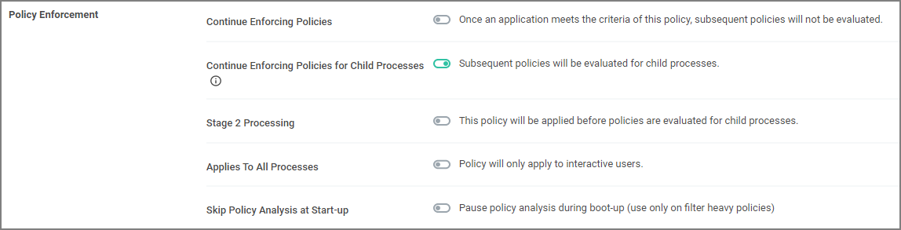

[title]: # (Policy Enforcement)
[tags]: # (stage 2 processing)
[priority]: # (6)
# Policy Enforcement

Each policy has advanced settings to address any non default Policy Enforcement options. Some of those pertain to parent-child processes and how policies are processed when they are supposed to work together in such parent-child or stage 2 processing scenarios.

## Continue Enforcing

After an application meets the criteria of this policy, the agent will continue checking if it matches additional policies. If this setting is not enabled, subsequent policies will not be evaluated.

This setting has to be active for __Stage 2 Processing__ to work as intended.

## Applies to All Processes

Policy will apply to system based processes. If this setting is not active, the policy will only apply to interactive users.

## Enforce Child Processes

Include child processes in the policy enforcement.

In certain situations this needs to be disabled, if for example you want to allow and application if it is launched by a specific process, but deny it if it's executed directly. Refer to the __Stage 2 Processing__ description.

## Stage 2 Processing

Policies are initially evaluated for the primary process. If no matches are found, policies are evaluated for a parent of that process. If, for example, you wanted to allow regedit.exe when launched by cmd.exe but block it if launched directly, you need to create

1. a policy to target and allow cmd.exe with an inactive "Enforce Child Processes" and
1. a policy that targets regedit.exe with a deny action and "Stage 2 processing" enabled.

The priority on the policy that targets regedit.exe directly needs to be higher than the priority on the allow cmd.exe policy.

## Skip Policy Analysis at Start-up

This setting can be used to pause policy analysis during boot-up, refer to [Increase Boot-up Performance](../../../troubleshooting/performance/boot-up.md) for details.
