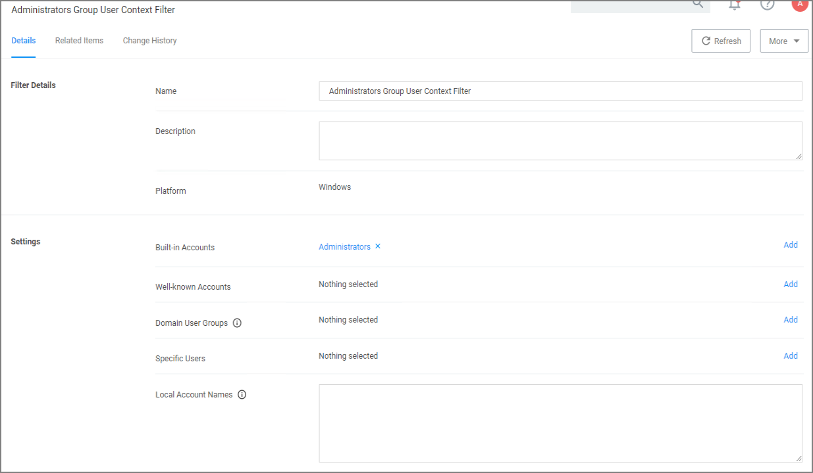
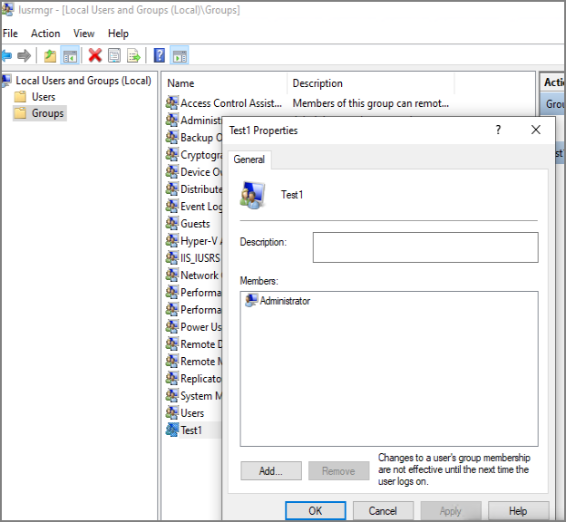
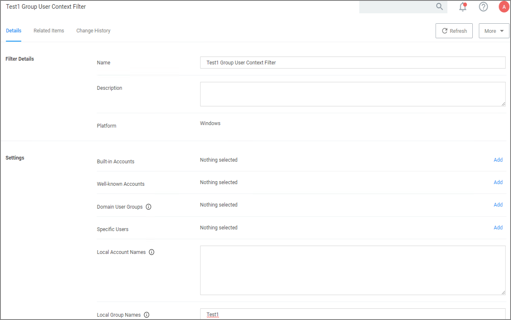

[title]: # (Exclusion of Users)
[tags]: # (dependencies)
[priority]: # (6)
# Exclusion of Users on Policies

If you wish to exclude certain users via filter from an application policy, follow these general guidelines.

## Targeting Administrators with the Exclusion

To target the Administrators group, you need to use a User Context filter and select under __Built-in Accounts__ options the __Administrators__. The out of the box __Administrators (Include Disabled)__ filter (item f9569529-62d4-49ba-aa21-b9362e1f4de6) accomplishes the same. the include disabled text just means the user is a member of the group, but the process may or may not be elevated.

Screenshot of a working filter for the Administrators Group:

## Targeting new Local Groups (not built-in)

The Local Group Names option can be used to target new local groups. New local groups are user groups that are not considered built-in system or out of the box Windows groups, such as Users, Administrators, Power Users, Backup Users, etc. 

For example, create a new local group on a local computer and call the group "Test1". Then add a user to it that you wish to exclude.

If you then configure a filter like the following the policy should correctly exclude users in the group.

