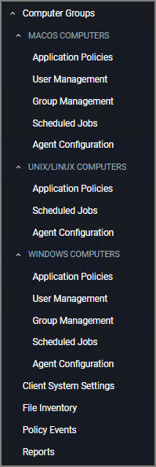

[title]: # (Computer Groups)
[tags]: # (admin,configuration)
[priority]: # (2100)
# Computer Groups

Privilege Manager's user interface provided a logical categorization via Computer Groups. The basic categorization is by operating system. Based on size of organization different business units can be targeted by separate Computer Groups established in Privilege Manager.

Each Computer Group has the following areas to specifically address

* Application Policies, which are used for Application Control policies that can be created by using the Policy Wizard.
* User Policies, which are used as part of local security and pertain to specific users.
* Groups Policies, which are also part of local security, but pertain to a group of users.
* Scheduled Jobs, these are also known as client tasks. Many are by default active.
* Agent Configuration, these are agent configuration policies allowing a global configuration of agent behavior.

