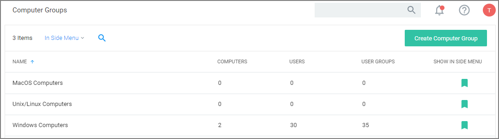

[title]: # (Computer Groups)
[tags]: # (admin,configuration)
[priority]: # (2100)
# Computer Groups

Privilege Manager's user interface provides a logical categorization via Computer Groups. The basic categorization is by operating system. Based on size of organization different business units can be targeted by separate Computer Groups established in Privilege Manager.

Each Computer Group has the following areas to specifically address

* Application Policies, which are used for [Application Control](app-control/index.md) policies that can be created by using the Policy Wizard.
* [User Policies](local-security/ls-local-users.md), which are used as part of [local security](local-security/index.md) and pertain to specific users.
* [Group Policies](local-security/ls-local-groups.md), which are also part of [local security](local-security/index.md), but pertain to a group of users.
* Scheduled Jobs, these are also known as [client tasks](../admin/tasks/client/index.md). Many are by default active.
* Agent Configuration, these are agent configuration policies allowing a global configuration of agent behavior.
  * [Windows](../agents/win/cfg/index.md)
  * [macOS](../agents/macOS/cfg/index.md)

If you have agents already installed and registered, you will see Computer Group numbers listed, divided by Privilege Manager’s two out-of-the-box computer groups:

* MacOS Computers
* Unix/Linux
* Windows Computers and

For example, in the screenshot above only 2 agent are registered with Privilege Manager. Local Security tells us that the agents are installed on a Windows computer (thus categorized in the Windows Computers group), that there are 30 local Users  and 35 User Groups on the two machines. Local Security automatically discovers this information upon every agent’s registration with Privilege Manager.

If you have Computer Groups (also called Resource Targets) already configured for Application Control in Privilege Manager, keep in mind that those groups also appear as Group Policies for a given Computer Group in the left navigation tree.
