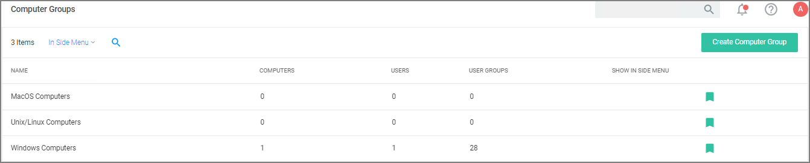

[title]: # (Computer Groups)
[tags]: # (admin,configuration)
[priority]: # (2100)
# Computer Groups

Privilege Manager's user interface provides a logical categorization via Computer Groups. The basic categorization is by operating system. Based on size of organization, different business units can be targeted by separate Computer Groups established in Privilege Manager.

Each Computer Group has the following areas to specifically address

* Application Policies, which are used for [Application Control](app-control/index.md) policies that can be created by using the Policy Wizard.
* [User Management](local-security/u-mgmt/index.md), which are used as part of [local security](local-security/index.md) and pertain to specific users.
* [Group Management](local-security/g-mgmt/index.md), which are also part of [local security](local-security/index.md), but pertain to a group of users.
* Scheduled Jobs, these are also known as [client tasks](../admin/tasks/client/index.md). Many are by default active.
* Agent Configuration, these are agent configuration policies allowing a global configuration of agent behavior.
  * [macOS](../agents/macOS/cfg/index.md)
  * [Unix/Linux](../agents/nix/cfg/index.md)
  * [Windows](../agents/win/cfg/index.md)

If you have agents already installed and registered, you will see Computer Group numbers listed, divided by Privilege Manager’s out-of-the-box computer groups:

* MacOS Computers
* Unix/Linux
* Windows Computers

For example, in the screenshot above only 1 agent is registered with Privilege Manager. Local Security tells us that the agents are installed on a Windows computer (thus categorized in the Windows Computers group), that there is 1 local User, and 28 User Groups on the machine. Local Security automatically discovers this information upon every agent’s registration with Privilege Manager.

If you have Computer Groups (also called Resource Targets) already configured for Application Control in Privilege Manager, keep in mind that those groups also appear under Group Management for a given Computer Group in the left navigation tree.

## Creating a Computer Group

To add new computer groups tailored to your organization’s environment,

1. Click __Create Computer Group__.
1. From the __Platform__ drop-down, select either macOS or Windows.
1. Enter a Name and Description for your new group.

   
1. To select the machines you want to include within this group, you must add Filter Rules that will target the appropriate machines on your organization’s network. The default filter rule begins with a rule that targets computers within the main OS Computer Group that was selected when you created the group, meaning it will target either all Windows or all Mac computers with registered agents.

   To narrow your group, click __Add Rule__.

   

   Multiple rules can be added per computer group. To change already established Computer Groups use add rules or change the resources already targeted.
   1. Specify the __Operation__ behavior, which can be:
      * Only Keep Computers in (default)
      * Include Computers in
      * Remove Computers in
   1. In the __List Type__ column select from the following options:
      * Computer List: Under __Selected Items__, use __Add__ if nothing is selected yet. Search for and select specific computers from the provided list of registered machines.
      * Collection: Under __Selected Items__, enter a collection name, e.g. collections can be “All Windows Computers” or “All Managed Computers”. You may also choose from the options in the drop-down
      * OU (Organizational Unit): Under __Selected Items__, click __Select__ and pick the OU from the populated domain tree.

        
      * Security Group: Under __Selected Items__, search for and select a security group filter.
1. Click __Save Changes__.