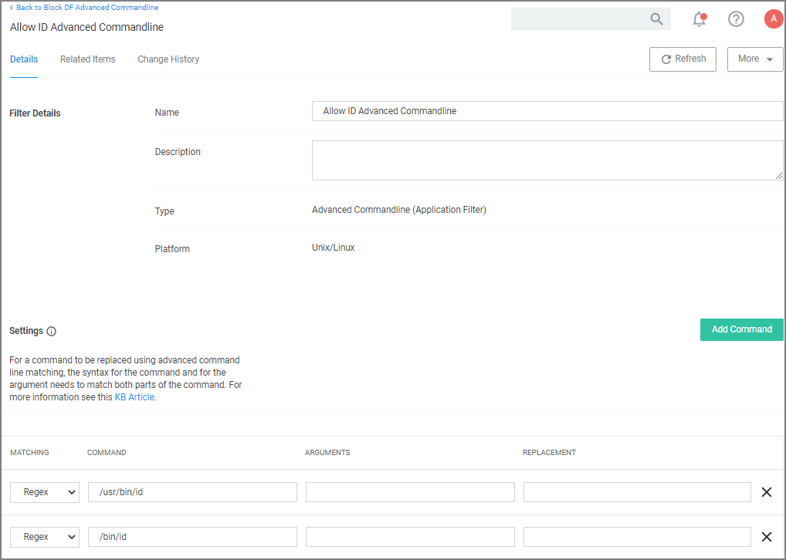
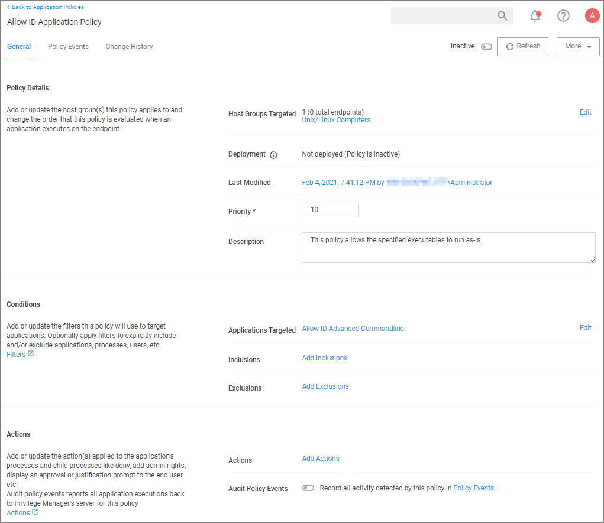

[title]: # (Allow ID)
[tags]: # (policy examples)
[priority]: # (2)

# Allow ID

1. Navigate to your Unix/Linux computer group and select Application Policies. 
1. Click __Create Policy__.
1. Using the Policy Wizard, create a controlling policy, click __Next Step__.
1. Select __Allow__, click __Next Step__.
1. Select __Executables__, click __Next Step__.
1. Select __Existing Filter__, search for select the __LS Advanded Commandline Filter__. If it doesn't exist, create it.

   
1. Click __Update__.
1. Click __Next Step__.
1. Name your policy, add a description.
1. Click __Create Policy__.

   
1. Set the __Inactive__ switch to __Active__.
1. Next to __Deployment__ click the __i__ icon and run the __Resource and Collection Targeting Update__ task.
