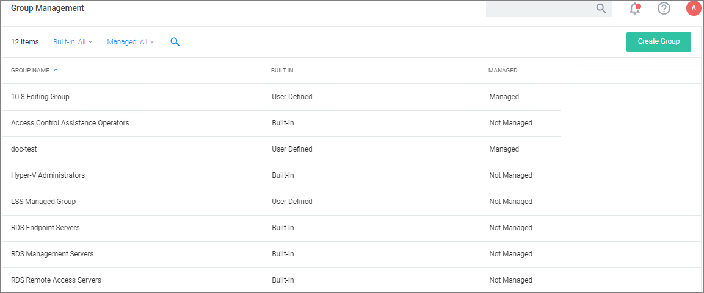
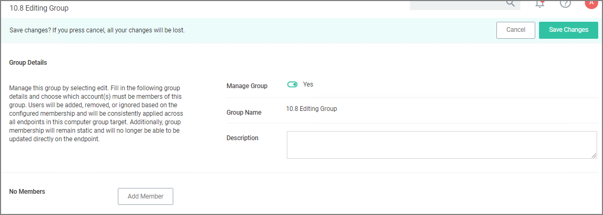
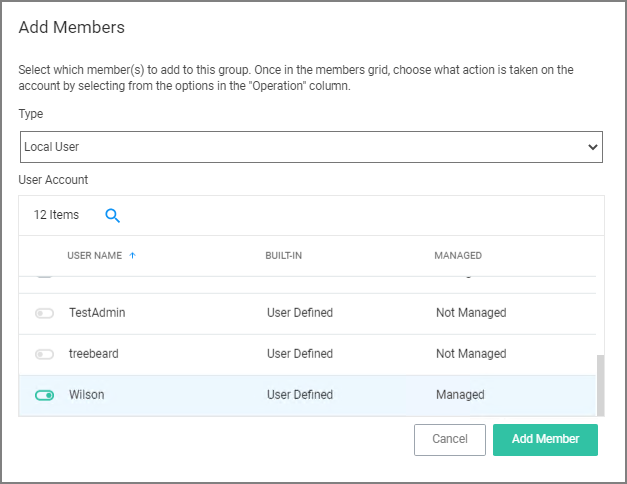
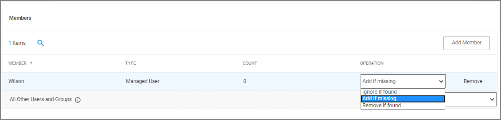
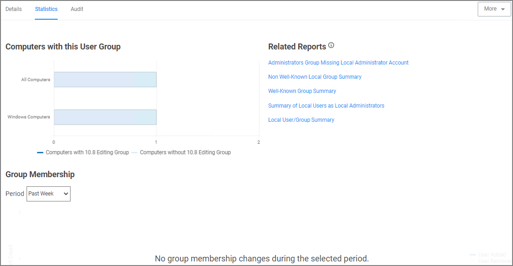

[title]: # (Group Management)
[tags]: # (local security,local groups)
[priority]: # (3)
# Group Management

Every Computer Group is divided into Groups and Users. Both __Groups__ and __Users__ in this context refer to local accounts and any Azure AD synchronized resources as part of a particular Computer Group.

The Computer Group page lists all local groups on this set of computers, and provides a high-level overview of the selected computer group based on Local Users, Local Groups, and the number of computers in the group.

Remember: when an agent registers, Local Security will automatically discover the local groups that exist on each machine.

## Create New Local Group

To create a new Group,

1. Under your Computer Group, select Group Management.
1. Click __Create Group__.
1. Enter a Name for your new group.
1. Click __Create__.

   

   The Manage Group switch is by default set to Yes.
1. Click __Add Member__.
1. From the __Type__ drop-down, select either
   * Domain User
   * Domain Group
   * Local User
1. On the __Add Member__ dialog, select from the available resource items for Domain User or Domain Group, click __Select__ to enter the search, for Local User, select the user from the list as shown in the example image below.

   
1. Click __Add Member__.

## Manage Local Groups

Managing a local group means that you determine which user accounts are in the group. In other words, if a group is being managed, the group membership will remain static and will no longer be able to be updated directly on the endpoint. Before adding users to any group, make sure you really want all those users in that particular group. Any exact group membership setting is rolled out to ALL endpoints in that computer group.

If a local group is not managed, the Manage Group checkbox is not selected. To Manage the group, click Edit from the Details tab and then check the Manage Group box. Click Save Changes, and Yes to Confirm Navigation. Changes to these settings may take up to 15 minutes to update on your endpoints.

When managing a group, existing members and any that have been added to the policy will appear in the Members table. Users will be added, removed, or ignored based on the configured membership and will be consistently applied across all endpoints in this computer group target. From the drop-down, choose which operation to perform if an account (user) is found on the endpoint. The following options can be selected:

* Ignore if found
* Add if missing
* Remove if found

Using __Remove if found__ for __All Other Users and Groups__ instates exact group membership and __Ignore if found__ cannot be used on individual accounts that are part of that group. Note that, if __exact group membership__ is used, an account that is initially listed as __Ignore if found__ switches to __Remove if found__ as part of the group membership. Individually specified accounts can be set to __Add if missing__ in those groups.  

>**Note**: Once saved, group membership is permanently defined. Updates made directly on the endpoint that break this policy will be immediately reverted.

The last row defines what action to take __on all other users and groups__. This ensures exact membership can be defined and any other users or groups can be automatically removed.

### Statistics

The __Statistics tab__ for a local group highlights some quick visual statistics and links you to relevant reports based on key factors like how many computers from your network are included in this group and whether there have been changes made to the Group’s Membership within the specified period. Click on these graphs to drill down into more details.

>**Note**: The reports in the “Related Reports” sections are scoped to only include endpoints in the current computer group. To view reports across all computers, go to the Reports section of the product.

### Audit

The __Audit tab__ is where you will find an audit record of all membership additions and deletions that have been made to your local groups.
