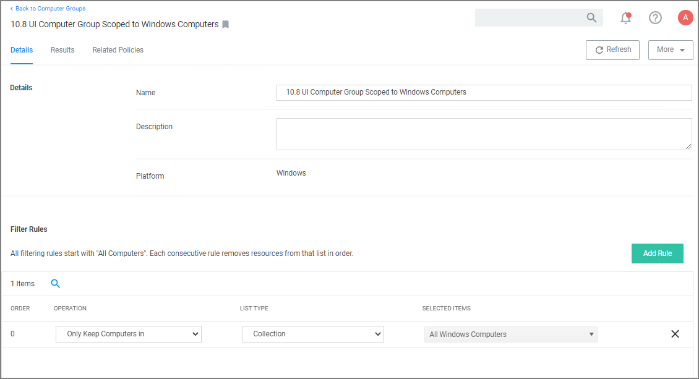
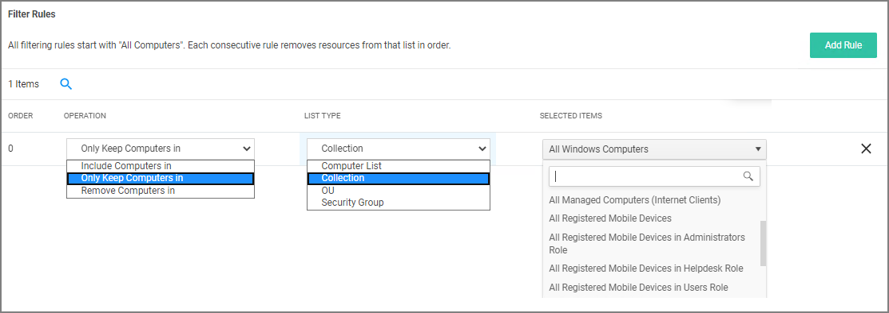
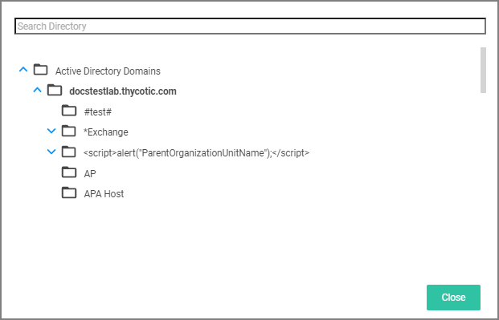

[title]: # (Create Computer Groups)
[tags]: # (Local Security,Computer Groups)
[priority]: # (2)
# Create New Computer Group

To add new computer groups tailored to your organization's environment,

1. Click __Create Computer Group__.
1. From the __Platform__ drop-down, select either macOS or Windows.
1. Enter a Name and Description for your new group.

   
1. To select the machines you want to include within this group, you must add Filter Rules that will target the appropriate machines on your organization's network. The default filter rule begins with a rule that targets computers within the main OS Computer Group that was selected when you created the group, meaning it will target either all Windows or all Mac computers with registered agents.

   To narrow your group, click __Add Rule__.

   

   Multiple rules can be added per computer group. To change already established Computer Groups use add rules or change the resources already targeted.
   1. Specify the __Operation__ behavior, which can be:
      * Only Keep Computers in (default)
      * Include Computers in
      * Remove Computers in
   1. In the __List Type__ column select from the following options:
      * Computer List: Under __Selected Items__, use __Add__ if nothing is selected yet. Search for and select specific computers from the provided list of registered machines.
      * Collection: Under __Selected Items__, enter a collection name, e.g. collections can be “All Windows Computers” or “All Managed Computers”. You may also choose from the options in the drop-down
      * OU (Organizational Unit): Under __Selected Items__, click __Select__ and pick the OU from the populated domain tree.

        
      * Security Group: Under __Selected Items__, search for and select a security group filter.
1. Click __Save Changes__.
