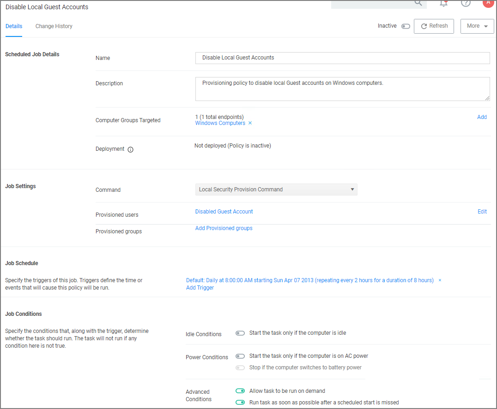
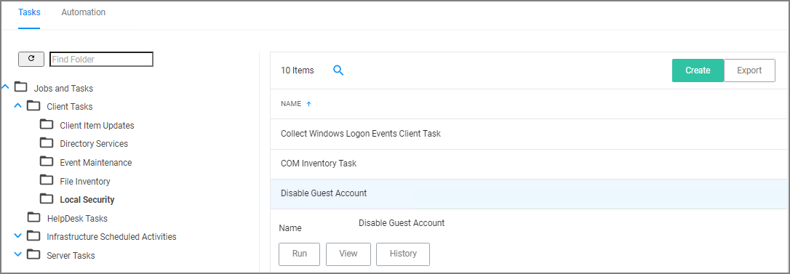

[title]: # (Disable Local Guest Account)
[tags]: # (local security)
[priority]: # (5)
# Disable Local Guest Accounts

To disable the guest account on computers that have the Local Security Agent installed, enable the __Disable Local Guest Accounts__ remote scheduled client command. This is an out-of-the-box policy; you do not need to make any configuration changes to this policy.

To enable the policy:

1. Under your __Computer Group__, navigate to __Scheduled Jobs__.
1. From the Scheduled Jobs list, select __Disable Local Guest Accounts__.

   
1. Set the __Inactive__ switch to __Active__.

If you wish to customize any aspects of the default behavior, create a copy and edit the copied policy.

The Disable Local Guest Accounts policy uses the Local Security task __Disable Guest Accounts__. If you wish to run the task on demand follow these steps:

1. Navigate to __Admin | Tasks__.
1. On the Tasks tab open the folder tree to __Client Tasks | Local Security__.
1. Select the __Disable Guest Account__ task.

   
1. Click __Run__.
