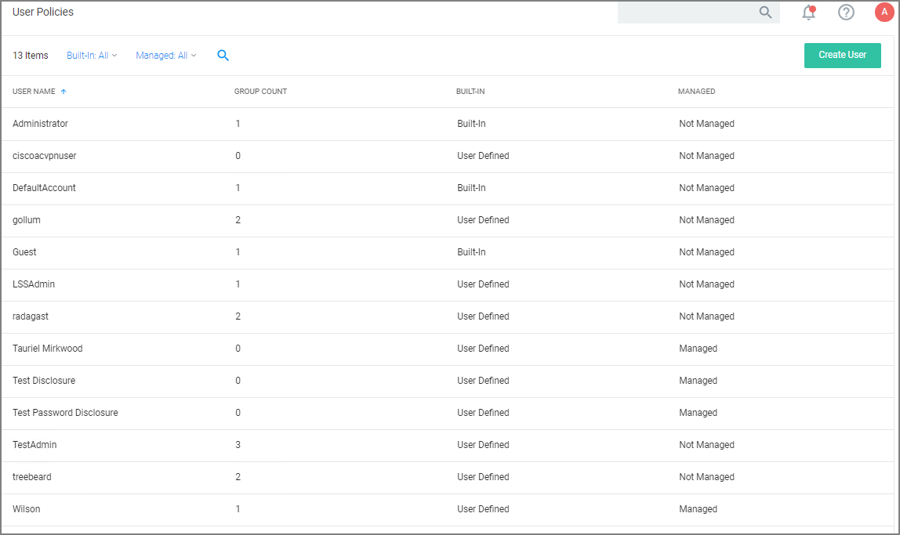
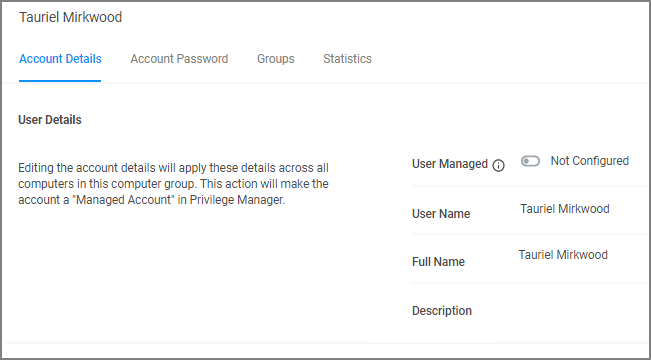
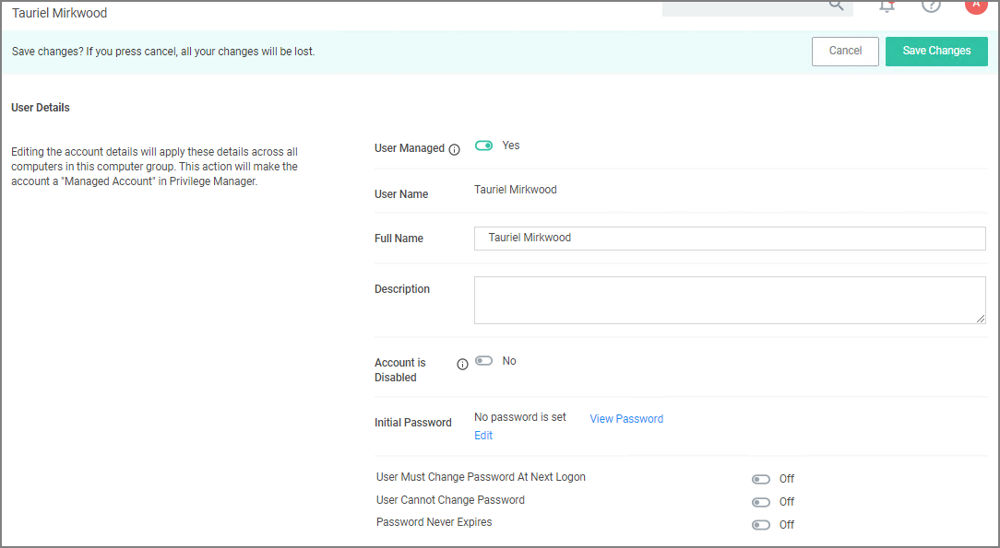
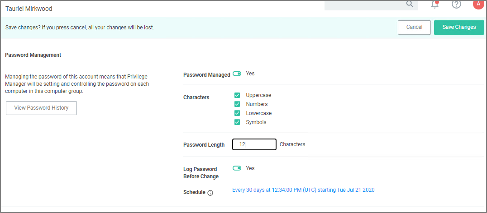

[title]: # (Local Users)
[tags]: # (Local Security,Users)
[priority]: # (4)
# User Management

The Users page listed under your Computer Group shows a list of local users that exist within this Computer Group. The information highlighted by this table includes

1. how many groups each user account is a member of,
1. whether the user account was built-in or user-defined, and
1. whether or not the account itself is managed.  

Managing local users in Local Security means that you are setting a password for the account and can rotate the password as desired.

## Create New Local User

To create a new local user,

1. Navigate to your Computer Group for this new user and select User Management.
1. On the User Management page, click __Create User__.
1. Enter the new User Name.
1. Click __Create__.
1. This takes you to the Account Details tab of your new user's account. To create a user through Local Security, it must be a managed user.

   
1. Set the __User Managed__ switch to __Yes__.

   In Local Security, the most important thing to know about your user accounts is whether or not each is being managed. Managing a local user account means that you are able to rotate the account's password from Local Security's console in Privilege Manager.

   

   >**Note**:
   >The following settings are all specific to Windows endpoints and will not be displayed for macOS based Computer Groups:
   >
   >* Account is Disabled
   >* User Must Change Password At Next Logon
   >* User Cannot Change Password
   >* Password Never Expires

1. Set the rules pertaining to the user's password. Managed user accounts require an initial password when created.
1. Click __Save Changes__.

While editing a user you can change the account User Name, add details like the full name of the user, you may disable the account or update the schedule that pushes out modifications to endpoints.

The most important part of managing a user is setting a one-time password for the account. This means that any user of the account is no longer able to access the account with the former password, effectively locking a user out of the account unless they contact the Privilege Manager Local Security Helpdesk.

The __Groups tab__ for a Local Account tells you how many groups and computers the account is on. Clicking on a Group Name from this page directs you back to the details of that local group.

The __Statistics tab__ for a local user account highlights some quick visual statistics and links to relevant reports based on key factors, like how many computers from your network have this user account and whether there have been changes made to the user’s membership within the specified period. Click on the graphs to drill down into more details.

## Password Management: Randomize Local Account Passwords

Local Security allows administrators to manage users and also to manage passwords and password rotation. Managing users, passwords, and rotation scheduled often go hand-in-hand, but not every managed user account also requires password rotation. For example, service accounts are managed, but usually do not have password rotation setup.

Password rotation can also be setup for existing users without having to provision user accounts.

>**Note**: Password rotation is an option that is not required for all accounts, especially not for service accounts.

1. On the __Account Password__ tab, set the __Password Managed__ switch to __Yes__.
1. Edit password length and strength rules. The password on this account will be rotated based on the Update Schedule details, click on the schedule link.

   

   The password for the account on each endpoint in the Computer Group will be unique.
1. Click __Save Changes__.

If the password is being managed, the update schedule determines when the new password is applied.

>**Note**: The Account Details of the user do NOT need to be managed in order to manage the password on a local account.

## Reports Relating to Managed Accounts

* __All Computers with Managed Passwords__: Lists all computers that have at least one local user with a managed password.
* __Password Disclosure History__: Lists all local and provisioned user's passwords that have been disclosed in a given time frame.
* __Disclosure Summary (Local User)__: Lists all local users whose managed password has been disclosed in the given time frame.
