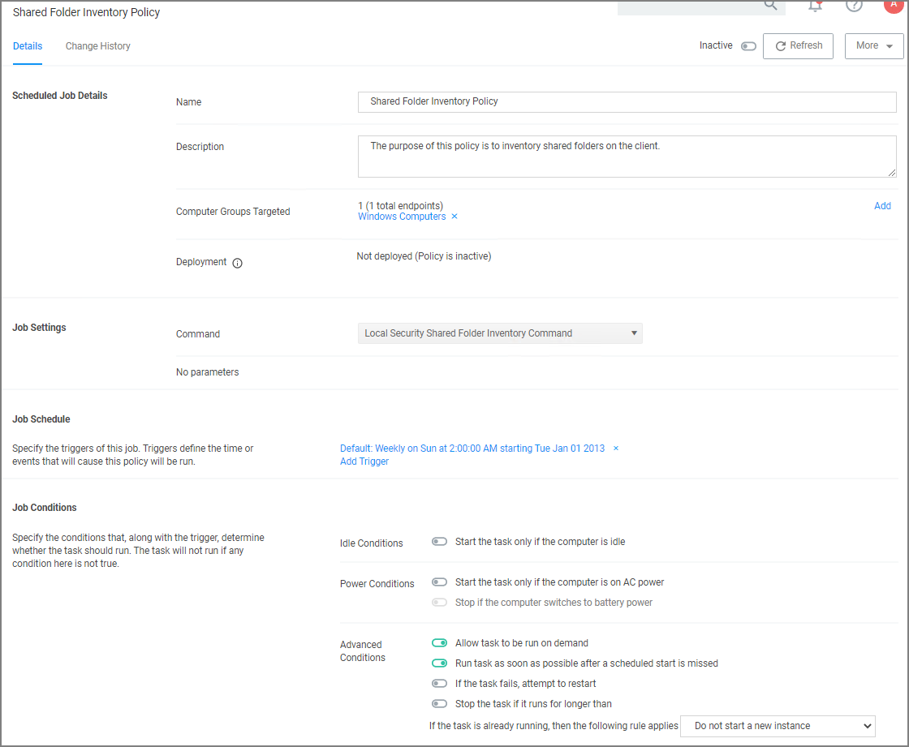

[title]: # (Shared Folder Inventory)
[tags]: # (local security,shared)
[priority]: # (6)
# Shared Folder Inventory

To inventory shared folders on computers that have the local security agent installed, enable the shared folder inventory policy. This is an out-of-the-box policy; you do not need to make any configuration changes to this policy.

## Enable the Policy

1. Under your __Computer Group__, navigate to __Scheduled Jobs__.
1. From the Scheduled Jobs list, select __Shared Folder Inventory Policy__.

   
1. Set the __Inactive__ switch to __Active__.
