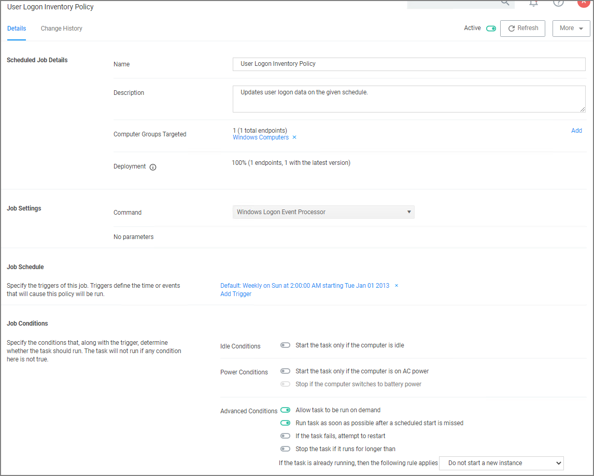
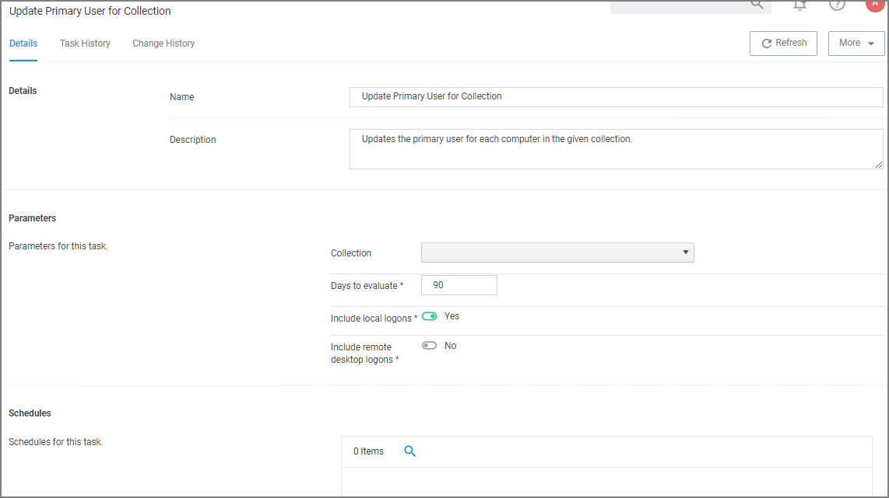
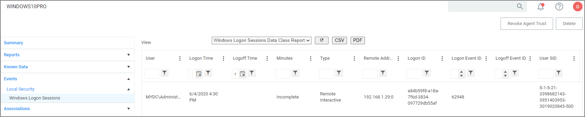

[title]: # (Logon User Tracking)
[tags]: # (local security)
[priority]: # (3004)
# Logon User Tracking

The Thycotic Local Security Agent collects logon and logoff events from Windows on a schedule configured via the User Logon Inventory policy. The Agent collects logon and logoff events and reports them as inventory data. The __Update Primary User for Collection__ task calculates the primary user and the primary user and associated inventory data can then be viewed in the Resource Explorer.

The __User Logon Inventory Policy__ is by default active.

If you wish to customize the schedule or any other policy specification, create a copy of the default policy (More > Duplicate) and edit the settings.

The default update primary user for collection task calculates the primary user on a schedule from inventory data.

1. Navigate to __Admin | Tasks__.
1. In the folder tree open __Server Tasks | Local Security__ and search for __Update Primary User for Collection__.
1. Click __View__.
1. Customize the settings and schedule by editing the task.

   
1. Click __Save Changes__.

You can run the __Update Primary User for Collection__ task at any time to immediately recalculate the primary user for all computers in the selected collection.

## Viewing the Resource

The Windows Logon Session events can be viewed by opening the __Local User/Group Summary__ report and selecting a computer resource from the list. Then select Events | Local Security | Windows Logon Sessions.

