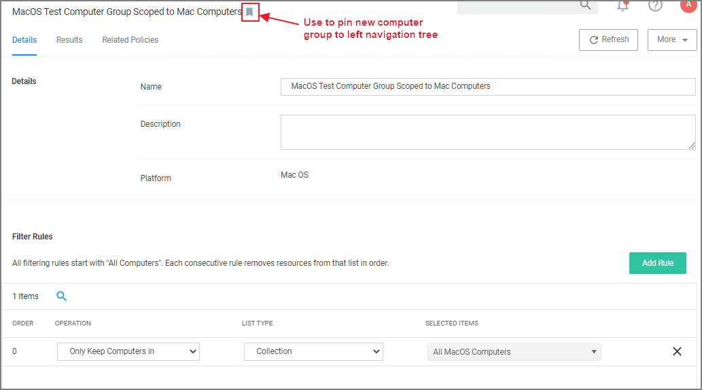
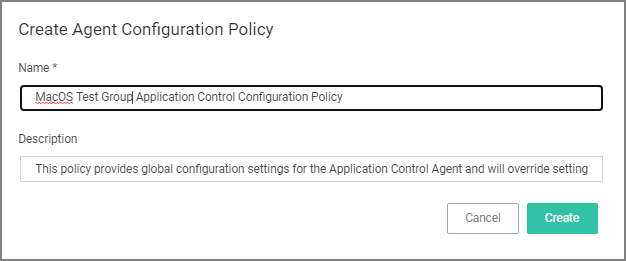
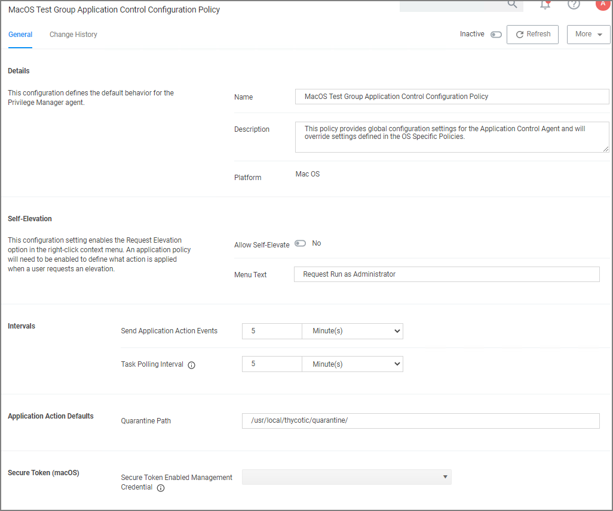
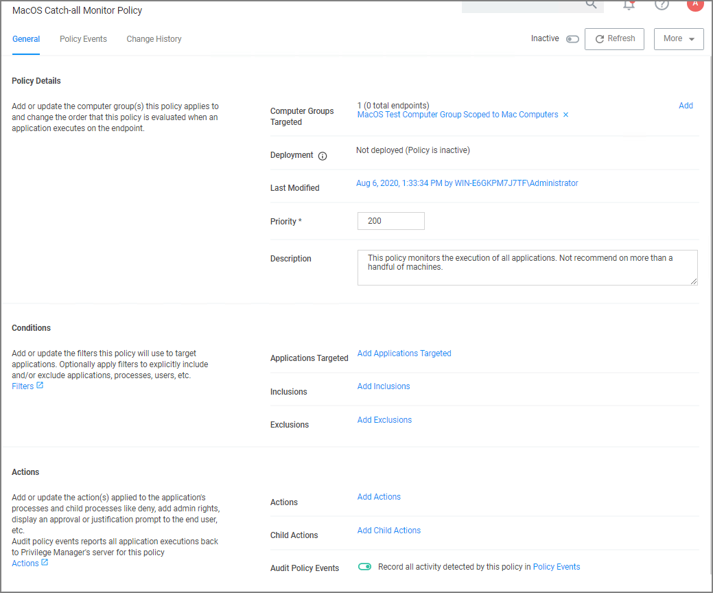
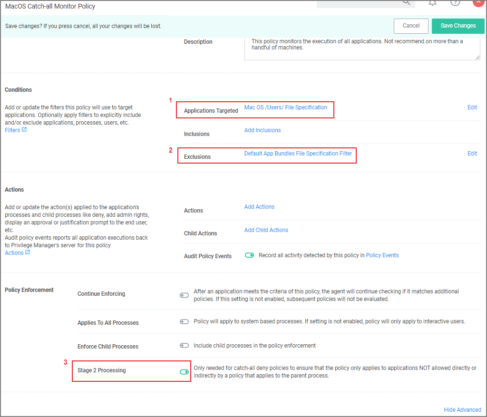

[title]: # (Add Agent to Testing Group)
[tags]: # (learning mode)
[priority]: # (100)
# Adding macOS Agents to a Computer Testing Group

The Policy Configuration examples in the following section will use a Learning Mode Policy that enables us to perform actions (i.e. run applications) on a test computer that Privilege Manager will then pick up. This makes targeting specific applications during policy creation easy.

## Creating a MacOS Test Computer Group

To create a Monitoring (or Learning Mode Policy) on your Mac, begin by 

1. Creating a macOS based test computer group:
   1. Navigate to __Computer Groups__. 
   1. Click __Create Computer Group__.
   1. From the __Platform__ drop-down select MacOS.
   1. Enter a name and description for your new group.
   1. Click __Create__.

      
   1. Add the macOS endpoints you want to be part of the computer group.
   1. Click __Save Changes__.
   1. Pin your computer group to the left navigation menu for quick access. Click the bookmark icon next to the computer group name.
<!-- 1. Optionally, click on Agent Configuration and create an __Agent Configuration Policy__ for this computer group.
   1. Click __Create Agent Configuration Policy__.
   1. Enter a name and description.

      
   1. Click __Create__.

      

Make any changes you want to globally apply to agents registered from endpoints in this computer group.-->

## Setting Up Monitoring Policies for macOS

1. Under your MacOS Test Computers Computer Group select __Application Policies__ and click __Create Application Policy__.
1. From the Policy Wizard select __Monitoring__ and click __Next Step__.
1. Select __Everything__ and click __Next Step__.
1. Enter a name, for example _MacOS Catch-all Monitor Policy_.
1. Click __Create Policy__.

   
1. Customize the policies Conditions, Actions, and Policy Enforcement, for example:
   * Under Applications Targeted, click __Add Application Target__ and search for and add __Mac OS /Users/ File Specification__.
   * Under Exclusions, click __Edit__ and add __Default App Bundles File Specification Filter__ to the exclusion list.
   * Under __Show Advanced | Policy Enforcement__ set the switch for __Stage 2 Processing__ to active an all others to inactive.

     
1. Click __Save Changes__
1. Set the __Inactive__ switch to __Active__.

This "Testing Computers" group should only be used for testing specific machines and configuration purposes. It should not be assigned to large groups of computers in your production environment.

Verify that under __Actions__ the __Audit Policy Events__ switch is active. 
