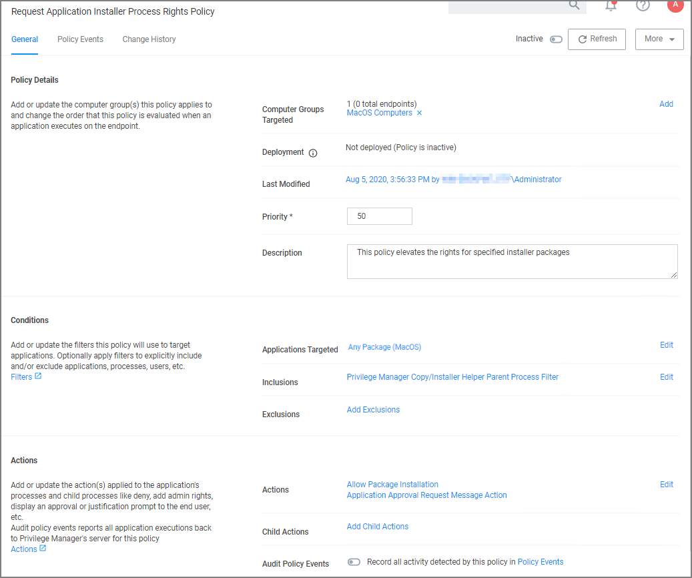
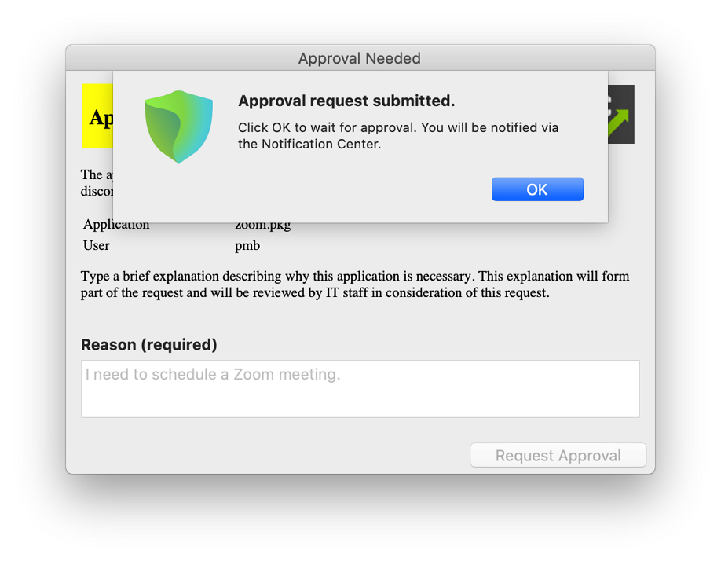

[title]: # (Request Application Installation)
[tags]: # (standard user, policy, kext)
[priority]: # (7)
[display]: # (none)
# Request Application Installation

>**Note**: This is the procedure for the kernel extension.

Privilege Manager can allow macOS users to install packages on demand. Do the following to create a policy to allow users to request installation of certain packages. For this to work, your endpoint must be online. If the system is offline, refer to the Offline Approval process documentation.

1. Navigate to your macOS Computer Group and select __Application Policies__.
1. Click __Create Policy__.
1. Select __Controlling__ and click __Next Step__.
1. Select __Elevate__ and click __Next Step__.
1. Select __Installer Packages__ and click __Next Step__.
1. Select what exactly you want the policy to target. This can be based of an __Existing Filter__, a __File Upload__, and/or __Inventoried File(s)__. Multiple targets can be selected. Our example shows the __Any Package (MacOS)__. Click __Next Step__.
1. Enter a Name and description for your policy, click __Create Policy__.

   
1. Set the __Inactive__ switch to __Active__ for policy updates at the endpoint.

Once the policy is enabled and in place at the endpoint, a user will typically go through the following steps to request an application installation:

1. Mount the DMG containing the application you’d like to install to Applications. If the DMG contains an application bundle that can be dragged to the Applications folder, do so. If the DMG contains an installer application, double-click and proceed with the steps outlined in installing an application.
1. The Authentication required dialog might open based on system settings:

   
1. Click the Authenticate button. The following Application Notice opens:

   
1. Enter the Reason why the application should be installed and click the Request Approval button. The Waiting for approval response dialog opens.

   
1. Once approved, the “This application has been approved…” text displays. Click the Continue button to proceed with the installation. If you click Cancel, the application will not be copied to the Applications folder and you may need to request approval again.

   
