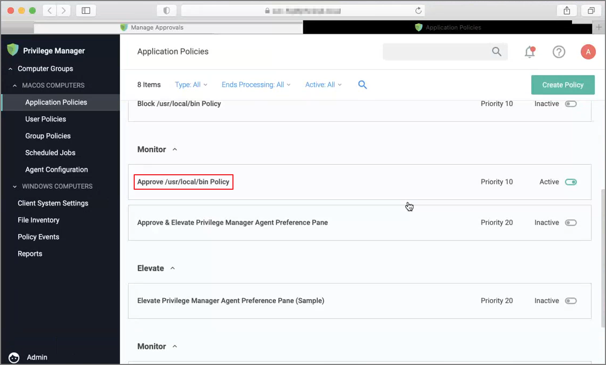
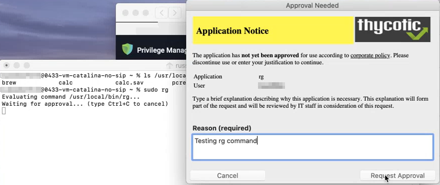
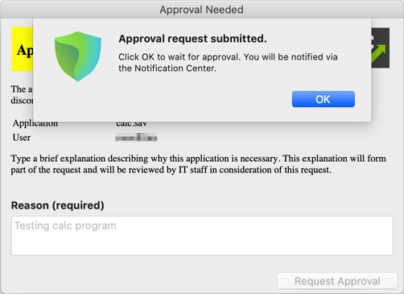
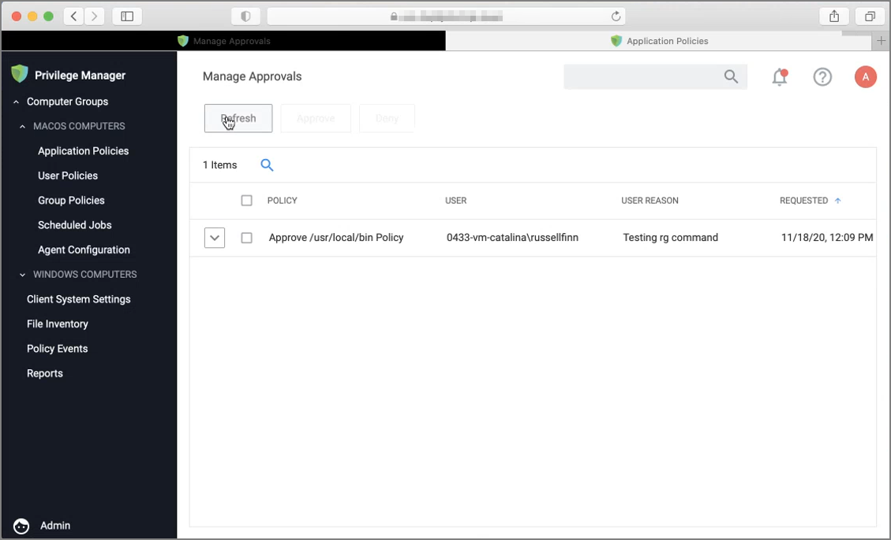
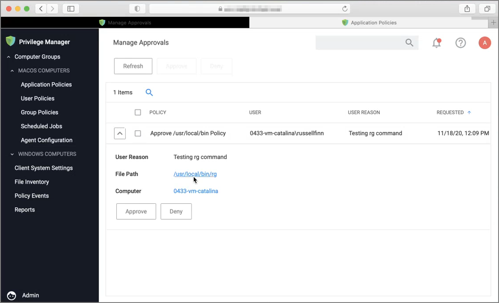
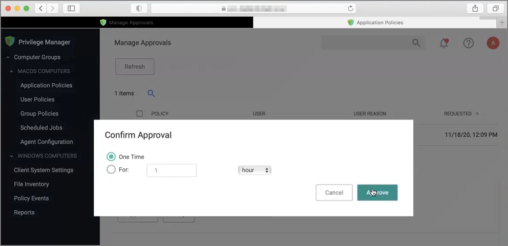
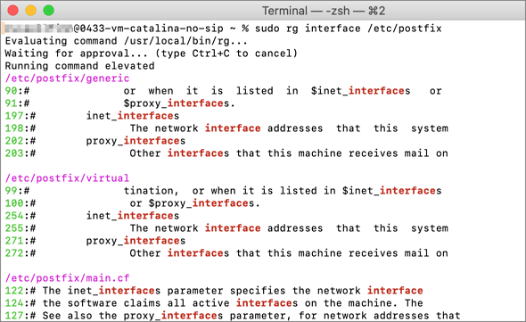
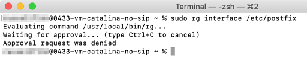

[title]: # (Sudo Approval Process)
[tags]: # (sudo, macOS)
[priority]: # (7)
# macOS Application Approval Process via Sudo Plugin

The macOS sudo plugin provides the means to run an application elevated via Terminal.app on macOS systems running Catalina and Big Sur. The sudo plugin also provides user feedback via Terminal when the request is approved or denied.

When an application policy requires approval, the user will be presented with a message in Terminal `"Waiting for approval... (Ctrl+C to cancel)"`. The application execution is blocked until the approval comes in. If the request is approved, the application runs. If it is denied, the process exits.

## Example: Elevate Applications Executed from Folder

The following monitor policy is configured to elevate applications located within `/usr/local/bin` after an approval when run via `sudo`.

### Endpoint Interaction

1. At the macOS endpoint, open Terminal.app and run an application via sudo. The __Approval Needed__ message opens:

   
1. Enter the approval reason and click __Request Approval__.

   In the Terminal, __Waiting for approval... (Ctrl+C to cancel)__ is displayed and the __Approval request submitted.__ dialog opens.
1. You will be notified of any status change via the notification center. Click __OK__ to wait for the approval.

   

### Privilege Manager Console Interaction

1. As an approval supervisor, navigate to __Admin | Manage Approvals__.

   
1. If no approval requests are listed, click __Refresh__.
1. __Expand__ the approval you want to either approve or deny.

   
1. Click __Approve__.

   
1. On the __Confirm Approval__ modal, choose to either issue a __One Time__ or a __timed__ approval. The default opens to __One Time__.
1. Click __Approve__

### Endpoint Interaction 

#### Following Approval

Following an approval, Terminal writes __Running command elevated__ and shows other process messages.

#### Following Denial

Following a denial, Terminal writes __Approval request was denied__ and shows other process messages.

