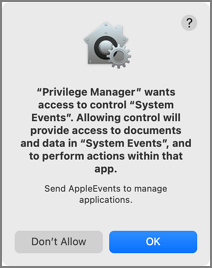
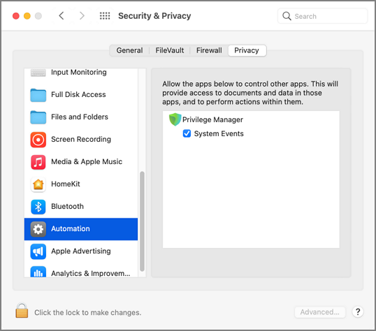
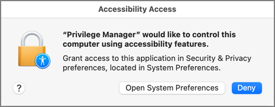
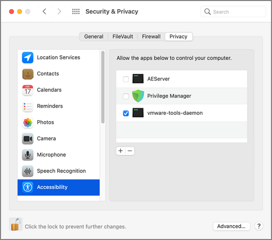
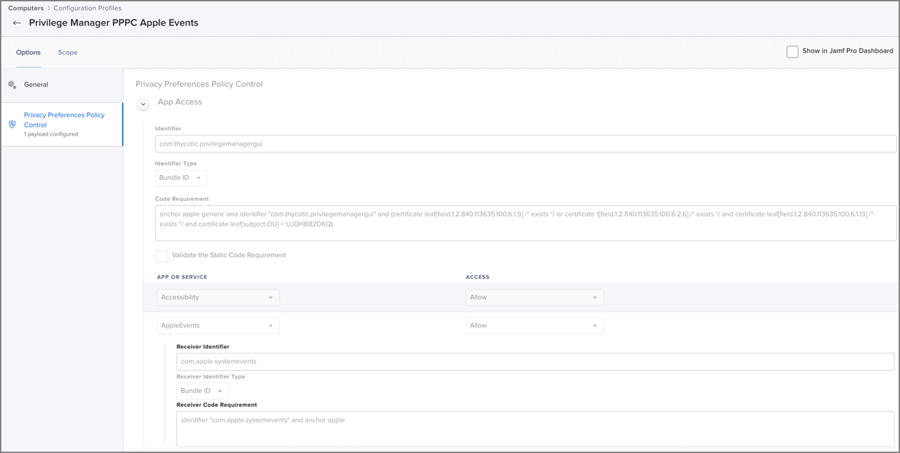

[title]: # (macOS Approval Process)
[tags]: # (application approvals, sysex)
[priority]: # (7)
# macOS Approval Process

To accommodate the new macOS Endpoint Security system extensions, the approval workflow of the macOS agent now terminates any justification or approval process and presents the user with an applicable message action.

The following workflows are impacted by this change:

* Application Approval Request Message Action
* Deny Execute
* Deny Execute and Deny Execute Message Action
* Deny Execute and Application Denied Message Action
* Application Justification Message Action
* Application Warning Message Action

Refer to the [Actions](../../../admin/actions/default-actions.md) topic.

## Application Approval Request Message Action

Workflow __prior to__ Privilege Manager __10.8__:

Action waits for the user to either click __Cancel__ or enter an __Approval Request Message__ and click __Request Approval__.

Workflow __starting with__ Privilege Manager __10.8__:

Privilege Manager immediately denies the execution with macOS displaying a dialog indicating the application can't be opened. If the user has granted Privilege Manager.app the necessary _SendEvents_ right, Privilege Manager closes the dialog.

* If the user clicks __Cancel__, the dialog is dismissed and no further action taken.
* If the user clicks __Request Approval__, the Approval is submitted and the user is presented with a modal dialog informing them that the approval request has been submitted and that they will be notified via Notification Center.

  * If successfully submitted, the request is queued and monitored by Privilege Manager.app.
  * If denied, a notification is pushed to the Notification Center indicating the app was denied. Clicking the notification or clicking the button to dismiss the notification causes the notification to be removed from the Notification Center.
  * If the request is approved, a notification is pushed to the Notification Center indicating the request was approved. Behavior for:

    * __application bundles__: Clicking the notification causes the app to be launched and the notification to be removed from the Notification Center.
    * __command-line utilities__: Clicking the notification causes the notification to be removed from the Notification Center. The user will have to manually run the command-line utility from a terminal window. If the user chooses to dismiss the notification, the notification is removed from the Notification Center and no further action is taken.

  * If the approval request fails to be submitted, __Request Approval__ is disabled on the Request Approval dialog and an error message displayed.

## Deny Execute

This action immediately denies the execution of the application and no interaction with Privilege Manager.app is required. The workflow is:

* MacOS will display a dialog indicating the application can't be opened. If the user has granted Privilege Manager.app the necessary _SendEvents_ right, Privilege Manager closes the dialog.
* No further user interaction is provided or necessary.

## Deny Execute and Deny Execute Message Action

This action immediately denies the execution of the application. The workflow is:

* MacOS will display a dialog indicating the application can't be opened. If the user has granted Privilege Manager.app the necessary _SendEvents_ right, Privilege Manager closes the dialog.
* A user notification is posted to the Notification Center that indicates the process was denied.

  * Clicking the notification or clicking the button to dismiss the notification causes the notification to be removed from the Notification Center.

* No further user interaction is necessary.

## Deny Execute and Application Denied Message Action

* Privilege Manager immediately denies the execution with macOS displaying a dialog indicating the application can't be opened. If the user has granted Privilege Manager.app the necessary _SendEvents_ right, Privilege Manager closes the dialog.
* The custom __Application Denied Message__ is shown. __Cancel__ and __Publisher Info__ are the only buttons enabled.

  * Clicking __Cancel__ closes the window.
  * Clicking __Publisher Info__ displays certificate information for the application that was denied.

* No further user interaction is necessary.

## Application Justification Message Action

This action waits for the user to either __Cancel__ or enter a __Justification Message__ and click __Continue__. The workflow is:

* Privilege Manager immediately denies the execution with macOS displaying a dialog indicating the application can't be opened. If the user has granted Privilege Manager.app the necessary _SendEvents_ right, Privilege Manager closes the dialog.

  * If the user clicks __Cancel__, the dialog is dismissed and no further action taken.
  * If the user clicks __Continue__, the __Justification__ will be submitted and the app bundle will be launched.

## Application Warning Message Action

This action waits for the user to either click __Cancel__ or __Continue__. The workflow is:

* Privilege Manager immediately denies the execution with macOS displaying a dialog indicating the application can't be opened. If the user has granted Privilege Manager.app the necessary _SendEvents_ right, Privilege Manager closes the dialog.

  * If the user clicks __Cancel__, the dialog is dismissed and no further action taken.
  * If the user clicks __Continue__, the app bundle will be launched.

## Privacy Preference Policy Control Requests

If you have a policy in Privilege Manager that includes __Deny Execute__ or any of the [Advanced Message Actions](../../../admin/actions/all/index.md), for example _Application Approval Request_, _Application Denied_, or _Application Justification_, the user at the endpoint might be presented with a macOS dialog saying that the application could not be launched.

When a policy with one of the above [Advanced Message Actions](../../../admin/actions/all/index.md) is triggered, Privilege Manager.app attempts to use AppleEvents to dismiss this dialog on behalf of the user to provide the best user experience possible. When Privilege Manager.app attempts to use AppleEvents for the first time, macOS will prompt the user with the following:

* If the user clicks __OK__ on the AppleEvents dialog, System Events will be checked for Privilege Manager.app and it is added to Automation in the Security & Privacy preference pane on the Privacy tab:

  
* If the user clicks __Don't Allow__ on the AppleEvents dialog, the System Events will be unchecked.

Afterwards, macOS prompts the user with an Accessibility Access dialog:

  

* If the user clicks __Deny__, Privilege Manager.app will not be granted access to use accessibility features to automatically close the dialog that states the application couldn’t be launched.

* If the user clicks __Open System Preferences__, the Security & Privacy preference pane opens to the Privacy tab:  

  

  If you check __Privilege Manager__, it will be granted access to use accessibility features to control other applications.

In order to automate the approval of these manual prompt(s), use [this XML](scripts/pppc.xml) or refer to the Jamf Pro screenshot as an example, depending on your existing MDM.

