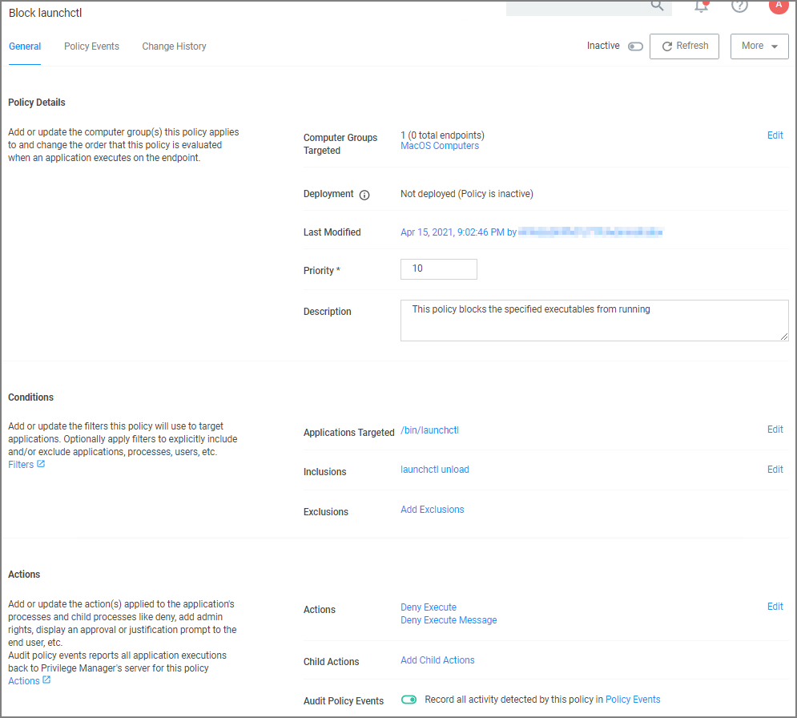

[title]: # (Block Agent Removal)
[tags]: # (deny)
[priority]: # (7)
# Block Agent Removal - launchctl

These are the filters and the example policy that need to be created that aid with the macOS agent hardening process.

## Creating a File Specification Filter

1. Navigate to __Admin | Filters__ and click __Create Filter__.
1. From the platform drop-down select __macOS__.
1. From the type drop-down select __File Specification Filter__.
1. Add a Name and Description, for example _/bin/launchctl_ and click __Create__.
1. On the filter page, under __Settings__:
   * __File Names__, type __launchctl__.
   * __Path__, type __/bin__.
1. Click __Save Changes__.

## Creating a Commandline Filter

1. Navigate to __Admin | Filters__ and click __Create Filter__.
1. From the platform drop-down select __macOS__.
1. From the type drop-down select __Commandline Filter__.
1. Add a Name and Description, for example _launchctl unload_ and click __Create__.
1. On the filter page, under __Settings__:
   * __Match Type__, type __Regular Expression__.
   * __Command Line__, type __com\\.thycotic__.
1. Click __Save Changes__.

## Creating the Blocking Policy

1. Under your macOS Computer Group, select __Application Policies__.
1. Using the Policy Wizard, create a controlling policy that blocks application execution on endpoints.
1. Select how you want the processes blocked, either __Block Silently__ or __Notify and Block__, for this example we use __Block Silently__. Click __Next Step__.
1. Select what types you want the policy to block, for this example it's __Executables__.
1. Choose your target, for this example __Existing Filter__.
1. Search for and __Add__ the __/bin/launchctl__ filter created in the above steps.
1. Click __Update__.
1. Click __Next Step__.
1. Name your policy and add a description, click __Create Policy__.
1. Under __Inclusions__, click __Edit__.
1. Search for __launchctl unload__ and __Add__ the filter created in the above steps.
1. Click __Update__.
1. Click __Save Changes__.

   
1. Set the __Inactive__ switch to __Active__.

### XML Example Files

* Policy xml sample to use as a [item upload](scripts/block-launchctl.xml).
* File Specification Filter [bin-launchctl](scripts/bin-launchctl.xml).
* Commandline Filter [launchctl-unload](scripts/launchctl-unload.xml).
