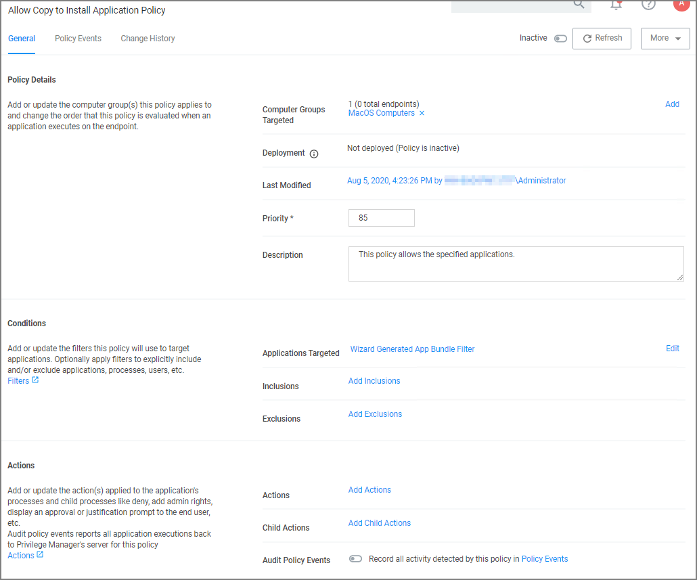
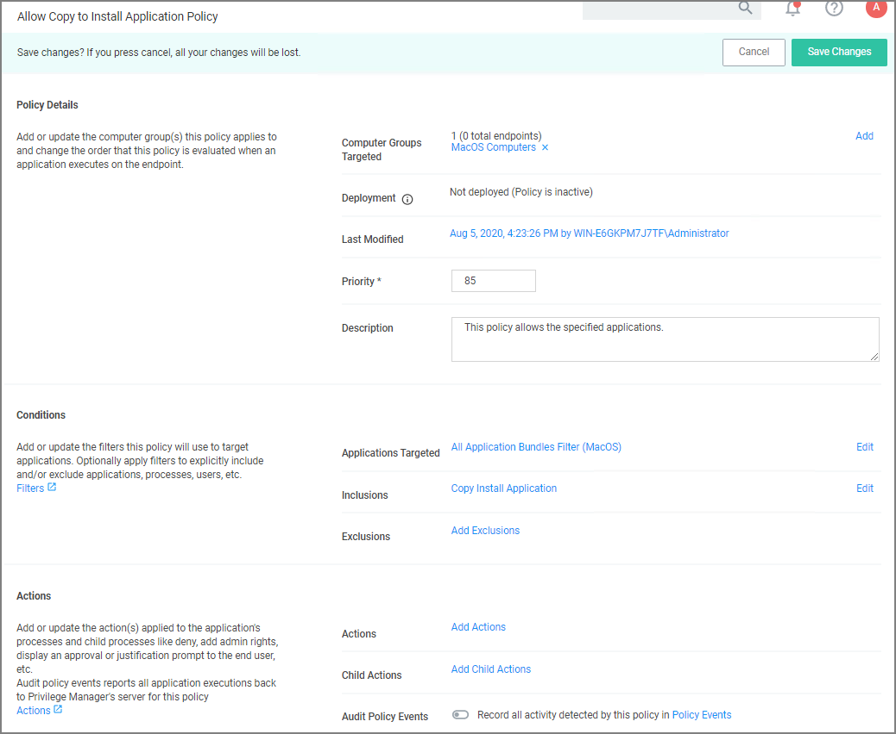
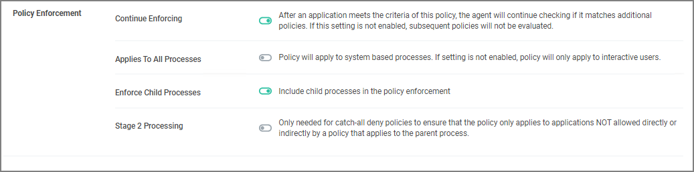

[title]: # (Allow Copy to Install Applications)
[tags]: # (standard user, policy, macOS)
[priority]: # (7)
# Allow Copy to Install Applications

A policy can be created to allow or deny standard users to install specific applications by copying/pulling the application into the Applications folder. Follow this example to create a policy that will enable this functionality for your Mac OS user.

1. Navigate to your macOS Computer Group and select __Application Policies__.
1. Click __Create Policy__.
1. Select __Controlling__ and click __Next Step__.
1. Select __Allow__ and click __Next Step__.
1. Select what exactly you want the policy to target. This can be based of an __Existing Filter__, a __File Upload__, and/or __Inventoried File(s)__. Multiple targets can be selected. Our example shows the __All Application Bundles Filter (MacOS)__. Click __Next Step__.
1. Enter a Name and description for your policy, click __Create Policy__.

   
1. Click __Add Inclusions__.
1. Search for and add the __Copy Install Application__ filter.
1. Click __Update__.

   
1. Click __Save Changes__.
1. Set the __Inactive__ switch to __Active__ for policy updates at the endpoint.

>**Note**:
>The new Copy Install Application Filter should not be used with the existing Privilege Manager Copy/Installer Helper Parent Process Filter, which should be removed from any policy before adding the new Copy Install Application Filter to the policy.

## Updating Existing Policies to Use the Copy Install Application Filter

If you have policies that currently use the Privilege Manager Copy/Installer Helper Parent Process Filter use the following steps to update them to use the Copy Install Application Filter in the Privilege Manager UI:

1. Navigate to the macOS Computers Group and select __Application Policies__.
1. For each application that currently uses the __Privilege manager copy/installer helper parent process filter__ as an inclusion filter, remove that filter and add the __Copy Install Application__ filter instead.
1. Click __Update__.
1. Under Actions remove __Allow copy to/Applications/Directory__ and add the __Application Approval Request Message Action__ in its place.
1. Click __Update__.
1. Click __Show Advanced__ and set these two option to active:

   * Continue Enforcing.
   * Enforce Child Processes.

   
1. Click __Save Changes__.

On the macOS endpoint,

1. Login as Admin user.
1. Open the macOS Agent via Terminal and run an update using command:

   ```shell
   sudo /usr/local/thycotic/agent/agentUtil.sh updateclientitems
   ```

The agent updates with new and updated policies and synchronizes.
