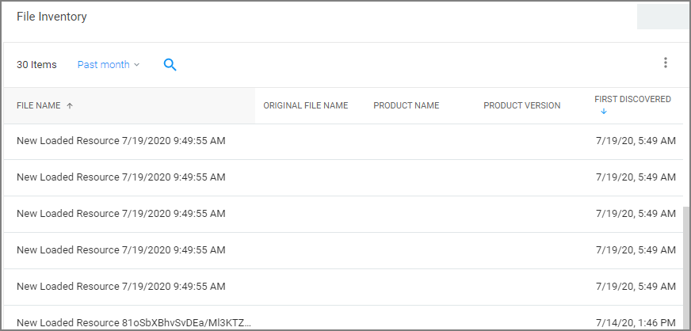
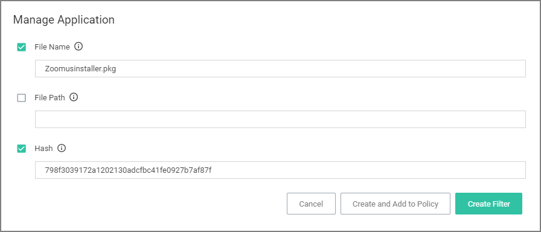
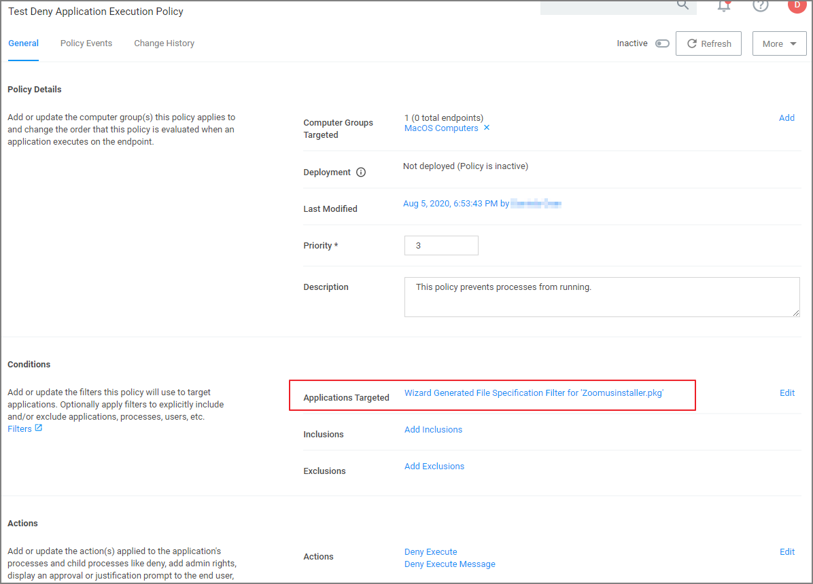

[title]: # (Deny Zoom)
[tags]: # (standard user, policy, macOS)
[priority]: # (7)
# Deny Zoom Application

>**Note**: This is the procedure for kernel extension.

With your monitoring policies properly set up, anything you do on your Mac test machine will be discovered by Privilege Manager. For this example we will create a policy that blocks the Zoom applications.

## File Inventory

Open the Zoom applications on an macOS test endpoint. When these applications are opened, Privilege Manager discovers these as an _Application Action from Event Discovery Testing Computers Audit Policy (MacOS)_.

1. In the Privilege Manager Console, navigate to __File Inventory__.
1. Verify new items have been registered by your Event Discovery Testing Computers (MacOS) policy. These may be listed as __New Loaded Resources__.

   
1. Select a __New Loaded Resource__ link.
1. On the loaded Resource Explorer page, click the __Discover Now__ button. It still may take time to properly load details about these new events, usually indicated by a __Discovery Status__ of __New__.

   

   Clicking the Discover Now button creates and executes a __Manual client-side resource discovery__ task. If you click the status link the task page opens (not shown in this example sequence).

   On the Resource Explorer page of a fully discovered resource, you can click __Manage Application__ to select the details you want to use to either create a filter or create and add to a policy options.

   

When a resource is fully discovered it is displayed with full name on the discovery events page:

From the File Inventory page you can also use the __View File__ or __Create Filter__ options to create specific filters for the discovered applications and assign those to existing policies.

## Assign to Policy

Once the resources have been fully discovered, the fastest way to either create a new policy or add to an existing one is via the Assign to Policy link on the Events page.

1. Click __Create Filter__.
1. The __Manage Application__ page opens for the selected resource.

   
1. Click __Create and Add To Policy__.

   
1. On the __Manage Application__ page select your existing deny application execution policy from the drop-down and click __Update Policy__.

   
1. Set the __Inactive__ switch to __Active__.

## Updating the Endpoint

On the macOS endpoint,

1. Open __System Preferences | Privilege Manager__.

   
1. Click __Update Client Items__.

## Policy Verification

Once this Deny-policy is updated on your endpoint, when you click Zoom, you will see a message like this:

   
