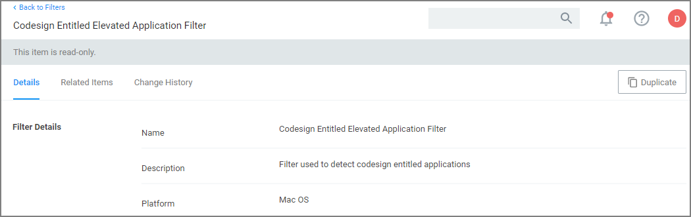
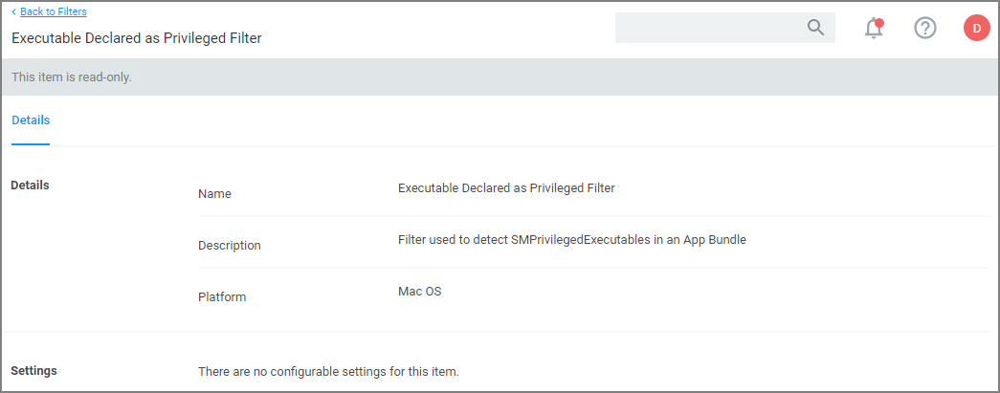
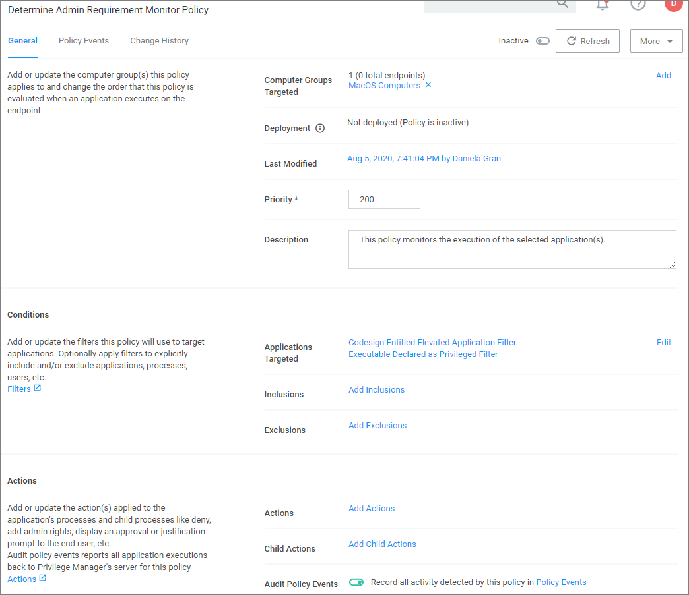

[title]: # (Determine Admin Requirement)
[tags]: # (macOS,policy)
[priority]: # (7)
# Determine Admin Requirement

Use discovery with event notification to determine if an application requests or requires administrative privileges to perform tasks or run on a macOS endpoint.

1. Use/Create a __Codesign Entitled Elevated Application Filter__. This filter creates events for application bundles that have a specific entitlement that might prompt for administrative permissions if launched.
   1. Create a __Duplicate__ of the Codesign Entitled Elevated Application Filter:

      
1. Use/Create a duplicate of the __Executable Declared as Privileged Filter__. This filter creates events for application bundles that list a privileged helper in their info.plist files.

   
1. Add both filters as the application target to a new policy and enable the __Send Policy Feedback__ action for that policy.

## Creating the Policy

1. Using the Policy Wizard, create a monitoring policy for specific applications.
1. Choose your targets. You can specify several different targets, for this example select __Existing Filter__.
1. Search for and add the two duplicated filters you created above.
1. Click __Update__.
1. Click __Next Step__.
1. Name your policy and click __Create Policy__.
1. Under Actions, set the __Audit Policy Events__ switch to active.

   
1. Click __Save Changes__.
1. Set the __Inactive__ switch to __Active__.
1. Next to __Deployment__ click the __i__ icon and run the __Resource and Collection Targeting Update__ task.

>**Note**:
>There is currently no option to determine if command-line tools require admin privileges.
