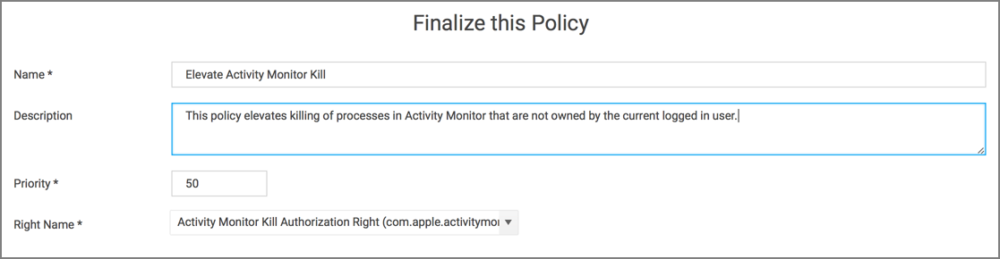
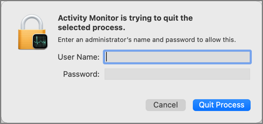

[title]: # (Elevate Activity Monitor)
[tags]: # (authdb, sysex)
[priority]: # (7)
# Elevating Activity Monitor

## Authorizationdb Right: com.apple.activitymonitor.kill

This action can be used to elevate killing processes that do not belong to the logged in user in Activity Monitor while it is running. The right will be elevated for the duration that Activity Monitor is running . Once the application is quit, the right will be restored to its default.

Advanced message actions such as Approval, Deny, Justification, or Warning should not be used in conjunction with this action.

## Example Application: Activity Monitor

1. Using the Policy Wizard, create a controlling policy, click __Next Step__.
1. Select __Elevate__, click __Next Step__.
1. Select __Run Silently__, click __Next Step__.
1. Select __Executables__, click __Next Step__.
1. Select __Modify Authorization Database__, click __Next Step__.
1. Select __Existing Filter__, search for select the App Bundle filter for Activity Monitor. If it doesn't exist, create it.
1. Click __Update__.
1. Click __Next Step__.
1. Name your policy, add a description.
1. From the __Right Name__ drop-down, select __Activity Monitor Kill Authorization Right (com.apple.activitymonitor.kill)__.

   
1. Click __Create Policy__.
1. Set the __Inactive__ switch to __Active__.
1. Next to __Deployment__ click the __i__ icon and run the __Resource and Collection Targeting Update__ task.

### What to Expect on the Endpoint

* __With__ a policy in place, when Activity Monitor is running and the policy is effective and you try to kill a process that doesn't belong to you and you click __Force Quit__, the process will be terminated without prompting you for admin credentials.

* __Without__ a policy in place, when Activity Monitor is running and you try to kill a process that doesn't belong to you, it will present this dialog:

  
