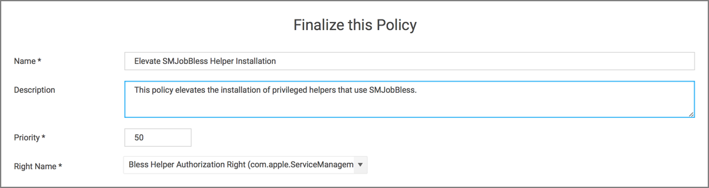
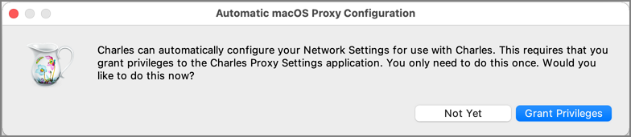
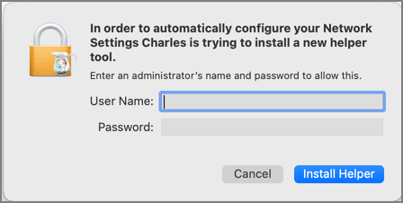

[title]: # (Elevate Charles Proxy)
[tags]: # (authdb, sysex)
[priority]: # (7)
# Elevating Charles Proxy

## Authorizationdb Right: com.apple.ServiceManagement.blesshelper

This action deals with applications that use SMJobBless to install privileged helpers. This action can be used to elevate the installation of a privileged helper while an application is running. The right will be elevated for the duration of the targeted application. Once the application is quit, the right will be restored to its default.

Advanced message actions such as Approval, Deny, Justification, or Warning should not be used in conjunction with this action.

## Example Application: Charles Proxy

1. Using the Policy Wizard, create a controlling policy, click __Next Step__.
1. Select __Elevate__, click __Next Step__.
1. Select __Run Silently__, click __Next Step__.
1. Select __Executables__, click __Next Step__.
1. Select __Modify Authorization Database__, click __Next Step__.
1. Select __Existing Filter__, search for select the App Bundle filter for Charles Proxy. If it doesn't exist, create it.
1. Click __Update__.
1. Click __Next Step__.
1. Name your policy, add a description.
1. From the __Right Name__ drop-down, select __Bless Helper Authorization Right (com.apple.ServiceManagement.blesshelper)__.

   
1. Click __Create Policy__.
1. Set the __Inactive__ switch to __Active__.
1. Next to __Deployment__ click the __i__ icon and run the __Resource and Collection Targeting Update__ task.

### What to Expect on the Endpoint

* __With__ a policy in place, when Charles Proxy is started and the policy is effective and its helper isn't installed, it will present this dialog:

  

  Clicking __Grant Privileges__ will approve the installation of the helper without prompting for admin credentials.
* __Without__ a policy in place, when Charles Proxy is started and its helper isn't installed, it will present an authorization required dialog:

  

>**Note**: Privileges to the Helper, if not already installed, need to be granted no matter if a policy is in place or not. Granting those privileges, however won't require an authorization when a policy with Bless Helper Authorization Right action is in place and active.
