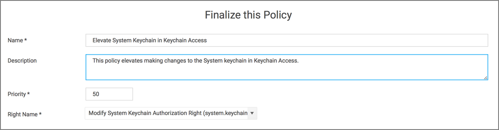
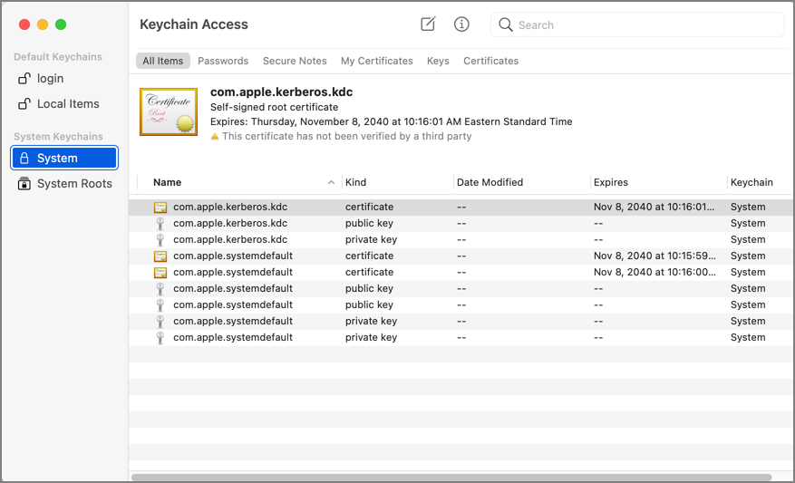
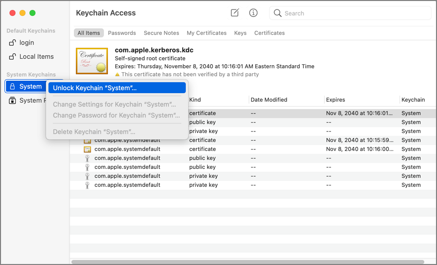
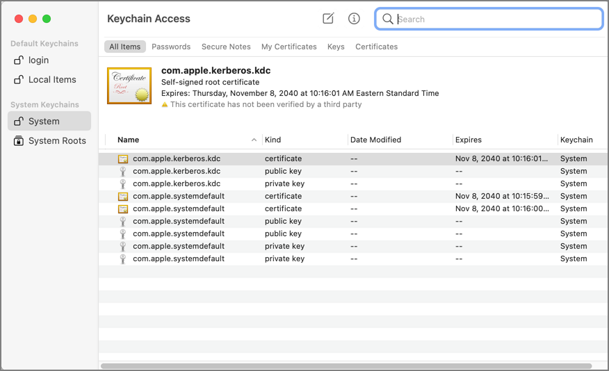
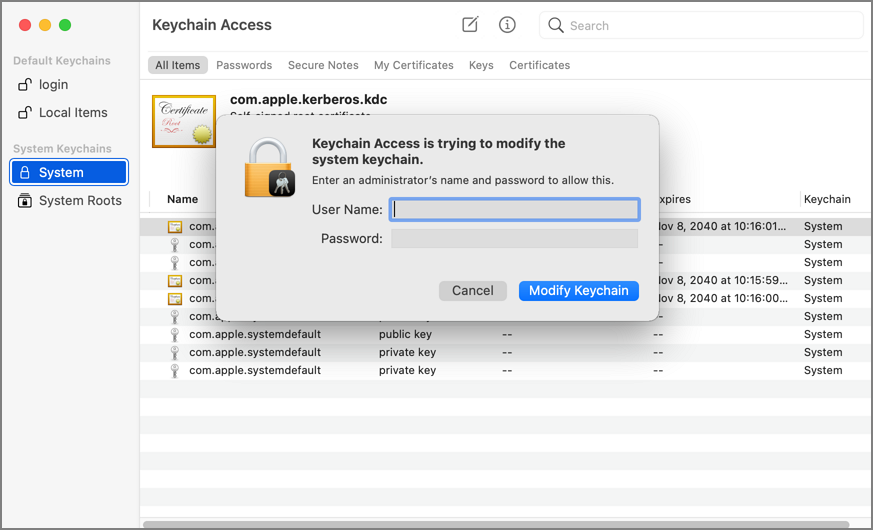

[title]: # (Elevate Keychain)
[tags]: # (authdb, sysex)
[priority]: # (7)
# Elevating Modifying the Keychain

## Authorizationdb Right: system.keychain.modify

This action can be used to elevate modifying the System keychain in Keychain Access while it is running. The right will be elevated for the duration that Keychain Access is running. Once the application is quit, the right will be restored to its default.

Advanced message actions such as Approval, Deny, Justification, or Warning should not be used in conjunction with this action.

## Example Application: Keychain Access

1. Using the Policy Wizard, create a controlling policy, click __Next Step__.
1. Select __Elevate__, click __Next Step__.
1. Select __Run Silently__, click __Next Step__.
1. Select __Executables__, click __Next Step__.
1. Select __Modify Authorization Database__, click __Next Step__.
1. Select __Existing Filter__, search for and select the App Bundle filter for Keychain Access. If it doesn't exist, create it.
1. Click __Update__.
1. Click __Next Step__.
1. Name your policy, add a description.
1. From the __Right Name__ drop-down, select __Modify System Keychain Authorization Right (system.keychain.modify)__.

   
1. Click __Create Policy__.
1. Set the __Inactive__ switch to __Active__.
1. Next to __Deployment__ click the __i__ icon and run the __Resource and Collection Targeting Update__ task.

### What to Expect on the Endpoint

* __With__ a policy in place, with Keychain Access running and the policy is effective, the System keychain icon will appear to be locked:

  

  When you right-click the System keychain icon, the Unlock Keychain "System" menu item will appear:

  

  When you click on Unlock Keychain "System", the System keychain will be unlocked and you can add and delete items without being prompted for admin credentials:

  
* __Without__ a policy in place, when Keychain Access is running and you try to unlock or modify the System keychain, it will present this dialog:

  
