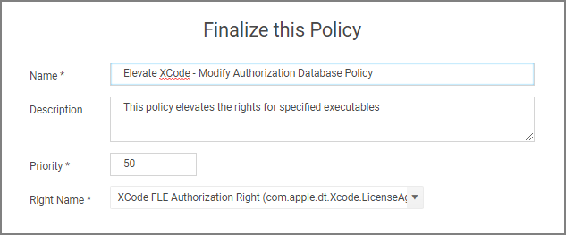
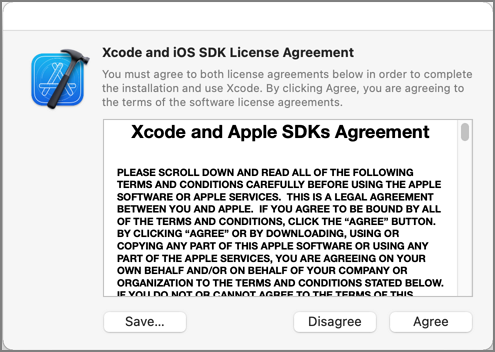
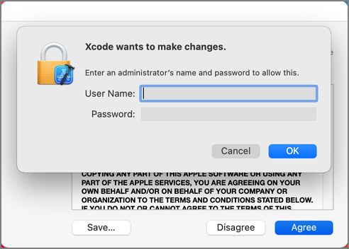
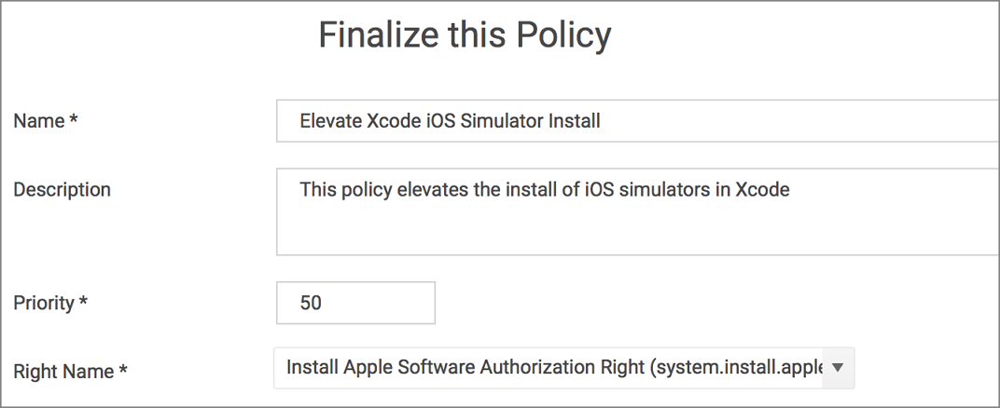
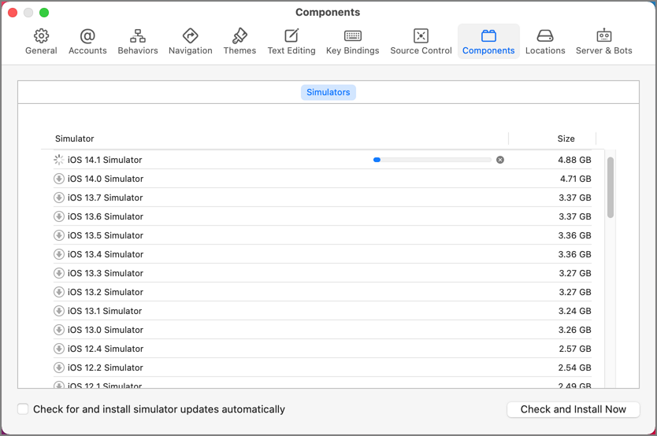
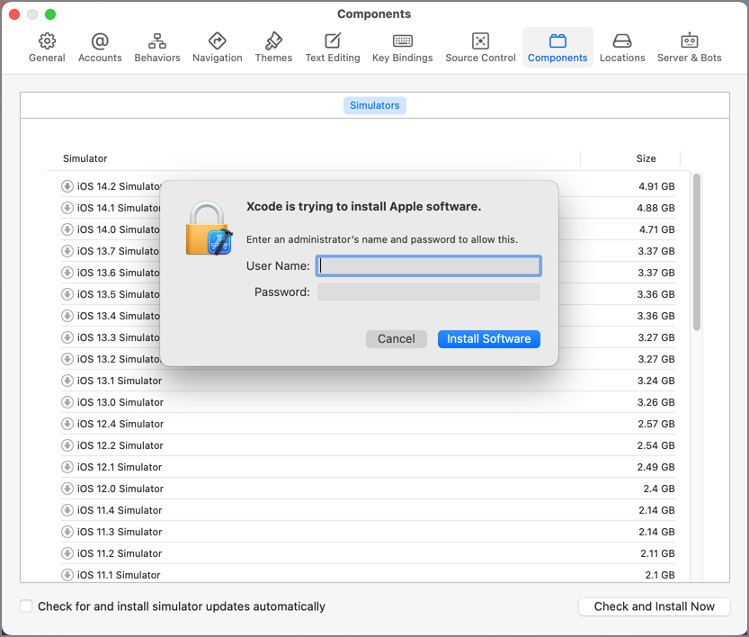
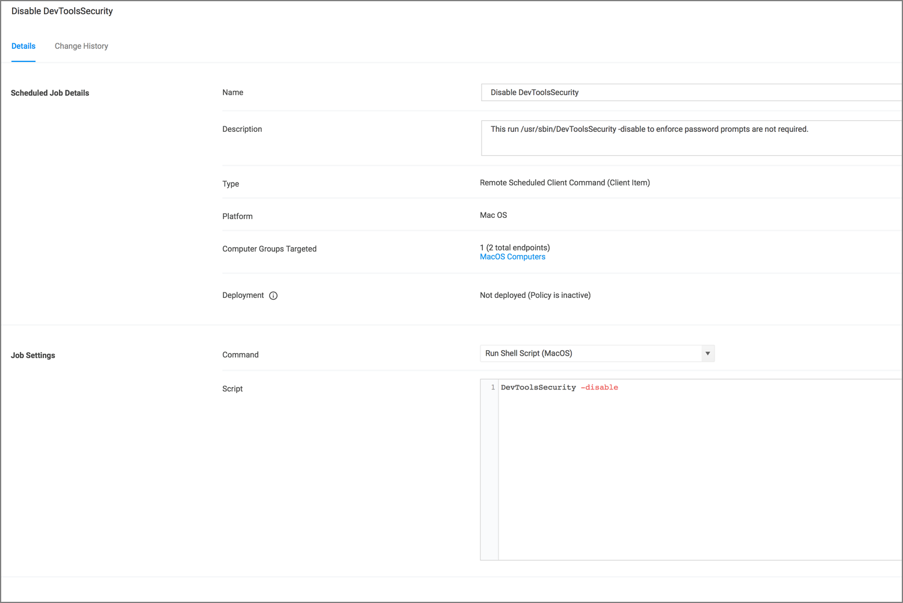

[title]: # (Elevate Xcode)
[tags]: # (authdb, sysex)
[priority]: # (7)
# Elevating Xcode

Xcode relies on two authorizationdb rights to provide certain aspects of its functionality:

* The acknowledgment of the license agreement upon first run after being installed.
* The ability to install iOS simulators.

## Agree to License Agreement

The default right to agree to the license agreement Xcode uses, requires the user to be in the admin's group and will prompt for admin credentials.

To elevate this aspect of Xcode, you can create a policy that targets Xcode and has the Xcode FLE Authorization Right (com.apple.dt.Xcode.LicenseAgreementXPCServiceRights) Authorization DB Right Name.

Advanced message actions such as Approval, Deny, Justification, or Warning should not be used in conjunction with this action.

1. Using the Policy Wizard, create a controlling policy, click __Next Step__.
1. Select __Elevate__, click __Next Step__.
1. Select __Run Silently__, click __Next Step__.
1. Select __Executables__, click __Next Step__.
1. Select __Modify Authorization Database__, click __Next Step__.
1. Select __Existing Filter__, search for and use an App Bundle filter that targets Xcode. If one doesn't exist, create it.
1. Click __Update__.
1. Click __Next Step__.
1. Name your policy, add a description.
1. From the __Right Name__ drop-down, select __Xcode FLE Authorization Right (com.apple.dt.Xcode.LicenseAgreementXPCServiceRights)__.

   
1. Click __Create Policy__.
1. Set the __Inactive__ switch to __Active__.
1. Next to __Deployment__ click the __i__ icon and run the __Resource and Collection Targeting Update__ task.

### What to Expect on the Endpoint

* __With__ a policy in place, when Xcode is run the first time and the user is a standard user and the policy is effective, the user will only be prompted to agree to the license agreement:

  

* __Without__ policy in place, when Xcode is run the first time and the user is a standard user, it prompts to agree to the license agreement. Clicking Agree results in the user being asked to provide admin credentials:

  

## Install iOS Simulators

Xcode uses a right that requires the user to be in the admin's group to install iOS Simulators. By default, when a standard user tries to install an iOS simulator they will be prompted to enter admin credentials.

To elevate this aspect of Xcode, you can create a policy that targets Xcode and has the Install Apple Software Authorization Right (system.install.apple-software) Authorization DB Right Name.

You can add this to a policy that already targets Xcode to elevate the license agreement with the XCode FLE Authorization Right (com.apple.dt.Xcode.LicenseAgreementXPCServiceRights) Authorization DB Right Name or you can create a policy that targets Xcode and this Authorization DB Right Name specifically.

To elevate this aspect of Xcode specifically, you can create a policy that targets Xcode and has the Install Apple Software Authorization Right (system.install.apple-software) Authorization DB Right Name.

Advanced message actions such as Approval, Deny, Justification, or Warning should not be used in conjunction with this action.

1. Using the Policy Wizard, create a controlling policy, click __Next Step__.
1. Select __Elevate__, click __Next Step__.
1. Select __Run Silently__, click __Next Step__.
1. Select __Executables__, click __Next Step__.
1. Select __Modify Authorization Database__, click __Next Step__.
1. Select __Existing Filter__, search for and use an App Bundle filter that targets Xcode. If one doesn't exist, create it.
1. Click __Update__.
1. Click __Next Step__.
1. Name your policy, add a description.
1. From the __Right Name__ drop-down, select __Install Apple Software Authorization Right (system.install.apple-software)__.

   
1. Click __Create Policy__.
1. Set the __Inactive__ switch to __Active__.
1. Next to __Deployment__ click the __i__ icon and run the __Resource and Collection Targeting Update__ task.

### What to Expect on the Endpoints

* __With__ a policy in place, when a standard user attempts to install an iOS simulator and the policy is effective, the install will begin without prompting for credentials:

  
* __Without__ a policy in place, by default, when a standard user attempts to install an iOS simulator they will be prompted for admin credentials:

  

## Enabling Developer Mode

By default, Xcode's Developer mode is disabled. When disabled, Xcode will prompt for admin credentials when the debugger or performance analysis tools are used to examine a process. If the user is a member of the ___developer__ group, the user will be prompted for their credentials instead.

The man page for DevToolsSecurity says:

"This tool changes the security authorization policies for use of Apple-code-signed debugger and performance analysis tools on development systems.

On normal user systems, the first time in a given login session that any such Apple-code-signed debugger or performance analysis tools are used to examine one of the user's processes, the user is queried for an administrator password for authorization. Use the DevToolsSecurity tool to change the authorization policies, such that a user who is a member of either the admin group or the ___developer__ group does not need to enter an additional password to use the Apple-code-signed debugger or performance analysis tools." (macOS system man page quote)

Depending on your requirements, you can address the issue of the user being prompted for admin credentials by adding your users to the ___developer__ group via LSS. If you wish to enable Developer mode and avoid the dialog entirely, you can create a scheduled command (client task) in Privilege Manager to run the DevToolsSecurity command and enforce it on specific endpoints based on the LSS group membership.

