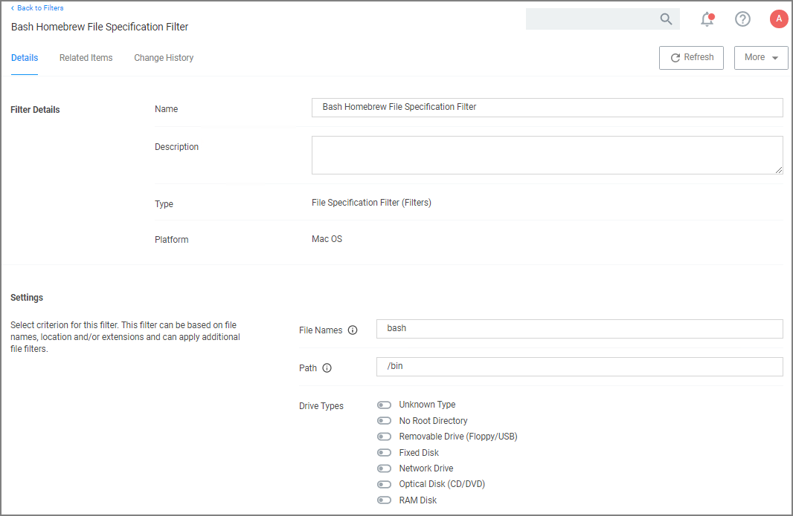
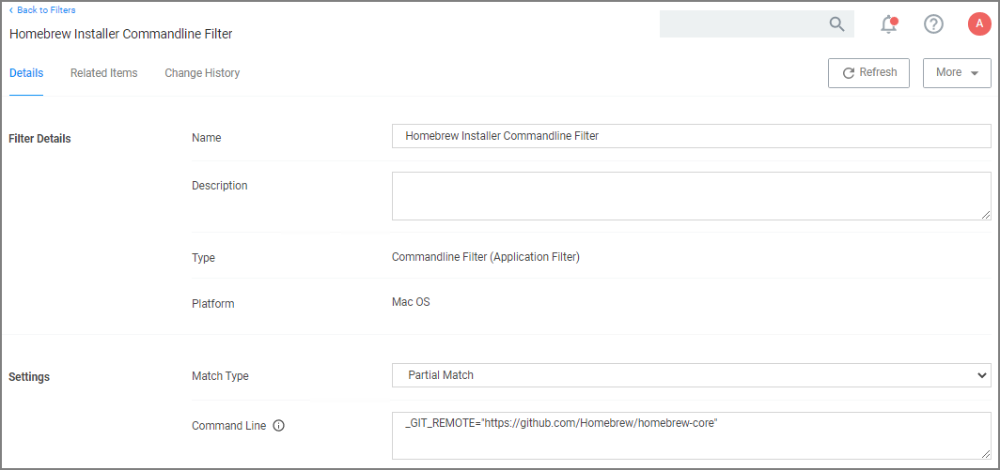
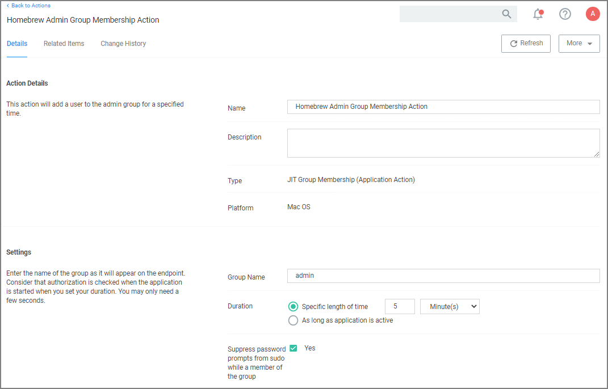
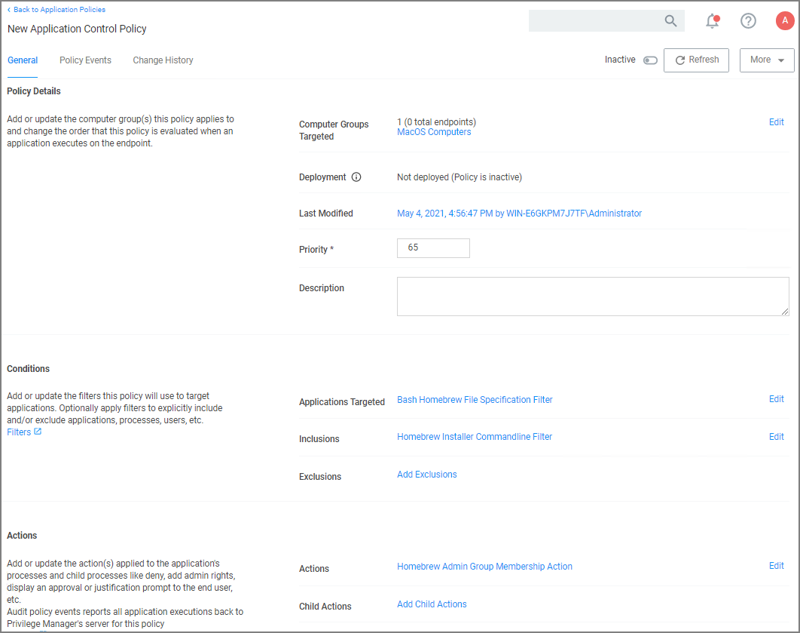

[title]: # (Homebrew Support)
[tags]: # (macOS,endpoint,installation)
[priority]: # (8)

# macOS Homebrew Installer Support

If you are using Homebrew to manage command line utilities and applications, you need to add the user to the admin group with a JIT group action and use a policy with additional advanced setting as described below.

With a policy in place, a standard (non-admin) user is able to run the Homebrew installer by entering the command line found on the Homebrew home page (https://brew.sh) at a Terminal window prompt. After that the installer proceeds and completes successfully, resulting in a Homebrew installation under `/usr/local` (or `/opt/homebrew` on Apple Silicon machines) owned by the user (not root).

## Creating the Filters Needed

### Create a Bash File Specification Filter

This filter will specify the applications targeted.

1. Navigate to __Admin | Filters__.
1. Click __Create Filter__.
1. From the __Platform__ drop-down, select __Mac OS__.
1. From the __Type__ drop-down, select __File Specification Filter__.
1. Name the filter and provide a description to reflect the purpose, for example __Bash Homebrew File Specification Filter__.
1. Click __Create__.
1. Under __Settings | File Names__, enter __bash__.
1. For __Path__, enter __/bin__.
1. Click __Save Changes__.

   

### Create a Homebrew Installer Commandline Filter

This filter will be added as an inclusion filter.

1. Navigate to __Admin | Filters__.
1. Click __Create Filter__.
1. From the __Platform__ drop-down, select __Mac OS__.
1. From the __Type__ drop-down, select __Commandline Filter__.
1. Name the filter and provide a description to reflect the purpose, for example __Homebrew Installer Commandline Filter__.
1. Click __Create__.
1. Under __Settings | Match Type__, select __Partial Match__.
1. For __Command Line__, enter ___GIT_REMOTE="https://github.com/Homebrew/homebrew-core"__.
1. Click __Save Changes__.

   

## Creating the Homebrew Admin Group Membership Action

This action will be added under Actions section of the policy.

1. Navigate to __Admin | Actions__.
1. Click __Create Action__.
1. From the __Platform__ drop-down, select __Mac OS__.
1. From the __Type__ drop-down, select __Just-in-Time Group Membership Action__.
1. Name the Action and provide a description to reflect the purpose, for example __Homebrew Admin Group Membership Action__.
1. Click __Create__.
1. Under __Settings | Group Name__, enter __admin__.
1. For __Duration__ keep the default 5 min setting.
1. For __Suppress password prompts from sudo while a member of the group__ set the checkmark to change to yes.
1. Click __Save Changes__.

   

## Creating the Homebrew Installation Policy

1. Navigate to your macOS computer group and select __Application Policies__.
1. Click __Create Policies__.
1. Select __Skip the wizard, take me to a blank policy__ option.
1. Name the policy, for example __Homebrew Installation Policy__.
1. Click __Create Policy__.
1. Under __Conditions | Applications Targeted__, click __Add Application Targeted__.
1. Search for and add the __Bash Homebrew File Specification Filter__ previously created.
1. Click __Update__.
1. Click __Inclusions__.
1. Search for and add the __Homebrew Installer Commandline Filter__ previously created.
1. Click __Update__.
1. Under __Actions__, click __Add Actions__.
1. Search for and add the __Homebrew Admin Group Membership Action__ previously created.
1. Click __Update__.
1. Click __Save Changes__.

   
