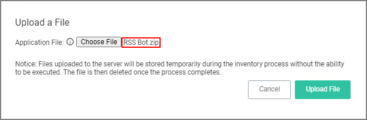
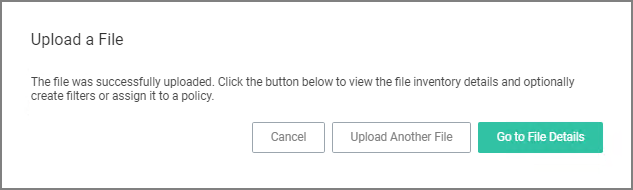
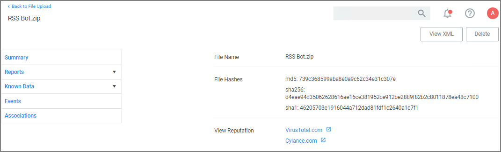
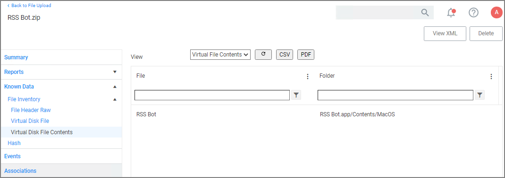
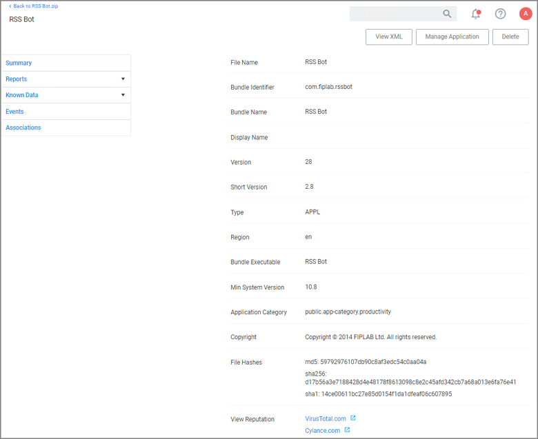
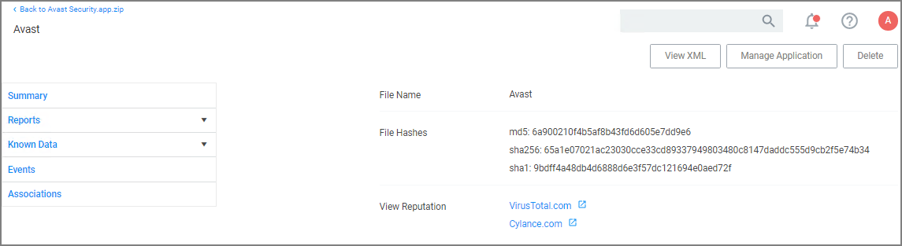
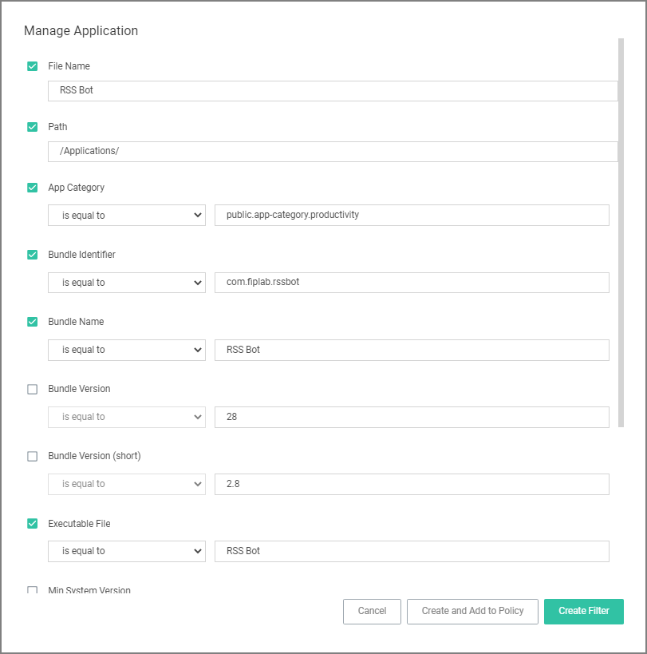
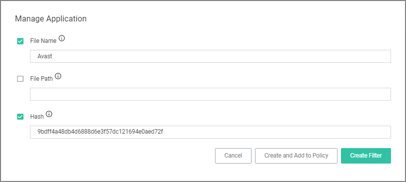
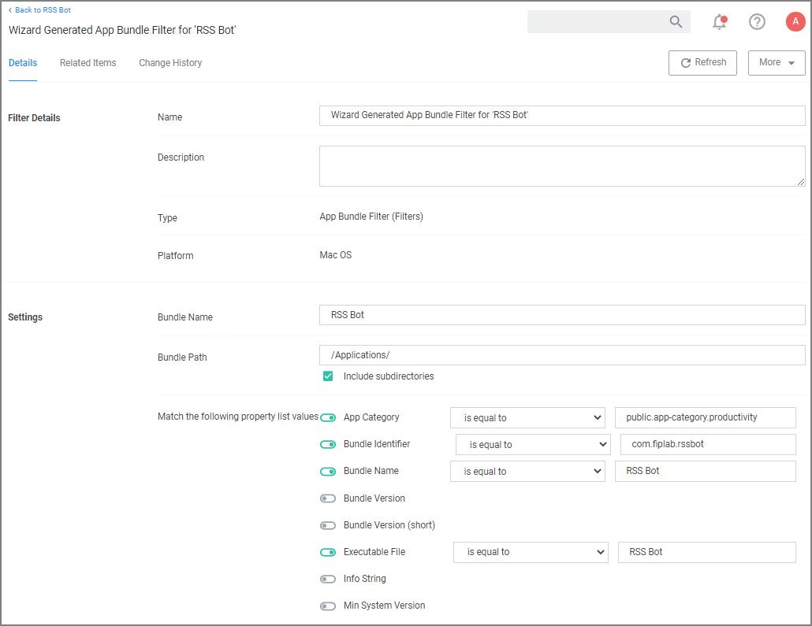
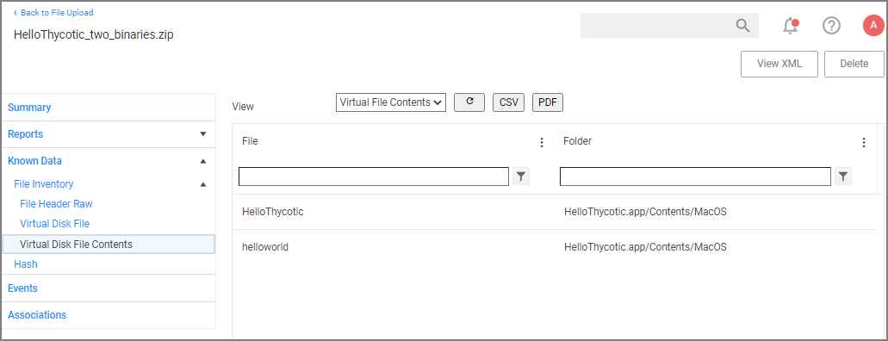

[title]: # (Inventorying Application Bundles)
[tags]: # (learning mode, macOS)
[priority]: # (101)
# Inventorying Application Bundles

Privilege Manager allows the inventory of macOS application bundles. These are most likely applications already installed on a macOS system that can be found in the Applications folder.
In order for Privilege Manager to inventory application bundles, the user needs to create a .zip file of the application bundles and move it outside of the Applications folder. Once the .zip is created and moved, it can be uploaded to Privilege Manager for inventory purposes.

A .zip of an application bundle when inventoried can contain one or more Mach-O binaries. The level of details that can be inventoried automatically depends on the format of and information provided in the Info.plist file.

The examples below show certain steps for the zip and upload process for one type of file, while the inventory examples are shown for

* a readable Info.plist file with an application bundle containing one Mach-O binary.
* a readable Info.plist file with an application bundle containing more than one Mach-O binary.
* a binary Info.plist file that does not provide sufficient details automatically and that will require manual steps to add information to the filter and/or policy.

The __Manage Application__ option is only available on files inside the .zip compressed archives and not on the .zip file itself.

## Creating a .zip File

1. Navigate to an application bundle file inside __/Applications__.
1. Right-click and select __Compress__.
1. Select the created .zip file and move it out of __/Applications__.

## Uploading the .zip File

1. Use __Admin | File Upload__ to start the inventory process.
1. Choose a file to upload and click __Upload File__.

   
1. After uploading a .zip file, click __Go to File Details__.

   
1. On the Resource Explorer page, view all the details available.

   

## Creating a Filter from the Inventoried .zip File

1. On the Resource Explorer page under __Known Data | File Inventory__, select __Virtual Disk File Contents__.

   
1. In the __File__ column, click on the Mach-O binary name.
1. The Resource explorer is now displaying the information for the client item. The table below shows the difference between readable (left column) and non-readable (right column) Info.plist files.

   | Info.plist readable | Info.plist non-readable (binary format) |
   | ----- | ----- |
   |  |  |
1. Click __Manage Application__.

   | Info.plist readable | Info.plist non-readable (binary format) |
   | ----- | ----- |
   |  |  |

   Select any or all of the options on the Manage Application modal.
1. Click __Create Filter__.

   When dealing with an application bundle that has a readable Info.plist, Privilege Manager creates a very detailed _Wizard Generated File Specification Filter_ for the application bundle. This filter can be further customized and added to any policy.

   

## Uploading a .zip with Two Mach-O Binaries

App bundles can contain more than one Mach-O binary, which will all be inventoried and accessible via the client items under __Known Data | Virtual Disk File Contents__:



While an application bundle can contain many binaries, you may want to only create an App Bundle filter for the binary set as the __CFBundleExecutable__ in the Info.Plist. For some applications this may be sufficient, but you may need to create additional non-App Bundle filters for the other binaries.

## App Bundle Contents Info.plist (binary format)

Depending on how the vendor created the application bundle, the level of detail to be inventoried might vary. Sometimes it is necessary to look at other artifacts in the bundle to customize the filter and or policy further.

For this we will look at an Info.plist file in binary format. For example,

* to manually add a Bundle Identifier to the filter, search for the tag `<CFBundleIdentifier>` and enter the string value in the appropriate filter field.
* to manually add a Bundle Version (short) to the filter, search for the tag `<CFBundleShortVersionString`> and enter the string value in the appropriate filter field.

>**Note**: Reading an Info.plist file might depend on the tool that is being used. If opened in TextEdit only, they can appear garbled. On macOS systems, we recommend using QuickLock (⌘Y), XCode, or something like Visual Studio Code. On Windows systems, we recommend Visual Studio Code or Notepad++. 

```xml
<?xml version="1.0" encoding="UTF-8"?>
<!DOCTYPE plist PUBLIC "-//Apple//DTD PLIST 1.0//EN" "http://wwwapplicationle.com/DTDs/PropertyList-1.0.dtd">
<plist version="1.0">
<dict>
	<key>BuildMachineOSBuild</key>
	<string>19G2021</string>
	<key>CFBundleDevelopmentRegion</key>
	<string>en</string>
	<key>CFBundleDisplayName</key>
	<string>Avast</string>
	<key>CFBundleDocumentTypes</key>
	<array>
		<dict>
			<key>CFBundleTypeName</key>
			<string>Any Item</string>
			<key>CFBundleTypeRole</key>
			<string>None</string>
			<key>LSHandlerRank</key>
			<string>None</string>
			<key>LSItemContentTypes</key>
			<array>
				<string>public.item</string>
			</array>
		</dict>
	</array>
	<key>CFBundleExecutable</key>
	<string>Avast</string>
	<key>CFBundleIconFile</key>
	<string>AppIcon</string>
	<key>CFBundleIdentifier</key>
	<string>com.avast.AAFM</string>
	<key>CFBundleInfoDictionaryVersion</key>
	<string>6.0</string>
	<key>CFBundleName</key>
	<string>Avast</string>
	<key>CFBundlePackageType</key>
	<string>APPL</string>
	<key>CFBundleShortVersionString</key>
	<string>14.9</string>
	<key>CFBundleSupportedPlatforms</key>
	<array>
		<string>MacOSX</string>
	</array>
	<key>CFBundleURLTypes</key>
	<array>
		<dict>
			<key>CFBundleTypeRole</key>
			<string>Viewer</string>
			<key>CFBundleURLName</key>
			<string>com.avast.webdocument</string>
			<key>CFBundleURLSchemes</key>
			<array>
				<string>avastav</string>
			</array>
		</dict>
	</array>
	<key>CFBundleVersion</key>
	<string>1</string>
	<key>DTCompiler</key>
	<string>comapplicationle.compilers.llvm.clang.1_0</string>
	<key>DTPlatformBuild</key>
	<string>12B45b</string>
	<key>DTPlatformName</key>
	<string>macosx</string>
	<key>DTPlatformVersion</key>
	<string>11.0</string>
	<key>DTSDKBuild</key>
	<string>20A2408</string>
	<key>DTSDKName</key>
	<string>macosx11.0</string>
	<key>DTXcode</key>
	<string>1220</string>
	<key>DTXcodeBuild</key>
	<string>12B45b</string>
	<key>LSMinimumSystemVersion</key>
	<string>10.10</string>
	<key>LSUIElement</key>
	<true/>
	<key>NSCameraUsageDescription</key>
	<string>Change Avast Omni profile picture</string>
	<key>NSHumanReadableCopyright</key>
	<string>Copyright © 2021 AVAST Software s.r.o. All rights reserved.</string>
	<key>NSMainNibFile</key>
	<string>MainMenu</string>
	<key>NSPrincipalClass</key>
	<string>Avast.AntivirusModule</string>
	<key>NSServices</key>
	<array>
		<dict>
			<key>NSMenuItem</key>
			<dict>
				<key>default</key>
				<string>Scan with Avast</string>
			</dict>
			<key>NSMessage</key>
			<string>scanFromServicesMenu</string>
			<key>NSPortName</key>
			<string>Avast</string>
			<key>NSRequiredContext</key>
			<dict>
				<key>NSApplicationIdentifier</key>
				<string>comapplicationle.finder</string>
			</dict>
			<key>NSSendFileTypes</key>
			<array>
				<string>public.item</string>
			</array>
			<key>NSServiceDescription</key>
			<string>ScanServicesDesc</string>
		</dict>
	</array>
</dict>
</plist>
```
