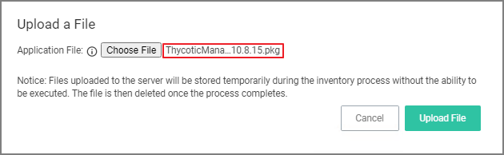

[title]: # (Inventoring .pkg Files)
[tags]: # (learning mode, macOS)
[priority]: # (101)
# Inventoring .pkg Files

Privilege Manager allows the inventory of macOS .pkg files. With the ability to upload and extract the contents within the .pkg files Privilege Manager inventories the applications that are bundled in any given .pkg.

1. Use __Admin | File Upload__ to start the inventory process.
1. Choose a file to upload and click __Upload File__.

   
1. After uploading a .pkg file select the __Go to File Details__ button.

   

In the Resource Explorer an Administrator can now look at all the details from the inventory.

* Showing the list of applications:

  

* Click on the main application __Privilege Manager__ to see those details:

  

* Click on Known Data and open __Software Management | MacOS Bundle__ to see the information specified in the macOS bundle:

  

>**Note**:
>Any packages that deviate from the standard configuration and layout might not have their contents inventoried correctly. If that is the case, unpack the .pkg and upload each contents file individually for inventory purposes.
