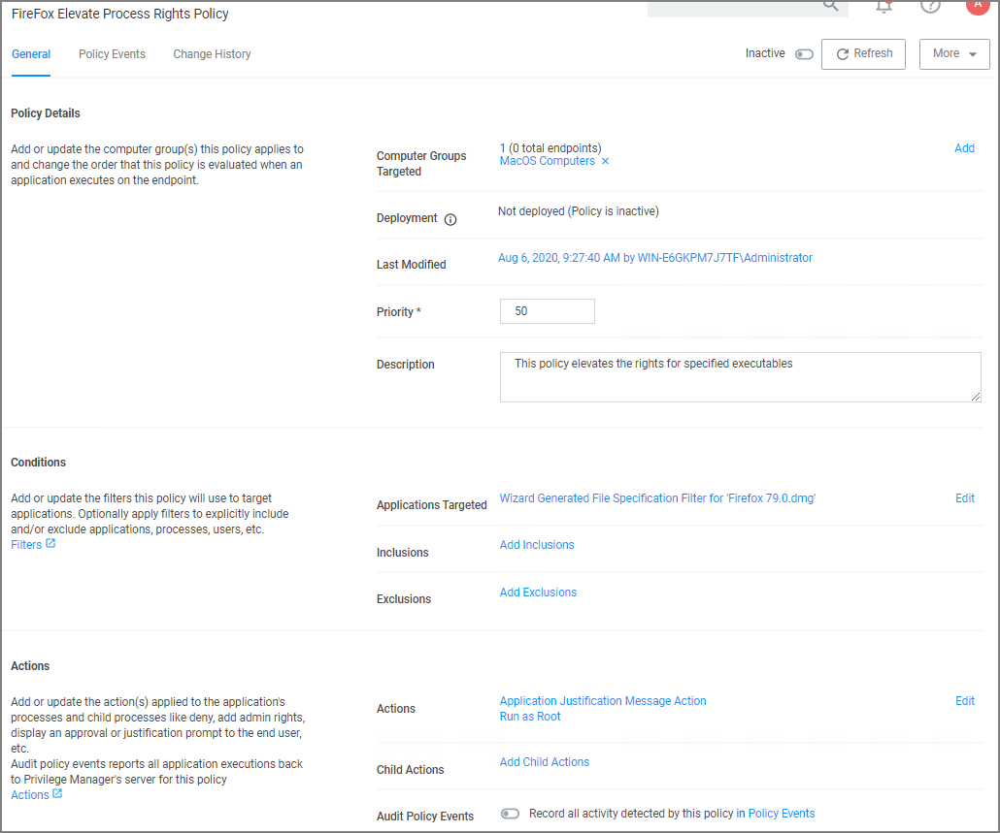
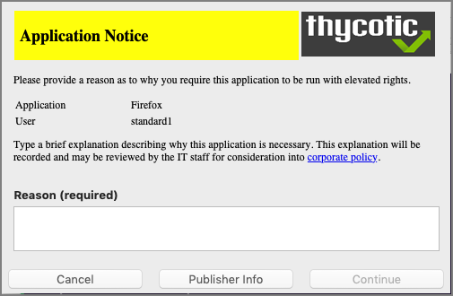

[title]: # (Justification - FireFox)
[tags]: # (standard user, policy, macOS)
[priority]: # (7)
# Require Justification - FireFox

The following example provides information on setting up a justification required policy for FireFox on a macOS endpoint.

Create a filter for Firefox either from discovery or manually. Use that filter in the steps below.

1. Using the Policy Wizard, create a controlling policy that elevates application execution on endpoints.
1. Select __Require Justification__, and click __Next Step__.
1. Select what file type to target, for this example select __Executable__, and click __Next Step__.
1. Choose your target, for this example __Existing Filter__.
1. Search for and add your Firefox filter.
1. Click __Updated__.
1. Click __Next Step__.
1. Name your policy and add a description, click __Create Policy__.

   
1. Set the __Inactive__ switch to __Active__.

## Updating the Endpoint

On the macOS endpoint,

1. Open __System Preferences | Privilege Manager__.

   
1. Click __Update Client Items__.

The agent updates with new and updated policies and synchronizes.

## Expected User Experience

Once the justification policy is updated on an endpoint, when users click Firefox they will see a prompt to enter their justification reason for accessing Firefox.

