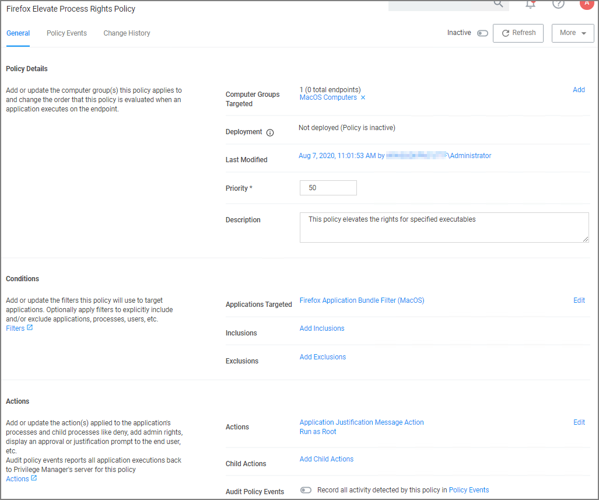

[title]: # (Justification - FireFox)
[tags]: # (standard user, policy, macOS)
[priority]: # (7)
# Require Justification - FireFox

The following example provides information on setting up a justification required policy for FireFox on a macOS endpoint.

1. Using the Policy Wizard, create a controlling policy that elevates application execution on endpoints.
1. Select __Require Justification__, and click __Next Step__.
1. Select what file type to target, for this example select __Executable__, and click __Next Step__.
1. Choose your target, for this example __File Upload__.
1. Click __Choose File__ and select a file to upload.

   
1. Click __Upload File__.
1. On the __Manage Application__ page select all the identifying factors you want the filter to target.

   
1. Click __Create Filter__.
1. Click __Next Step__.
1. Name your policy and add a description, click __Create Policy__.

   
1. Set the __Inactive__ switch to __Active__.

To make sure your policy is effective, pull up Terminal on your testing macOS endpoint and run `sudo /usr/local/thycotic/agent/agentUtil.sh updateclientitems` command.

Once the justification policy is updated on your endpoint, when you click Firefox you will see a prompt where the user can enter their justification reason for accessing Firefox.
