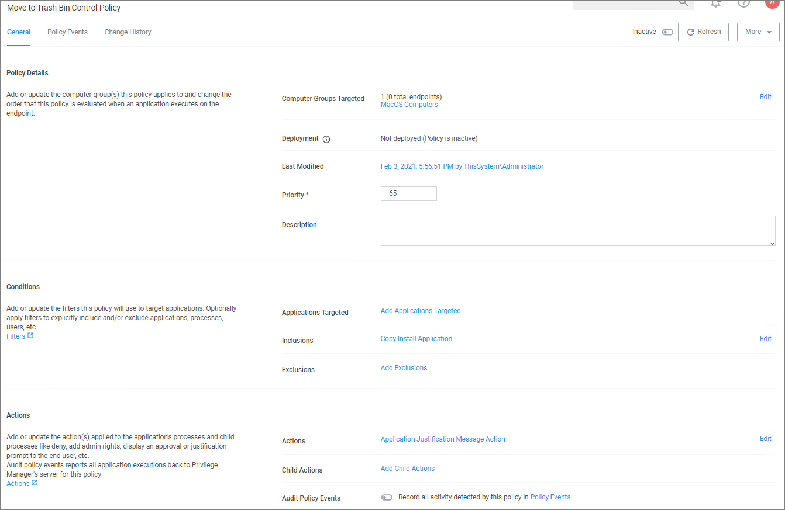

[title]: # (Move to Trash)
[tags]: # (macOS, standard user, elevate)
[priority]: # (7)

# Move to Trash Bin Policy

When a standard user deletes an application bundle via __⌘-delete__ or __drag-n-drop__ from /Applications, the following actions are taken based on policy evaluation:

* Allow - Is allowed without prompting user for credentials
* Present appropriate Advanced Message Dialog: 
  * Approval - Approval process is invoked before it is allowed to complete
    * Cancelled - It is denied.
  * Denied - Denied dialog is invoked and user can not delete the application bundle
  * Justification - Justification process is invoked before it is allowed to complete
    * Cancelled - It is denied.
  * Offline-Approval - Offline-approval process is invoked before it is allowed to complete
    * Cancelled - It is denied.
  * Warning - Warning dialog is invoked before it is allowed to complete
    * Cancelled - It is denied.

To allow a standard user to delete application bundles from the /Applications directory, create an elevation policy that uses the __Copy Install Application__ filter under Inclusions. We recommend to also add a justification message action.

1. Navigate to your macOS Computer Group and select __Application Policies__.
1. Click __Create Policy__.
1. Select __Controlling__ and click __Next Step__.
1. Select __Elevate__ and click __Next Step__.
1. Select __Require Justification__ and click __Next Step__.
1. Select what types to target. This can be based of an __Executables__, a __Installer Packages__, and/or __Scripts__. Multiple targets can be selected.
1. Click __Next Step__.
1. Select what exactly you want the policy to target. This can be based of an __Existing Filter__, a __File Upload__, and/or __Inventoried File(s)__. Multiple targets can be selected.
1. Click __Next Step__.
1. Enter a Name and description for your policy, click __Create Policy__.
1. Click __Add Inclusions__.
1. Search for and add the __Copy Install Application__ filter.
1. Click __Update__.
1. Click __Save Changes__.
1. Set the __Inactive__ switch to __Active__ for policy updates at the endpoint.

   

>**Note**: These basic steps can also be used to allow a user to update or replace an App Bundle by drag-n-drop via Finder to the /Applications folder.
